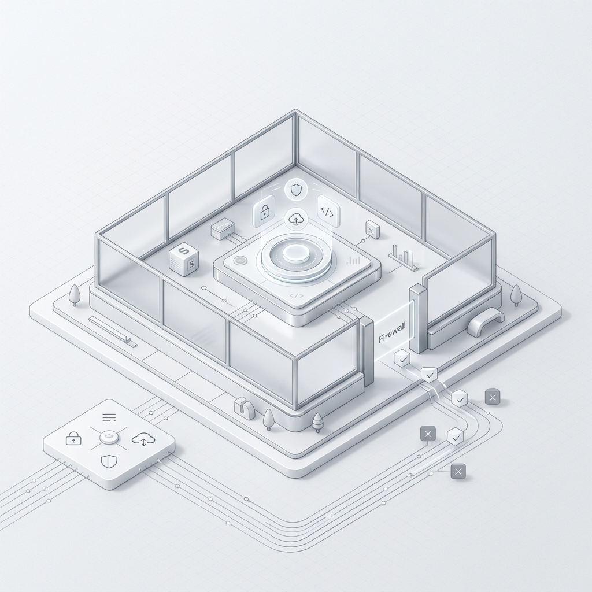
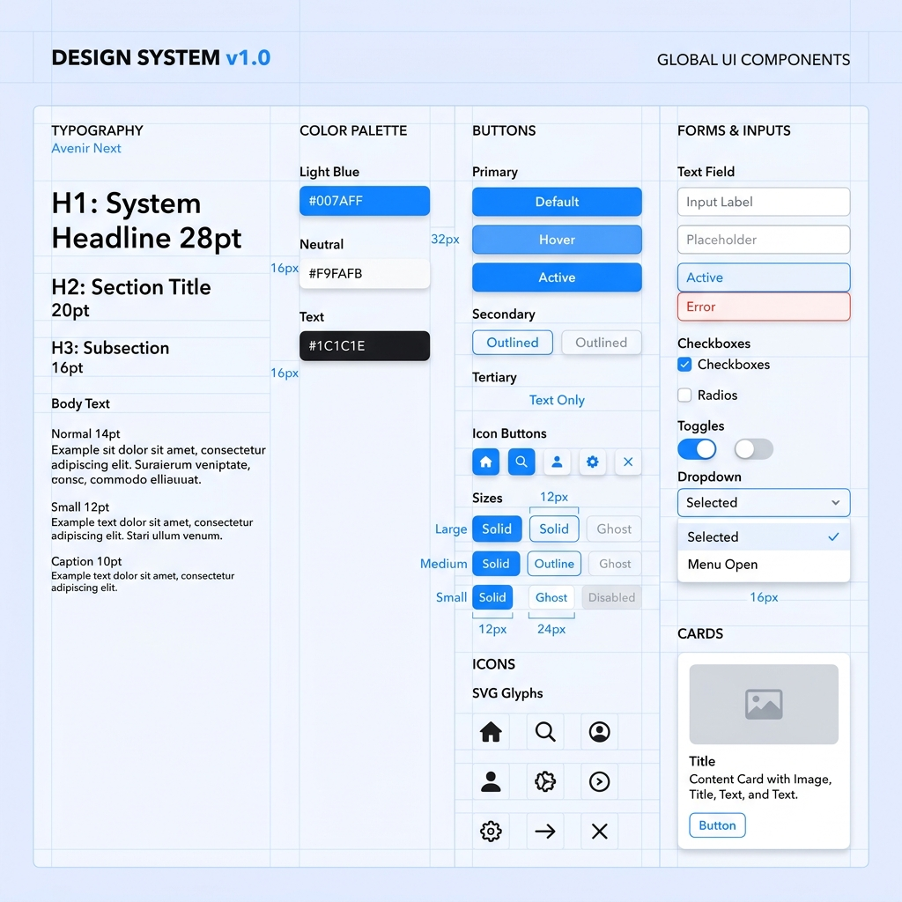

# Hi, I'm Hanalice
**Apple-Style Minimalist Developer | Minimalist Geek**

---

<!-- 动态仪表盘口子 -->

  
  

## 🛠 Dashboard & Featured Projects

> "Less, but better." - Dieter Rams

<!-- 响应式项目卡片区域：通过外层居中表格实现整体居中 -->
<table align="center">
  <tr>
    <td>
      <table align="left" width="310">
        <tr>
          <td align="center" valign="top">
            
             
            <strong>Project A</strong>
             
            A professional-grade digital asset catalog platform built with a focus on performance, scalability, and maintainability.
             
            <a href="https://hanalice.github.io/connect-store/" target="_blank">Demo</a>
          </td>
        </tr>
      </table>
      <table align="left" width="310">
        <tr>
          <td align="center" valign="top">
            
             
            <strong>Project B</strong>
             
            High-performance sandbox architecture.
             
            <!-- <a href="#">Case Study</a> -->
          </td>
        </tr>
      </table>
      <table align="left" width="310">
        <tr>
          <td align="center" valign="top">
            
             
            <strong>Project C</strong>
             
            Minimalist design system implementation.
             
            <!-- <a href="#">Demo</a> / <a href="#">Article</a> -->
          </td>
        </tr>
      </table>
    </td>
  </tr>
</table>

 

---

## ✍️ Latest Stream

<!-- BLOG-POST-LIST:START -->
- [2024-09-19] [Http请求常用方法解释](./posts/http_request.md)
- [2024-09-19] [Git修改历史提交的作者信息](./posts/git_change_history_commit_authors.md)
- [2017-11-30] [Git常用命令](./posts/git_help.md)
- [2017-09-22] [AngularJS中$http服务的简单用法](./posts/angular_http.md)
- [2017-08-15] [AngularJS的工具类集合](./posts/angular_utils.md)
- [2017-08-15] [Vim命令合集](./posts/vim_help.md)
- [2017-08-07] [使用ssh-agent 管理多个ssh key](./posts/ssh-agent.md)
- [2017-07-18] [Dockerfile 快速上手：构建并运行你的第一个容器](./posts/docker_quickstart.md)
- [2017-07-01] [Hello World: 我的 GitHub 门户开通了](./posts/hello-world.md)
<!-- BLOG-POST-LIST:END -->

---

## 🏷 Categories

<!-- TAG-CLOUD:START -->
[`#AI(1)`](./tags/AI.md) [`#Agent(1)`](./tags/Agent.md) [`#AngularJS(2)`](./tags/AngularJS.md) [`#Apple(1)`](./tags/Apple.md) [`#Container(1)`](./tags/Container.md) [`#DevOps(1)`](./tags/DevOps.md) [`#Docker(1)`](./tags/Docker.md) [`#Git(3)`](./tags/Git.md) [`#Http(2)`](./tags/Http.md) [`#Minimalist(1)`](./tags/Minimalist.md) [`#SSH(1)`](./tags/SSH.md) [`#Tutorial(1)`](./tags/Tutorial.md) [`#Vim(1)`](./tags/Vim.md)
<!-- TAG-CLOUD:END -->

  <a href="./posts">All Posts →</a>

<!-- STATUS: HEALTHY, LAST_SYNC: 2026-05-06 22:01:06 -->
