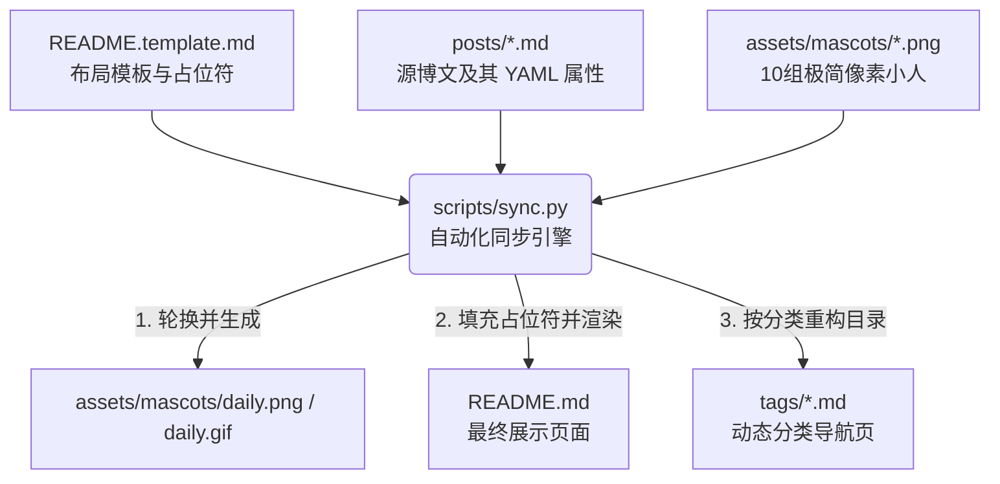

# GitHub Profile 个人门户架构与运维指南 (Architecture & Ops Guide)

本指南旨在详细介绍 Hanalice 个人门户项目的整体设计、技术架构、自动化体系（CI/CD）以及运维规范，帮助维护者深刻理解其背后的工程逻辑与最佳实践。

---

## 📖 1. 核心设计哲学 (Core Philosophy)

本项目的核心愿景是打造一个**极简、可读、零成本运维**的个人主页与技术博客。设计上严格遵循以下三大原则：

1. **Apple 极简主义设计 (Apple-Style Minimalism)**
   - 界面布局极致干净，采用高对比度的浅色色调，提供极佳的视觉可读性与无障碍支持（Accessibility）。
   - 避免冗余的装饰，遵循 Dieter Rams 的“少，但更好 (Less, but better)”的设计理念。

2. **100% GitHub 原生 (GitHub Native & Serverless)**
   - 零服务器、零数据库、零外部 Web 托管。
   - 所有数据和静态页面完全驻留在 GitHub 上，直接以 GitHub Profile 页面呈现。

3. **数据驱动的 README (Data-Driven Profile)**
   - 不直接编辑 `README.md`。使用 `README.template.md` 作为“单一数据源”，通过自动化构建引擎生成最终的 `README.md`。

---

## 🏗 2. 技术架构与数据流 (Architecture & Data Flow)

项目本质上是一个**静态编译型 CMS 系统**，基于 Python 脚本和 Markdown 源文件构建。其单向数据流向设计如下：



### 📁 核心目录结构
```text
/
├── README.template.md        # 主页排版模板（单一数据源，含渲染占位符）
├── README.md                 # 自动生成的主页文件（勿手动修改）
├── posts/                    # 博文存储目录（存放所有 Markdown 源文件）
├── assets/                   # 静态资源目录
│   └── mascots/              # 10 个像素小人图片池（用于每日轮换）
├── tags/                     # 自动生成的标签分类归档目录
├── scripts/                  # 运维核心脚本
│   └── sync.py               # 核心编译与同步 Python 脚本
├── docs/                     # 项目技术文档
│   ├── ADR/                  # 架构决策记录
│   ├── knowledge/            # 运维知识库与踩坑指南
│   └── architecture_ops_guide.md # 本技术架构与运维指南
├── tests/                    # 测试组件
│   └── test_sync.py          # sync.py 核心逻辑单元测试
└── Makefile                  # 本地开发快捷指令
```

---

## 🤖 3. 自动化流水线 (CI/CD Workflows)

项目的持续集成与自动部署完全托付给 GitHub Actions，主要包含三个核心流水线：

### 🔄 3.1 门户同步与每日轮换流水线 (`blog-sync.yml`)
- **触发时机**：
  - 每日凌晨零点（UTC）定时运行。
  - 推送代码到 `posts/` 或 `assets/mascots/` 路径时触发。
  - 支持手动触发（`workflow_dispatch`）。
- **运行步骤**：
  1. 拉取最新代码。
  2. 初始化 Python 3 环境。
  3. 执行 `python scripts/sync.py`：
     - 解析 `posts/` 下所有博文的 YAML Frontmatter（标题、日期、分类标签）。
     - 从 `assets/mascots/` 中随机抽取一个小人，将其复制为 `daily.png` 或 `daily.gif`。
     - 生成最新的博文列表（按日期倒序，首页最多展示最新 10 篇）。
     - 生成分类标签云（Tag Cloud）及对应的 `/tags/*.md` 页面。
     - 注入构建时间戳 `{{LAST_SYNC}}`。
  4. 将生成的 `README.md`、`tags/*.md` 和 `daily.*` 自动 Commit 并 Push 回主仓库。

### 🖼 3.2 图像无损压缩流水线 (`image-compress.yml`)
- **触发时机**：当 `assets/` 路径下的图片有新增或更新时触发。
- **作用**：利用 `calibreapp/image-actions` 对静态图片及像素小人进行无损压缩，优化访问速度，降低历史膨胀率。
- **安全设计**：由于压缩后会自动 commit 回仓库，为了防止重新触发 Push 流水线导致无限死循环，所有的自动 commit 都会被标记 `[skip ci]` 标签阻断触发。

### 🔗 3.3 链接可用性巡检流水线 (`link-checker.yml`)
- **触发时机**：每月 1 号定时执行，或手动触发。
- **作用**：基于 `lycheeverse/lychee-action`，扫描仓库内所有 Markdown 文件中的外链。如果检测到 404 或死链，将自动在仓库中创建 GitHub Issue，提醒维护者更新链接，保持门户的健康度。

---

## 🛠 4. 运维规范与最佳实践 (Ops Best Practices)

为保持仓库的轻量和长期健壮运行，维护者必须严格遵循以下运维准则：

### 🚫 4.1 严防 Git 历史膨胀 (Git Bloat Prevention)
由于 GitHub 仓库不适合高频提交变动频繁的二进制文件，因此：
- **像素小人轮换机制**：只会在本地复制图片为固定的 `daily.png` / `daily.gif`，或直接通过修改 `README.md` 中指向固定图片的 URL 路径来进行轮换。
- **严禁直接上传大体积 gif**：对于文章中的动图配图，应进行极致压缩，或使用外部轻量级图床。

### 📦 4.2 依赖管理与零心智负担 (Zero-Maintenance)
- **Actions 安全与更新**：配置了 `.github/dependabot.yml`，每月自动检查所有 GitHub Actions 以及依赖库的版本升级，并自动发起 PR。
- **权限最小化原则**：Actions 工作流在编写时必须显式配置最小权限（如 `permissions: contents: write`），禁止使用全局宽泛权限以保障仓库安全。

### 📝 4.3 新博文发布流程
若要发布一篇新博文，只需在本地或 GitHub 网页端执行以下操作：
1. 在 `posts/` 目录下新建 `your-post-name.md` 文件。
2. 头部必须包含如下格式的 YAML 属性：
   ```yaml
   ---
   title: 您的博文标题
   date: 2026-05-25
   tags: Git, DevOps
   ---
   ```
3. 提交代码并 Push。GitHub Actions 会在数秒内自动启动编译，更新主页博文流、重构标签分类页，并轮换今日像素小人。

---

## 💻 5. 本地开发与测试调试 (Local Development)

项目针对开发者提供了一套简单实用的本地开发闭环，无需任何外部环境依赖：

### ⚙️ 常用快捷指令
在项目根目录下，您可以使用 `Makefile` 提供的快捷指令进行本地开发：

*   **同步构建主页**：
    ```bash
    make sync
    ```
    执行该命令会直接在本地运行 `scripts/sync.py` 脚本，将模板编译并输出到 `README.md`。

*   **预览最新效果**：
    ```bash
    make preview
    ```
    该命令会运行同步逻辑，并为您输出接下来的预览步骤（在 IDE 中开启 Markdown 预览即可直观看到生成的博文流和新小人）。

*   **运行单元测试**：
    ```bash
    make test
    ```
    执行 `tests/test_sync.py` 下的单元测试集，确保 `parse_post` 的解析逻辑、占位符替换和文件名处理没有逻辑缺陷。在修改 `scripts/sync.py` 之前，请务必保证此测试集 100% 通过。
