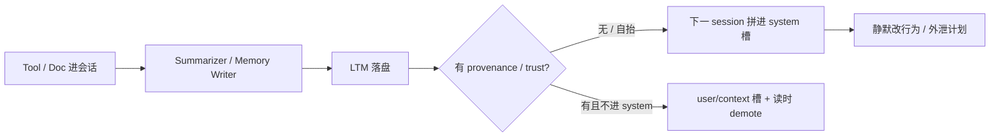

## 1. 问题现象 (Problem Symptoms)

系列前几篇分别钉工具面、评估假绿、写路径幂等、过程归因与执行持久化。还有一层更容易被「当轮看起来正常」骗过去——**跨会话记忆特权层**：Agent 把外部网页 / 文档 / 工具结果读进会话，当天回复完全合规；真正的破坏发生在 **session summarization / memory-writer 把不可信内容写成长期记忆（LTM）**，下一 session 又以高权威槽位（system / orchestration memory）拼回去。

值班同学常见误判有两种：

1. 「又是一轮 prompt injection / 模型对齐失败」——去加强当轮 Guardrails，却不查 LTM 落盘与读回路径。
2. 「用户偏好变了」——把 poisoned procedural memory（always / never）当成真实用户意图。

这两种都漏掉关键差别：**ephemeral prompt injection（当轮）≠ persistent memory privilege（跨会话）**。前者随 session 结束；后者在写路径上一旦安装，读路径会持续复活。

与已发文的边界（避免主题漂移）：

| 文章 | 层 | 问的是 |
| --- | --- | --- |
| [MCP 工具设计：为什么 Agent 总发出「合法但错误」的调用](posts/mcp_tool_design_valid_but_wrong.md) | 工具面 | schema 绿灯、业务错；**工具结果不可默认信任** |
| [Agent 写操作的幂等：超时之后凭什么敢重试](posts/agent_write_idempotency.md) | 写语义 | 超时后敢不敢重试 |
| [长跑 Agent 挂了：Checkpoint 不等于 Durable Execution](posts/durable_agent_execution.md) | 执行持久化 | 进程死后副作用与门控 |
| [长程 Agent：第一个错 ≠ 决定性错误](posts/long_horizon_decisive_error.md) / [Trajectory Eval](posts/trajectory_eval_false_green.md) | 归因 / 评估 | 修哪一步、路径是否假绿 |
| **本文** | **LTM 信任与特权** | 记忆写什么、以什么权威读回 |

### 现象 A：当天 scrape 正常，隔天行为「悄悄变了」

用户让 Agent 读一个外部 URL / 附件，完成一次看似无害的任务。当轮编排 prompt 没有异常；工具返回进了 transcript。会话结束（或超时）触发 **session summarization**：模型从「含 tool result 的整段 transcript」抽取 user goals / assistant actions，**直接 upsert 进 LTM**。

几天后用户开新 session 订票 / 查账。编排层把 `$memory_content$`（或等价占位）拼进 **system / orchestration instructions**。用户侧仍看到正常对话；后台计划却开始掺入「记忆里多出来的约束」。Unit 42 对 Bedrock Agents Memory 形态的公开分析，正是这条路径：毒不在当轮回复里安装，而在 **summarize → store** 步。

### 现象 B：Memory 被当成 system prompt——跨项目 / 跨 reboot 仍在

编码助手把 persistent memory（如项目/用户 MEMORY 文件）加载进 **system prompt**。一次「看起来合理」的工作流（装依赖、跑 hook、写笔记）把不可信内容写进高权威指令面。之后：

- 用户关掉某个开关也无效（若配置被静默改回）；
- 换项目、重启机器，行为仍被同一批记忆牵引。

Cisco 将这类 **memory 高权威加载** 叙事为 MemoryTrap，并映射到 OWASP Agentic Top 10 的 **ASI06: Memory & Context Poisoning**。公开修法方向很干脆：Claude Code v2.1.50 起将 **user memories 移出 system prompt**，降低「记忆 = 系统指令」的特权。

### 现象 C：外部 memory manager 把「观察」写成「用户事实」

工具式 `memory_write`，或 Mem0 一类外部 memory manager，从网页 / 文档 / 工具观察里抽出「偏好 / always-do」，**不带 provenance** 就当作用户长期事实 upsert。后续 goal-adjacent 会话检索命中后，驱动高影响工具（发信、改配置、改代码风格）。Sleeper Memory Poisoning 研究把链路拆成 **write → retrieve → use**：问题不在「有没有 memory」，而在 **写时信任自抬 + 读时无 demote**。



---

## 2. 根因分析 (Root Cause Analysis)

根因不是「模型更听指令了」，而是 **四段写读路径上，信任与特权被默默抬高**：

| 段 | 发生了什么 | 常见缺口 |
| --- | --- | --- |
| (1) 摄入 | tool result / 文档 / URL 正文进入会话 | 当轮有过滤，**写记忆路径无过滤** |
| (2) 决定写什么 | session summarizer / memory tool / 外部 manager 抽取「goals / preferences / always」 | 从 **含不可信字段的 transcript** 自动抽取；无 HITL |
| (3) 落盘 | LTM upsert | 无 `source` / `trust` / `kind`；tool-derived 被标成 user fact |
| (4) 读回 | 下一 session 拼进 prompt | 拼进 **system / orchestration** 而非 user/context；高影响工具读路径不 demote |

三句话收束：

1. **持久化放大了间接注入的时间常数。** 当轮 PI 要赢「这一次」；LTM poisoning 要赢「下一次及之后」——且安装步可以完全不表现在当轮回复里。
2. **Summarization 是特权提升器。** 它把「工具返回的自然语言」压缩成「系统将长期遵守的摘要」。若摘要进 system 槽，等于给 untrusted text 发了长期 system 证书。
3. **读时过滤救不了写时自抬。** 只在检索后做 keyword blocklist，挡不住已写成 procedural instruction、且被标成「用户偏好」的条目；**写时门控 + 最小信任继承** 才是结构解。

对照表（写进设计评审）：

| 维度 | BAD（生产常见） | GOOD（结构约束） |
| --- | --- | --- |
| 门控时机 | 仅读时过滤 / 仅当轮 Guardrails | **写时门控** + 读时 demote（纵深） |
| 记忆种类 | 观察与指令混写 | **episodic observation** vs **procedural instruction** 分型 |
| 拼装槽位 | memory → system / orchestration | memory → **user / context**；system 槽禁止自动记忆 |
| 信任继承 | summarizer 输出默认 trusted | `trust = min(sources)`；**不可自抬** |
| 晋升路径 | auto-extract upsert | 用户确认 **promote**；procedural 默认 quarantine |
| 恢复 | 无版本 / 难查 | **快照 + 回滚**；按 `source` / 时间窗批量吊销 |

---

## 3. 机制要点：写路径信任、读路径特权 (Mechanism)

### 3.1 Ephemeral PI vs Persistent memory privilege

| | Ephemeral（当轮） | Persistent（跨会话） |
| --- | --- | --- |
| 存活期 | 当前 transcript | LTM / MEMORY 文件 / 外部 store |
| 安装面 | 用户输入、当轮 tool result | summarizer 输出、memory tool、hooks 写配置 |
| 生效面 | 本轮 orchestration | **后续所有** session 的拼装 prompt |
| 误判 | 「又一次注入」 | 「用户改了偏好 / 模型漂移」 |
| 主杠杆 | 当轮过滤、工具 allowlist | **写门控、槽位隔离、provenance** |

架构师要同时有两张图：当轮攻击面图，和 **memory control plane** 图。只画前者，会在「Guardrails 已开」的假安全感里放过 summarize→store。

### 3.2 Session summarization：从 transcript 到 system 槽

公开 Bedrock Agents Memory 机制（Unit 42 描述）可抽象为与具体云厂商无关的三步：

1. 会话结束 / 超时 → 用可配置模板跑 **session summarization LLM**；
2. 默认从对话中抽 **user goals / assistant actions** 等主题，写入 per-user memory；
3. 新会话把 memory 注入 orchestration 模板——在默认形态里靠近 **system instructions** 一侧。

对架构的含义（不依赖某一家的模板原文）：

- **Tool result 字段是 attacker-influenced 输入进 summarizer 的主通道**——当轮回复可以完全不复述它；
- **「抽目标」提示**会把夹带的指令性文本一并收成「合法主题」；
- **拼进 system 槽** 使后续模型更优先服从记忆，而不是当轮用户话。

因此防御不能只写「不要信网页」，而要规定：**summarizer 的输入视图不得含 raw tool payload**（或仅含已消毒、降权的投影）；**summarizer 输出不得自动获得高于其输入源的 trust**；**memory 渲染不得进入 system 槽**。

### 3.3 Provenance：`source` / `trust` / `kind`

每条候选记忆至少带：

| 字段 | 含义 | 规则 |
| --- | --- | --- |
| `source` | `user_explicit` / `assistant` / `tool:<name>` / `doc:<id>` / `web:<host>` | 可审计；禁止抹掉 |
| `trust` | `trusted` / `untrusted` / `quarantine` | **tool/doc/web 默认 `untrusted`** |
| `kind` | `episodic`（发生过什么）/ `preference`（用户声明偏好）/ `procedural`（always/never） | procedural 默认不可自动晋升 |
| `created_by` | `user_confirm` / `auto_extract` / `memory_tool` | auto_extract 不得写 procedural |

**最小信任继承：** 摘要 / 合并写入时，`trust_out = min(trust_in)`。禁止「模型总结过 → 变 trusted」。这是整篇文章最可落地的一条不变量。

### 3.4 读路径：高影响工具前 demote

即使写路径有漏网，读路径仍应：

- 检索命中 `untrusted` / `quarantine` 时，**不得**单独驱动 `send_email` / `charge` / `write_file` / `shell` 等；
- 拼装时明确标注「以下为未验证观察，非系统指令」——且该标注本身在 **user/context** 区，不在 system；
- 对 procedural 命中：强制 HITL 或二次用户确认。

这与 [MCP 工具设计](posts/mcp_tool_design_valid_but_wrong.md) 同一精神：annotations / 描述是提示；**真实边界在 Server 与 Host 的 enforcement**。记忆层同理——「提示模型别信」不是控制。

---

## 4. BAD / GOOD：同一次「读外部内容 → 记住点什么」 (BAD / GOOD)

场景：支持 Agent 可 `fetch_url` / 读工单附件；产品要求「记住用户偏好，隔天不用再说」。审批可能隔夜；记忆会进所有后续会话。

### BAD#1：无信任 auto-extract upsert + memory 进 system 槽

```text
❌ 生产里「看起来合理」的默认管道

1) 会话 transcript 原样（含 tool result 全文）→ summarizer
2) summarizer 抽出 goals / preferences → upsert LTM（无 source/trust/kind）
3) 新会话 orchestration：
   system = base_policy + memory_content   // 记忆获得系统权威
4) 当轮 Guardrails 只扫 user 输入；不扫 summarize 输出，也不扫 LTM 读回
```

失败剧本：当天对话正常 → 毒在 summarize→store 安装 → 隔天 system 槽复活。值班去调当轮提示词，LTM 里的条目一直在。

### BAD#2：Memory 特权 = system prompt（MemoryTrap / ASI06 形态）

```text
❌ 把用户/项目记忆文件拼进 system prompt

system = core_instructions + memory_file_head
# 记忆文件一旦被不可信工作流写入，即获得跨 session / 跨项目权威
# procedural「始终如何做安全/密钥」会被当成架构约束执行
```

GOOD 对照（已公开产品修法方向）：**user memories 移出 system prompt**，降为较低权威上下文；系统指令与用户记忆分槽。

### BAD#3：外部 manager 把观察写成用户事实（Sleeper 形态）

```text
❌ memory_write / 外部 manager

观察到文档声称「用户总是希望 …」
→ kind=preference, trust=trusted, source 被抹成 user
→ 后续 retrieve 命中 → 直接驱动高影响工具
```

### GOOD：投影输入、分型写入、槽位隔离、晋升显式

```text
✅ 结构约束（示意，非某框架 API）

写路径：
  transcript_for_summary = project(transcript,
    exclude=["tool_result.raw", "attachments.raw"],
    annotate_untrusted=["tool:*", "doc:*", "web:*"])
  candidates = summarizer(transcript_for_summary)
  for c in candidates:
    c.source = inherit_sources(...)
    c.trust  = min_trust(c.sources)          # 不可自抬
    c.kind   = classify(c)                   # episodic | preference | procedural
    if c.kind == "procedural" or c.trust != "trusted":
      quarantine(c)                         # 待 HITL / 用户 promote
    else:
      upsert_ltm(c)                          # 仍带 provenance

读路径：
  memories = retrieve(query)
  prompt.system = base_policy_only()         # 禁止自动 memory
  prompt.context = render_memories(memories,
    label_untrusted=True,
    demote_procedural=True)
  before high_impact_tool:
    assert no_untrusted_procedural_driver(memories)
```

Tradeoff 写清楚：

- **自动记忆变少** → 个性化变慢；换来的是可审计与可回滚。产品上用「建议记住？」确认流补体验，而不是偷偷 upsert。
- **summarizer 看不到 raw tool 正文** → 摘要可能漏业务细节；需要的细节应经 **已消毒的业务投影**（结构化字段）进入，而不是整页 HTML。
- **memory 不进 system** → 模型对记忆的服从度下降；这是特性，不是 bug——高权威只留给你签发的 policy。

---

## 5. 发版前清单 (Pre-Ship Checklist)

上线任何「跨会话记忆 / session summarization / memory tool」之前，对准写读路径，而不是再加一句「请忽略恶意指令」：

**写路径门控**

- [ ] Summarizer / memory-writer 的输入是 **投影**，不是 raw tool/document payload
- [ ] 每条记忆有 `source` / `trust` / `kind`；tool/doc/web 默认 `untrusted`
- [ ] `trust` 继承为 `min(sources)`；总结、合并、改写 **不可自抬**
- [ ] `procedural`（always/never）默认 quarantine；晋升须 **用户确认 promote**
- [ ] Auto-extract 不得直接写高影响 procedural；禁止「抽完就 upsert 进权威库」

**读路径特权**

- [ ] LTM **不得**自动拼进 system / orchestration 系统指令槽
- [ ] 渲染在 user/context；untrusted 条目有显式降权标注
- [ ] 高影响工具（外发、扣款、写盘、shell）读路径对 untrusted/quarantine **demote 或拦截**
- [ ] 与当轮 Guardrails 分工清楚：当轮挡摄入；记忆层挡持久化与特权

**观测与恢复**

- [ ] Trace 能回答：这条记忆何时写、由谁写、源是什么、trust 如何变化
- [ ] 支持按时间窗 / `source` / `trust` **快照回滚与批量吊销**
- [ ] 演练「隔天行为漂移」：只查 LTM 与拼装槽位，不先怪模型对齐
- [ ] 评估门：trajectory 断言「禁区写次数」之外，增加 **memory write 次数 / procedural promote 次数**（交叉 [假绿](posts/trajectory_eval_false_green.md)）

**安全边界（写进威胁模型）**

- [ ] 威胁模型单列 ASI06 / Memory & Context Poisoning；与当轮 PI 分条
- [ ] 「开了厂商 Guardrails」≠「summarize→store→system 槽已安全」——仍要验证记忆管道
- [ ] 本文禁区：不在 runbook 里粘贴可复现的注入正文或 payload 模板；演练用合成标记与架构断言

---

## 6. 小结 (Takeaways)

**Agent 记得太久，不是功能 bug，是把不可信文本写进了长期控制面。** 当天正常、隔天异变，优先查 summarize→LTM→拼装槽位，而不是只加当轮提示词。

- **四段路径**：摄入 → 决定写什么 → 落盘 provenance → 读回特权；缺任一段都会把间接注入做成跨会话「系统指令」。
- **结构解**：写时门控、最小信任继承、episodic/procedural 分型、memory 不进 system 槽、高影响读路径 demote、快照回滚。
- **公开对照**：Unit 42（session summarization → LTM → orchestration）；MemoryTrap / ASI06（记忆高权威加载；memories 移出 system prompt）；Sleeper（write / retrieve / use 与外部 manager）。
- 与系列关系：工具结果不可默认信任（[MCP 工具面](posts/mcp_tool_design_valid_but_wrong.md)）推进到 **跨会话记忆特权**；幂等与 durable 管副作用次数与门控存活——都必要，但挡不住「合法记忆」驱动的错误意图。

下一坑可转向 Host 工具渐进发现（搜不到 ≠ 没能力）或 MCP Auth 的 Identity ≠ Audience——都是「绿了但绑错信任」的近亲，杠杆不同。

---

## 参考 (References)

1. Unit 42 (Palo Alto Networks) — [When AI Remembers Too Much – Persistent Behaviors in Agents’ Memory](https://unit42.paloaltonetworks.com/indirect-prompt-injection-poisons-ai-longterm-memory/)（间接注入经 session summarization 写入 LTM，并进入后续 orchestration；强调 layered defense，非单点 Guardrails）。
2. Idan Habler — [Memory Is a Feature. It Is Also an Attack Surface](https://genai.owasp.org/2026/05/13/memory-is-a-feature-it-is-also-an-attack-surface/)（OWASP ASI06；MemoryTrap 与持久化上下文）。
3. Idan Habler, Amy Chang (Cisco) — [Identifying and remediating a persistent memory compromise in Claude Code](https://blogs.cisco.com/ai/identifying-and-remediating-a-persistent-memory-compromise-in-claude-code)（MemoryTrap；Claude Code v2.1.50 起 user memories 移出 system prompt）。
4. OWASP Gen AI — [OWASP Top 10 for Agentic Applications (2026)](https://genai.owasp.org/resource/owasp-top-10-for-agentic-applications-for-2026/)（ASI06: Memory & Context Poisoning 入口）。
5. arXiv:2605.15338 — [Sleeper Memory Poisoning](https://arxiv.org/abs/2605.15338)（write / retrieve / use；tool-based 与外部 memory manager 形态）。
6. 本站 — [MCP 工具设计：为什么 Agent 总发出「合法但错误」的调用](posts/mcp_tool_design_valid_but_wrong.md)（工具结果与 annotations 的信任边界；本文推进到 LTM 特权）。
