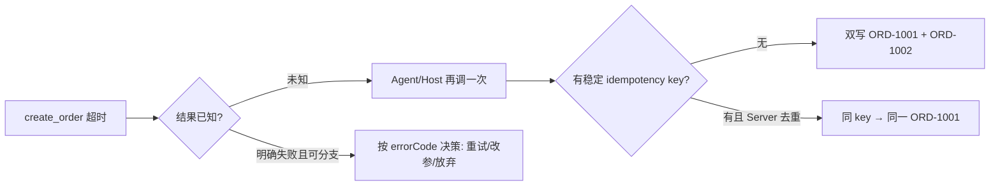

## 1. 问题现象 (Problem Symptoms)

上一篇工具面讲过现象 C：`create_order` 超时，模型分不清「已落库但响应丢了」和「根本没写成功」，再调一次就双写。评估面也提过：空转重试在终答绿灯下仍可能把副作用放大。本文只钉**写路径重试语义**——不是 Temporal / checkpoint 教程，也不是 durable execution 全景；那些是进程死亡与工作流历史那一层。这里是：**MCP / 工具调用在 timeout 之后，凭什么敢重试，而不变成 side effect amplifier**。

生产里我们反复看到同一类事故：Host 或 Agent 对写工具做「看起来合理」的自动重试，账本、订单、邮件、扣款各多一份。

### 现象 A：超时后二次 `create`——双写

Agent 调 `create_order({ sku: "SKU-9", qty: 2 })`。上游已落库 `ORD-1001`，回包在网关 / Host 超时。模型上下文里只剩一句 stringified `timeout` / `500`。下一轮它换了（或没换）参数再调一次 → `ORD-1002`。用户看见两张单；库存扣两次；对账对不上。

关键点：**timeout 不是「没发生」的证明**。它只是「你没在约定时间内拿到结果」。在分布式系统里这是 at-least-once 与「未知结果」的经典窗口；Agent 把「未知」当成「失败」再 create，就会把窗口变成双写。

### 现象 B：错误不可分支——一律盲重试

工具返回 `isError: true`，文案是 `"Error 500"` 或 `"failed"`。模型（或 Host 的通用 retry 中间件）对所有错误一视同仁：sleep → 再调。`validation_failed` 被重试（浪费）；`rate_limit_exceeded` 被立刻重试（更糟）；`request_timeout` 被换成新参数重试（双写）。没有稳定 `errorCode`，重试策略无法分支。

### 现象 C：`idempotentHint: true` 被当成幂等实现

工具在 `annotations` 里标了 `idempotentHint: true`。Host 放心自动重试；Server 侧却没有 idempotency key 存储，也没有「同 key 返回同一资源」的去重。Annotation 是**提示**，不是 enforcement。把 hint 当 ACL / 当幂等保证，是上一篇已经写过的边界误用——在写路径上会直接变成生产事故。



---

## 2. 根因分析 (Root Cause Analysis)

双写不是「模型太急」，而是三层契约同时缺席：

| 缺失层 | 表现 | 后果 |
| --- | --- | --- |
| Schema 契约 | create 无必填 `idempotencyKey`；重试可换 key / 换业务字段 | 每次调用在业务上像「新请求」 |
| 错误契约 | timeout / 5xx / 4xx 糊成一句话；无 `errorCode` + 可行动文案 | 无法区分「安全同 key 重试」vs「改参」vs「停止」 |
| Annotation / Host 契约 | `idempotentHint` 被当成 Server 已实现幂等；或 Host 对非幂等写也盲重试 | 重试放大器挂在不可靠链路上 |

用分布式系统里通行的说法（Stripe / 支付 API 的 Idempotency-Key 惯例同源）：**客户端重试必须携带稳定的幂等键；服务端对同一键在窗口内只产生一次副作用，并返回同一逻辑结果**。Agent 场景只是多了两个放大器：

1. **模型会改参数**——人写的 SDK 重试通常复用同一请求体；LLM 下一轮可能「优化」qty、补一个 note、换一个 clientReference，等于故意换 key。
2. **错误进了自然语言上下文**——stringified 500 没有机器可分支的码，Host 通用 retry 与模型「再试一次」叠在一起。

对照四类 misuse（上一篇）：这里主要是 **Can't recover**——不是选错工具，而是失败后恢复动作本身不安全。

| 失败形态 | 表面信号 | 真实世界状态 | 错误重试 | 正确动作 |
| --- | --- | --- | --- | --- |
| 写成功、响应丢了 | timeout / 连接重置 | 已有 ORD-1001 | 无 key 再 create | **同 key** 再调 → 返回已有单 |
| 写根本没进 | timeout / 上游未达 | 无记录 | 无 key 再 create（碰巧对） | 同 key 再调 → 首次落库 |
| 参数非法 | 4xx / `validation_failed` | 无记录 | 同参盲重试 | **改参**，新 key 或同 key+修正体（按 Server 约定） |
| 限流 | `rate_limit_exceeded` | 未知或未写 | 立刻重试 | 退避后 **同 key** 重试 |
| 业务拒绝（库存不足） | `conflict` / `out_of_stock` | 明确失败 | 换 sku 再 create | 换业务意图；**必须新 key** |

根因收成一句：**把 at-most-once 的愿望，寄托在 at-least-once 的传输上，又不给去重键**。

---

## 3. 机制要点：幂等键、错误码、与 MCP annotations (Mechanism)

### 3.1 Idempotency key：谁生成、谁存储、何时算「同一请求」

约定（与常见 HTTP `Idempotency-Key` 对齐，落到 MCP tool 参数即可）：

1. **Client（Agent / Host）生成**稳定键，并在**语义相同的重试**中原样复用。键建议：`taskId + toolName + intentHash` 或 Host 分配的 UUID；不要每轮让模型「新编一个好听的」。
2. **Server 持久化** `(tenant, toolName, idempotencyKey) → outcome`（成功结果或确定性失败）。窗口期（idempotency window）按业务定（支付常见 24h；内部订单可更短）。
3. **同 key + 同请求体** → 返回首次结果（replay），不再执行副作用。
4. **同 key + 不同请求体** → 显式告知冲突（`idempotency_key_reuse_mismatch`），停下来修Client——要么同 key 原样重放，要么换意图并换 新 key。**不要**静默按新体执行——那是另一种双写 / 错写。
5. **不同 key** → 一律新副作用。模型「再试一次」若换了 key，Server 无法救命。

Agent 特有约束：**键必须进 `inputSchema` 且 required**；description 写明「超时与网络错误时必须复用同一值」。仅靠系统提示「请记得幂等」会在压力下失效。

### 3.2 错误码分支：timeout 不是一种业务失败

上一篇分过 **Protocol Error** vs **Tool Execution Error（`isError: true`）**。写路径上还要在 **Tool Execution Error** 里再分叉——给模型与 Host 中间件看的是稳定码，不是散文：

| `errorCode` | 含义 | 重试策略 | key 策略 |
| --- | --- | --- | --- |
| `request_timeout` / `upstream_unavailable` | 结果**未知** | 可重试 | **必须同 key** |
| `rate_limit_exceeded` | 过载 | 退避后重试 | 同 key |
| `validation_failed` | 形状/语义非法 | 不重试同参 | 改参；通常新 key 或按 Server 文档 |
| `precondition_failed` | 世界状态不对 | 先读再写 | 新意图 → 新 key |
| `conflict` / `out_of_stock` | 明确业务拒绝 | 不盲重试 | 新意图 → 新 key |
| `idempotency_key_reuse_mismatch` | 同 key 异体 | **停止**，修 client | 调查，勿再撞 |

差文案：`"Error 500"`。  
好文案：`"errorCode":"request_timeout","message":"上游未在 8s 内确认。请使用同一 idempotencyKey 重试；勿改 sku/qty。"`

Host 若做自动 retry：只对「未知结果 / 限流」类码重放**同一 `tools/call` 参数**；不要让模型在中间「帮忙改一改」。

### 3.3 MCP `ToolAnnotations`：hint ≠ 实现

规范里 `idempotentHint`（以及 `readOnlyHint` / `destructiveHint` / `openWorldHint`）挂在 **Tool** 对象上，随 `tools/list` 返回；`tools/call` 结果里没有这份结构。规范要求：clients **MUST** 把 annotations 视为 **untrusted**，除非 Server 可信。含义是：

- `idempotentHint: true` → Host **可以**更放心地自动重试 / 少弹确认。
- `idempotentHint: false`（或默认语义下「非幂等写」）→ Host **应当**更谨慎；**仍然**不免除 Server 对真实副作用的去重责任——因为不可信 hint 不能当证明。
- **真正的幂等**是 Server 侧的 key 存储与去重逻辑；annotation 只影响 Host UX 与重试策略的**提示**。

落地建议：

| 工具类型 | `idempotentHint` | Schema | Server |
| --- | --- | --- | --- |
| 纯读 | `true` + `readOnlyHint: true` | 无 key 也可 | 无副作用 |
| 天然幂等写（按 id 覆盖 / void 已 void） | `true` | 资源 id 本身即键 | 按资源态去重 |
| Create / 外发 / 扣款 | `false` | **必填** `idempotencyKey` | 键表 + replay |
| 破坏性一次性 | `destructiveHint: true`；是否 idempotent 看第二次是否 no-op | 视资源而定 | 第二次应安全 no-op 并标 hint 诚实 |

把 create 标成 `idempotentHint: true` 却不做键去重，是**说谎的 annotation**——比不标更危险，因为 Host 会放开重试。

### 3.4 与 durable-agent-execution 的边界（一句划清）

- **本文**：单次（及重试）工具调用的**重试语义与幂等键**——MCP schema、errorCode、annotations。
- **另一层**：进程被杀、HITL 等待、图节点从边界重入——checkpoint / event history / Activity 结果落盘。那一层即使工具有 key，也要处理「节点重跑是否再次 `tools/call`」；但没有工具层幂等，工作流层再厚也挡不住双 create。两层互补，勿写成一篇 Temporal 入门。

---

## 4. BAD / GOOD：`create_order` 超时对照 (BAD / GOOD)

同一任务：创建一笔订单。网络在「已写入、未返回」处断开。

### BAD：无键 + 糊错误 + 暗示可盲重试

```typescript
// ❌ 超时后二次 create = 双写温床
server.tool(
  "create_order",
  "Create an order for the given SKU and quantity.",
  {
    sku: z.string(),
    qty: z.number().int().positive(),
  },
  async ({ sku, qty }) => {
    try {
      const order = await orders.insert({ sku, qty }); // 已提交
      return { content: [{ type: "text", text: JSON.stringify(order) }] };
    } catch (e) {
      // 超时与校验失败长得一样
      return {
        isError: true,
        content: [{ type: "text", text: "Error 500: " + String(e) }],
      };
    }
  },
  // annotations 省略或谎报：
  // { idempotentHint: true }  // 更糟：Host 放心重试
);
```

Agent 行为（常见）：

1. 第一次 call → Host 侧 timeout（Server 可能已 insert）。
2. 模型看到失败 → 再 `create_order({ sku, qty })`（无 key，Server 当新单）。
3. 或 Host 中间件对所有错误自动 retry 一次 → 同样双写。

### GOOD：必填键 + 可分支错误 + 诚实 annotation

```typescript
// ✅ 同 key 重试收敛到同一订单；异体冲突显式失败
server.tool(
  "create_order",
  "Create an order. On timeout or transient failure, retry with the SAME idempotencyKey and body; never mint a new key for the same user intent.",
  {
    sku: z.string().min(1),
    qty: z.number().int().positive(),
    idempotencyKey: z
      .string()
      .min(8)
      .describe("Stable per user intent; retries MUST reuse this value"),
  },
  async ({ sku, qty, idempotencyKey }, ctx) => {
    const tenant = ctx.session.tenantId; // 自会话推导，不信任模型传 tenant
    const existing = await idempo.get(tenant, "create_order", idempotencyKey);
    if (existing) {
      if (!sameBody(existing.request, { sku, qty })) {
        return err("idempotency_key_reuse_mismatch",
          "同一 idempotencyKey 曾用于不同 sku/qty。勿重试；换新 key 仅当业务意图已变。");
      }
      return ok(existing.response); // replay，无新副作用
    }

    try {
      const order = await orders.insert({ sku, qty });
      await idempo.put(tenant, "create_order", idempotencyKey, {
        request: { sku, qty },
        response: order,
      });
      return ok(order);
    } catch (e) {
      if (isTimeout(e) || isUnavailable(e)) {
        // 注意：若不确定 insert 是否成功，不要写入「失败」到 idempo；
        // 让同 key 重试走「查重 / 唯一约束」或事务外的完成探测。
        return err("request_timeout",
          "结果未知。请使用同一 idempotencyKey 与同一 sku/qty 重试。");
      }
      if (isRateLimit(e)) {
        return err("rate_limit_exceeded", "退避后用同一 idempotencyKey 重试。");
      }
      if (isValidation(e)) {
        return err("validation_failed", e.message); // 改参，勿盲重试
      }
      throw e;
    }
  },
);

// tools/list 上的 annotations（与 handler 分开登记）
// annotations: {
//   title: "Create order",
//   readOnlyHint: false,
//   destructiveHint: false,
//   idempotentHint: false, // 无 key 时非幂等；有 key 的「安全重试」是 Server 去重，不是 hint 变魔术
//   openWorldHint: true,
// }
```

说明两点 tradeoff，避免「标了 false 就不能重试」的误解：

1. **`idempotentHint: false`** 表示「随意重放调用不安全」——这逼 Host / 模型走**带同一 key 的受控重试**，而不是「工具天生可随便重放」。键去重使**同键重试**安全；hint 描述的是无键或改键时的默认危险性。若你的 Server 保证「任意重放同参都 no-op」，才可标 `true`，并在文档写清。
2. **超时窗口内「是否已写入」不确定**时：用 DB 唯一约束（业务自然键）或「先占键再写」状态机（`started` → `succeeded`）；不要在不确定失败时把 idempo 记成终态失败，否则同 key 重试会错误地短路。

### Host / Agent 侧重试伪代码

```typescript
// ✅ 只对「未知 / 限流」自动重放同一参数；键由 Host 注入，不让模型每轮新编
async function callCreateOrder(intent: { sku: string; qty: number }, taskId: string) {
  const key = `${taskId}:create_order:${hash(intent)}`;
  const args = { ...intent, idempotencyKey: key };

  for (let attempt = 1; attempt <= 3; attempt++) {
    const result = await mcp.call("create_order", args);
    if (!result.isError) return result;
    const code = result.errorCode;
    if (code === "request_timeout" || code === "upstream_unavailable" || code === "rate_limit_exceeded") {
      await backoff(attempt);
      continue; // 同 args，含同一 key
    }
    // validation / conflict / mismatch → 交回模型改意图，并生成新 key
    return result;
  }
}
```

对照现象 A：BAD 路径两张单；GOOD 路径两次 call、一张单（第二次 replay）。

---

## 5. 发版前清单 (Pre-Ship Checklist)

上线任何一个**非只读** MCP 工具前，过一遍写路径幂等：

**Schema**

- [ ] Create / 扣款 / 外发类工具：`idempotencyKey`（或等价字段）为 **required**
- [ ] description 写明：超时与 transient 错误时**复用**同一 key 与同一业务体
- [ ] 禁止只靠 prompt 约定键；键要进 schema，最好由 Host 注入

**Server**

- [ ] `(tenant, tool, key) → outcome` 持久化在主库（PostgreSQL 等）；同 key 同体 → replay
- [ ] 窗口用 `expires_at`（或 Redis TTL）覆盖「超时后仍会重试」的时间，且与业务一致
- [ ] 同 key 异体 → `idempotency_key_reuse_mismatch`，不静默覆盖
- [ ] 超时不确定时不把「失败」写成幂等终态；配合唯一约束或占键状态机
- [ ] 鉴权与租户从会话来，不信任模型传 `tenantId`

**错误可分支**

- [ ] `request_timeout` / `upstream_unavailable` / `rate_limit_exceeded` / `validation_failed` / `precondition_failed` / `conflict` / `idempotency_key_reuse_mismatch` 稳定可解析
- [ ] 文案可行动：何时同 key 重试、何时改参、何时停止
- [ ] 区分 Protocol Error（进不了工具）与 `isError`（工具已执行/已受理）

**Annotations**

- [ ] `idempotentHint` 与真实去重能力一致；无键 create 标 `true` 视为缺陷
- [ ] `destructiveHint` / `readOnlyHint` 诚实；clients 视 annotations 为 untrusted
- [ ] Host 自动重试白名单只覆盖「未知结果 / 限流」，且**锁定参数字节级相同**

**与评估 / 观测交叉**

- [ ] Trace 里能看到 key（可脱敏）与是否 replay，便于抓双写与假重试
- [ ] Trajectory 断言：禁区写次数、同 intent 多 key 的尖刺（评估面另一篇）

---

## 6. 小结 (Takeaways)

超时之后敢重试的唯一底气，不是「再试一次运气」，而是 **同键去重 + 可分支错误码 + 诚实的 annotation 边界**。

- **Timeout = 结果未知**，不是「未写入」；无键二次 create 是双写的标准配方。
- **Idempotency key** 必须进 schema、由 Client/Host 稳定复用、由 Server 在主库持久化 replay；同键异体要显式冲突。窗口表不是队列。
- **错误码分支**决定「同键重试 / 改参 / 停止」；stringified 500 让 Host 与模型一起盲撞。
- **`idempotentHint` 是 Host 提示，不是幂等实现**；说谎的 hint 比没有更危险。
- 与 **durable execution** 不同层：本文管工具重试语义；进程死亡与节点重入是另一篇文章——两边都要，但不要合并成框架选购清单。

系列上：工具面挤掉「合法但错误」；评估面挤掉「答对但路径烂」；本文挤掉「超时后双写」。下一坑可转向长程归因（第一个错 ≠ 决定性错误）或 checkpoint ≠ durable execution——都与写副作用有关，但杠杆不同。

---

## 参考 (References)

1. Model Context Protocol — [Tools (specification 2025-06-18)](https://modelcontextprotocol.io/specification/2025-06-18/server/tools)；[schema：`Tool` / `ToolAnnotations`](https://modelcontextprotocol.io/specification/2025-06-18/schema#toolannotations). `idempotentHint` 等 annotations 为 untrusted hints；与 `tools/list` 同级返回。
2. 本站 — [MCP 工具设计：为什么 Agent 总发出「合法但错误」的调用](posts/mcp_tool_design_valid_but_wrong.md) 现象 C（超时重试双写）与 annotations 边界。
3. 本站 — [Trajectory Eval：答对了为什么还是假绿](posts/trajectory_eval_false_green.md)（路径上的重试与副作用需进评估门）。
4. Stripe Docs — [Idempotent requests](https://docs.stripe.com/api/idempotent_requests)（Idempotency-Key：同键同体 replay、同键异体冲突；分布式写重试惯例，非 MCP 专有）。
5. berthelius (Frihet) — [Designing MCP tools an agent won't misuse](https://dev.to/frihet/designing-mcp-tools-an-agent-wont-misuse-1ah1)（Can't recover / typed errors / annotations 与 enforcement 分工）。
