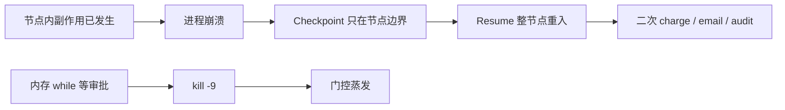

## 1. 问题现象 (Problem Symptoms)

系列前几篇分别钉工具面、评估面、写路径幂等与过程归因。长跑编排还有一层更容易被「看起来绿了」的演示骗过去——**执行持久化层**：接了 checkpointer、手动 restart 后 thread 还能继续，就以为 Agent 已经抗杀进程。它没有。Checkpoint 回答的是「能不能从上次图状态接着跑」；Durable Execution 回答的是「崩溃、重试、多日审批之后，副作用是否仍只生效一次、门控是否还在」。两问不同，混称「已经 durable」是生产里双扣款 / 双发邮件的标准配方。

与 [Agent 写操作的幂等：超时之后凭什么敢重试](posts/agent_write_idempotency.md) 只交叉一句：**那篇管 MCP / 工具调用的重试语义与幂等键；本文管进程死亡、节点重入与工作流事件历史。** 两层都要，勿合并成一篇框架选购清单。

### 现象 A：Postgres checkpointer「看起来活了」——二次 charge

值班验收「看起来合理」：

```python
from langgraph.checkpoint.postgres import PostgresSaver

with PostgresSaver.from_conn_string(DB_URL) as checkpointer:
    checkpointer.setup()  # 首次建表
    graph = builder.compile(checkpointer=checkpointer)

config = {"configurable": {"thread_id": "refund-job-42"}}  # 必须稳定；换 ID = 新 thread


def charge_card(state):
    charge(state["payment_id"])   # 副作用在 return 前
    # kill 落在这里：节点未 return → 没有「已扣款」快照
    return {"charged": True}


graph.invoke({"payment_id": "pay_1"}, config)  # 跑到 charge_card 中途 kill
graph.invoke(None, config)                    # 新进程、同一 thread_id：图「继续了」
```

Checkpoint 只在 **super-step / 节点边界** 落盘；半截节点没有快照。Resume 时 `charge_card` **从函数开头重入** → `charge()` 再打一次。Demo 测的是「thread 能接着」；没测「节点内副作用是否只发生一次」。这不是「你没用对 Saver」，是恢复粒度就是节点边界。

### 现象 B：`interrupt()` 前写审计——审批回来日志翻倍

HITL 节点「看起来合理」：

```python
def approval_node(state):
    audit_id = db.create_audit_log(...)   # 副作用在 interrupt 前
    approved = interrupt({"action": "refund", "amount": state["amount"]})
    if approved:
        refund(...)
    return {"approved": approved}
```

LangGraph 官方规则写得很直：resume 时 **从含 `interrupt` 的节点开头重跑**，`interrupt` 之前的代码会再执行一遍。非幂等的 `create_audit_log` / `send_notification` 于是翻倍。这不是「你没用对 checkpointer」，是恢复粒度就是节点边界。

### 现象 C：进程内 flag 等审批——`kill -9` 后门控蒸发

```python
# ❌ 门控活在进程内存里
approved = False
while not approved:
    time.sleep(1)  # 或 asyncio.Event / 线程 flag
# 然后执行危险工具
```

Redeploy、OOM、`kill -9`：等待循环没了，审批状态也没了。结果二选一都糟——要么重跑危险动作且不再问人，要么工作蒸发、无人知情。事件源运行时的对照很干脆：先落盘 `ToolApprovalRequired`（或等价事件），再停工；parked 状态就是日志本身，杀进程碰不到它。



---

## 2. 根因分析 (Root Cause Analysis)

根因不是「没选对某个框架品牌」，而是 **把三种不同保证叠成了一个词「能 resume」**：

| 层 | 实际保证 | 不保证什么 | 典型误判 |
| --- | --- | --- | --- |
| (1) 图状态快照（Checkpointer） | 在 **super-step / 节点边界** 持久化 channel 状态；同 `thread_id` 可接着跑 | 节点中途崩溃后「从半截行继续」；副作用自动去重；崩溃自动被发现并拉起 | 「PostgresSaver = crash-proof」 |
| (2) 事件历史回放（Workflow Event History） | 每步/Activity 结果进历史；恢复时回放代码，已完成 Activity **返回已落盘结果**而非重调 | 无 Activity 边界的「任意 Python 行」精确续跑（仍要你划边界） | 把 checkpointer 当成 Event History |
| (3) 工具层幂等键 | 同 key 重试收敛到同一业务结果 | 节点重入是否再次发起 `tools/call`；HITL 门控是否存活 | 「工具有 key 了，编排层随便重跑」 |

三句话收束：

1. **Checkpoint 保的是边界之间的图状态，不是节点内部的执行游标。** LangGraph 文档对 interrupt 的规则与 durable-execution 讨论一致：assume nodes re-execute on resume。
2. **`durability` 模式与 Saver 类型决定「有没有中途可恢复的点」，不决定「重入是否安全」。** `exit`：仅在图退出（成功 / 错 / interrupt）时持久化——**无中途崩溃恢复**；`async`：异步写，崩溃窗口仍可能丢最近 checkpoint；`sync`：下一步前同步落盘，一致性最好、仍按节点边界恢复。`InMemorySaver` 进程一死，连边界快照都没了。
3. **HITL 若只是进程内等待，门控与「工作是否还在」绑定在同一生命周期。** Temporal Approval 模式用 Signal + `wait_condition` / `workflow.wait_condition`：等待期 **不占 Worker 算力**；审批数据进 Workflow History，天然可审计。JamJet 一类事件源把 `ToolApprovalRequired` 落盘后再 settle——杀进程碰不到 parked 状态。

并发还有第四刀（常被单机 demo 藏住）：checkpointer 按 `thread_id` 取状态，**不自带「同 thread 只能被一个 worker resume」的租约**。分布式恢复时两个进程同时 `invoke` 同一 `thread_id`，重复副作用再次放大——这是编排协调问题，不是再换一个更贵的 Postgres 能单独解决的。

与本系列其他文的边界：

| 文章 | 层 | 问的是 |
| --- | --- | --- |
| [MCP 工具设计：为什么 Agent 总发出「合法但错误」的调用](posts/mcp_tool_design_valid_but_wrong.md) | 工具面 | schema 绿灯、业务错 |
| [Trajectory Eval：答对了为什么还是假绿](posts/trajectory_eval_false_green.md) | 评估面 | 终答对、路径烂 |
| [Agent 写操作的幂等：超时之后凭什么敢重试](posts/agent_write_idempotency.md) | 运行时写语义 | 超时后敢不敢重试 |
| [长程 Agent：第一个错 ≠ 决定性错误](posts/long_horizon_decisive_error.md) | 过程归因 | 失败后该修哪一步 |
| **本文** | **执行持久化** | 进程死后门控与副作用是否仍正确 |

---

## 3. 机制要点：三层边界与 HITL 等待 (Mechanism)

### 3.1 LangGraph：恢复粒度 = 节点 / super-step 边界

Checkpointer 在每个 super-step 提交完整 `StateSnapshot`；同一 super-step 内成功节点的 pending writes 可避免「兄弟节点」整段重算，但 **正在执行、尚未返回的那个节点** 仍会从函数入口重跑。`interrupt()` 靠特殊异常把执行挂起并持久化；resume 时 runtime **重启整个节点**，不是从 `interrupt` 那一行的下一字节继续。

因此官方 interrupt 规则里有一条生产向硬约束：**`interrupt` 之前的副作用必须幂等，或把副作用挪到 `interrupt` 之后 / 独立节点 / `@task`。** `@task` 把非幂等调用的结果记下来，回放时返回缓存值而不是再打外部 API——这是框架内缩小「节点重入」窗口的杠杆，不是把 checkpointer 变成 Event History。

### 3.2 `durability`：`exit` | `async` | `sync`

`compile(checkpointer=...)` 决定快照**写到哪**（Postgres / 内存）。`durability` 是 **`invoke` / `stream` 的参数**，决定快照**何时写**。两者缺一，跨进程 resume 都不成立。它不改变 3.1 的恢复粒度：任何模式下，正在跑、尚未 `return` 的那个节点都没有行级游标。

用第 4 节那张三节点图，人已经批过、一次 `invoke` 连续往前跑：`approval_node`（立刻 return）→ `audit_and_notify_node` → `refund_node`。在 `refund_node` 里 `charge_refund()` 已发生、尚未 `return` 时 `kill`：

| 模式 | 何时落盘 | 这次 kill 之后库里有什么 | 再 `invoke(None)` |
| --- | --- | --- | --- |
| `exit` | **整张图退出**时才写（成功 / 抛错 / `interrupt` 挂起）。节点与节点之间不写 | 往往还停在更早的快照（例如上次 interrupt）。`audit` 已成功那一步可能没落盘 | 可能把 **audit + refund 整段再跑**；中途崩溃 **不能**从「下一个节点」恢复 |
| `async` | 下一步已经开始跑，同时**异步**写上一边界 | 多数时候有「下一步 = refund」；崩溃窗口里可能丢掉最近一次边界 | 通常只重跑 `refund_node`；小窗口下会像 `exit` 一样倒退 |
| `sync` | **下一步开始前**同步写完当前边界 | 「`audit` 已完成、下一步 `refund`」一定在盘上（只要 `audit` 已 return） | 只重跑 `refund_node`；`charge_refund` 仍可能再执行一遍——所以还要幂等键（3.1 / 3.4） |

`interrupt` 本身算图退出，所以 **`exit` 也能保住「等人批」的挂起**；值班用 `exit` 演示 HITL resume，看起来也是绿的。假绿在后半段：审批回来之后的多节点冲刺，`exit` 不在节点之间落盘，发布流水线中途 `kill` 就会倒退整段。长跑生产要中途可恢复时用 `sync`（或接受 `async` 的小窗口），不要默认 `exit`，也不要用 `InMemorySaver`（进程一死连库都没有）。

官方说明见 [Checkpointers · Durability modes](https://docs.langchain.com/oss/python/langgraph/checkpointers)。

### 3.3 Temporal / 事件源：Activity 结果进历史；Approval = Signal

Durable Execution 引擎把「已发生的步骤」记进 **Workflow Event History**。恢复时回放 Workflow 代码：已完成的 Activity 从历史取结果，不重调；未完成的再调度。代价是 Workflow 侧要保持确定性——LLM / HTTP / 工具调用进 Activity（或等价边界）。

HITL 对照（机制，不是入门教程）：

- Temporal Approval：`@workflow.signal` 写入审批数据 → `workflow.wait_condition(...)` 阻塞；等待 **零算力**；决策进历史，可 Query 状态。
- 事件源门控：先 append `ToolApprovalRequired`，worker settle 后离开；approve 后再走正常调度——`kill -9` 杀的是进程，不是事件日志。

一句话：**门控必须先成为持久化事实，再允许进程消失。**

### 3.4 对照表（写进设计评审）

| 维度 | Checkpointer（图快照） | Event History / Durable Runtime | 工具层幂等键 |
| --- | --- | --- | --- |
| 恢复粒度 | 节点 / super-step 边界；含 interrupt 的节点从头重跑 | Activity（或事件）边界；已完成步骤回放结果 | 单次（及重试）`tools/call` |
| 副作用去重谁负责 | 你：`@task` / 幂等节点 / 副作用放 interrupt 后 | 运行时对已记录 Activity 不重执行；业务仍建议 Activity 幂等 | Server 键表 replay |
| 并发 resume 同 `thread_id` | 无内置租约；需自建锁 / 外置编排 | 运行时协调，避免双 worker 抢同一 run | 不解决编排并发 |
| 多日 HITL 是否占 Worker | 进程内 wait → 占着或一杀就丢 | Signal / 事件停工 → **不占算力** | 无关 |
| 确定性约束 | 节点逻辑无强制确定性（但重入会放大非幂等） | Workflow 必须确定性；非确定进 Activity | 键稳定复用 |

第 4 节按这张表走同一笔退款：先写生产里怎么接，再写这条链上的错法、改法，以及死在 `send_email` 时 `exit` / `sync` / Activity 各留下什么。

---

## 4. 同一笔退款：怎么接、错在哪、改完怎么走

贯穿全文的都是这一单：`thread_id="refund-job-42"`，`payment_id="pay_1"`，金额 80。链路：Agent 起草 → 人在页面上批准（可隔夜，发布会杀进程）→ 审计 / Slack → 冲正 → 确认邮件。现象 A / B / C 和第 3 节的 3.1–3.4 都标在这条链上。

生产里常见的接法是：**LangGraph 管这张图，审批是图外面的另一次 HTTP 调用。** 多日等待靠 `interrupt` 把快照写入 Postgres，进程可以退出。Temporal 不是这条链的默认运行时；它出现在 4.4，专门解决「`refund_node` 里面记不住扣款已经成功」。

### 4.1 常见接法

图只有三个 super-step：`approval_node → audit_and_notify_node → refund_node`。`charge_refund()` 和 `send_email()` 是最后一个节点里的两行，不是两个节点。

```python
from langgraph.types import Command

config = {"configurable": {"thread_id": "refund-job-42"}}

# 发起退款。跑到 interrupt 就返回，把待批内容留给页面
graph.invoke({"payment_id": "pay_1", "amount": 80}, config, durability="sync")
pending = graph.get_state(config).interrupts

# 人点「批准」时，审批接口用同一 thread 再调一次。图里没有 hook
graph.invoke(Command(resume=True), config, durability="sync")
```

第一次调用停在 `approval_node`。第二次调用从该节点开头再进，`interrupt()` 拿到 `True` 后，**同一次调用**继续审计和冲正，直到 `END`。节点 `return` 的 `approved`、`status` 由 LangGraph 合并进 `StateSnapshot.values`，不是框架自带字段。

### 4.2 这条链上容易写错的样子

下面仍是 `pay_1`，只是把等待、审计、扣款塞进一个函数，并用 `durability="exit"`。

```python
def refund_job(state):
    db.create_audit_log(...)          # B / 3.1：interrupt 前的写，resume 会再做一遍
    notify_slack(...)
    approved = interrupt({...})
    if approved:
        charge_refund(...)             # A / 3.1：和门控同一节点，死在 return 前整段重入
        send_email(...)                # 3.4：没有幂等键
    return {"approved": approved}

while not human_flag:                  # C / 3.3：门控在进程内存里
    time.sleep(1)
graph.invoke({"payment_id": "pay_1", "amount": 80}, config, durability="exit")
```

`while` 一被 `kill`，审批蒸发（现象 C）。改成只靠 `interrupt` 再 resume，审计和 Slack 翻倍（现象 B）。扣款若发生在 `return` 之前，再扣一次（现象 A）。`exit` 只在图退出时写盘（3.2）：停在 `interrupt` 看起能恢复，人批完后的这段节点之间没有快照。

### 4.3 同一条链改完

改三处，单还是 `pay_1`，存储还是 Postgres checkpointer。

| 相对 4.2 | 为什么 | 现象 / 机制 |
| --- | --- | --- |
| 删掉 `while`，只留 `interrupt` | 审批在快照里，杀进程杀不到门控 | C / 3.3 |
| 审计和 Slack 挪到 `interrupt` 之后的节点，用 upsert | resume 仍会重跑含 `interrupt` 的节点，但那段已经没有副作用 | B / 3.1、3.4 |
| 扣款和发信放进 `refund_node`，调用带幂等键；人批完这次 `invoke` 用 `sync` | 崩溃只重跑这一个节点；两行仍会一起再执行，靠 key 收成一笔 | A / 3.1、3.2、3.4 |

```python
def approval_node(state):
    decision = interrupt({"payment_id": state["payment_id"], "amount": state["amount"]})
    return {"approved": bool(decision)}          # 写入 values["approved"]

def audit_and_notify_node(state):
    if not state["approved"]:
        return {"status": "rejected"}
    db.upsert_audit(payment_id=state["payment_id"], action="refund_approved")
    notify_slack_once(key=f"refund:{state['payment_id']}")
    return {"status": "audited"}                 # 写入 values["status"]

def refund_node(state):
    if state["status"] != "audited":
        return state
    key = f"{state['thread_id']}:{state['payment_id']}"
    charge_refund(state["payment_id"], state["amount"], idempotency_key=f"{key}:refund")
    send_email(..., idempotency_key=f"{key}:email")   # 与上一行同一个 super-step
    return {"status": "done"}

builder.add_edge(START, "approval_node")
builder.add_edge("approval_node", "audit_and_notify_node")
builder.add_edge("audit_and_notify_node", "refund_node")
builder.add_edge("refund_node", END)
graph = builder.compile(checkpointer=postgres_saver)  # 快照按 thread_id 写入 Postgres
```

`compile(checkpointer=...)` 只负责快照写到哪。它不记录节点内部执行到哪一行。

### 4.4 两个崩溃点

都用 4.3 的图。`async` 和 `sync` 一样在节点之间写，但写完前被杀会丢掉最近一张快照，退款这条后半段不要用它。

**停在 `interrupt`，人还没批。** 第一次 `invoke` 已经返回。`exit` 和 `sync` 都会留下快照：`next` 是 `approval_node`。进程杀掉不影响等待。人点批准必须再调 `Command(resume=True)`，图里不会自己继续。

**审计已 `return`，`charge_refund()` 已返回，死在 `send_email()`。** 这发生在人批完的那一次调用里。

| | 库里最新快照 | 下一步调用 |
| --- | --- | --- |
| `exit` | 仍是「停在 `interrupt`」。`approved` 和 `status` 都没写上 | 再送 `Command(resume=True)`，三个节点再跑；扣款靠幂等键 |
| `sync` | `status="audited"`，`next` 是 `refund_node` | `invoke(None, config)` 只重跑 `refund_node`。扣款和发信都从第一行再执行 |

`sync` 记住的是「`refund_node` 还没 `return`」，不是「扣款已经成功」。要让死在发信时不再打支付网关，得把两次调用拆成两条完成记录。那是另一套运行时，不是把 `durability` 再调严一点：

```python
await workflow.wait_condition(lambda: self.approved is not None)          # 对应 interrupt
await workflow.execute_activity(charge_refund, args=["pay_1", 80])        # 完成后写入 History
await workflow.execute_activity(send_email, args=["pay_1"])                # kill 在这里：只重调度发信
```

两次调用若仍写在同一个 Activity 里，就退回 `refund_node`：没有完成事件，扣款还会再调度。

多日审批用 4.3 就够：等人的是快照，不是 Worker。要换 Temporal（或 SAP 一类流程引擎）当外层，是因为已完成的扣款不能重放，或者多个 Worker 会同时 resume 同一个 `thread_id`。Agent 图缩成外层里的一步「起草这 80 元」；批准和过账不要留在 `refund_node` 里面。

---

## 5. 发版前清单：对准崩溃注入点 (Pre-Ship Checklist)

对照第 4 节的两个崩溃点（停在 `interrupt`，以及死在 `send_email`）用注入而不是演示证明：

**恢复粒度**

- [ ] 团队口头能区分：checkpoint（节点边界）≠ Event History（步骤/Activity 回放）≠ 工具幂等键
- [ ] 文档写明：resume / interrupt 恢复时，**哪个函数会从头再跑**
- [ ] 含 `interrupt` 的节点：`interrupt` 前无非幂等写；或已拆到后续节点 / `@task`

**Durability 与存储**

- [ ] 生产不是 `InMemorySaver`
- [ ] 需要中途崩溃恢复时，不用 `durability="exit"`；明确 `async` 窗口或改用 `sync`
- [ ] 测过：节点中段 `kill -9` 后 resume，外部副作用次数 = 1（charge / email / audit）

**HITL 门控**

- [ ] 审批状态不活在进程内存 `while` / `Event` / 线程 flag
- [ ] 门控先持久化（checkpointer interrupt 快照 / Signal 进 History / `ToolApprovalRequired` 事件）再允许 worker 消失
- [ ] 多日等待不长期占满 Worker 线程；超时与升级路径有定义

**并发与幂等**

- [ ] 同 `thread_id` 并发 resume：有锁、租约或外置编排；单测/演练过双 worker
- [ ] 危险工具仍带稳定 idempotency key（交叉：[写操作幂等](posts/agent_write_idempotency.md)）——编排层正确 ≠ 可删工具层
- [ ] 审计日志用 upsert / 自然键，禁止「每次进入节点 insert 一条」

**崩溃注入（合并门建议）**

- [ ] 注入点 A：副作用已调用、节点未 return
- [ ] 注入点 B：`interrupt` 已触发、审批未返回时杀进程
- [ ] 注入点 C：审批返回瞬间杀进程（resume 重入窗口）
- [ ] 注入点 D：两个 worker 同时 resume 同一 `thread_id`
- [ ] 断言：外部 mock 上 charge/email/audit **恰好一次**；门控仍在或明确失败关闭

---

## 6. 小结 (Takeaways)

**能 resume 的图 ≠ 扛得住杀进程的执行。** Checkpoint 是边界上的状态快照；Durable Execution 是「历史里已经发生的步骤不会在恢复时再对世界做一遍」，外加门控与调度的生命周期。

- LangGraph：resume / `interrupt` **从节点开头重跑**；`interrupt` 前副作用必须幂等或后移；`durability=exit|async|sync` 与 `InMemorySaver` 决定有没有中途可恢复点。
- 三层分工：图快照管 thread 状态；Event History / Activity 管步骤级回放；工具幂等键管单次写重试——[幂等文](posts/agent_write_idempotency.md)是第 3 层，本文是第 1↔2 层。
- 多日审批：`interrupt` 把门控写入快照即可，进程不用空等。已完成的扣款不能重放、或多 Worker 抢同一 `thread_id` 时，外层改用 Event History（第 4.4 节）。
- 发版证明靠崩溃注入，不靠「手动 restart 看起来活了」的 demo。

系列位置：工具面 → 评估假绿 → 写路径幂等 → 过程归因 → **执行持久化（本文）**。下一坑可转向多 agent 交接的状态所有权，或 discovery 层的工具渐进暴露——都与「生产里到底保证了什么」有关，但杠杆不同。

---

## 参考 (References)

1. LangChain Docs — [Interrupts](https://docs.langchain.com/oss/python/langgraph/interrupts)（resume 从含 `interrupt` 的节点开头重跑；`interrupt` 前副作用须幂等或置于其后 / 独立节点）。
2. LangChain Docs — [Checkpointers](https://docs.langchain.com/oss/python/langgraph/checkpointers)（super-step 边界快照；`durability`：`exit` / `async` / `sync`；`exit` 无中途崩溃恢复）。
3. LangChain Docs — [Add memory](https://docs.langchain.com/oss/python/langgraph/add-memory)（`PostgresSaver.from_conn_string` + 首次 `setup()`；生产用数据库 checkpointer）。
4. LangChain Docs — [Time travel](https://docs.langchain.com/oss/python/langgraph/use-time-travel)（`graph.invoke(None, config)` 从该 thread 最新 / 指定 checkpoint 继续）。
5. LangChain Docs — [Persistence](https://docs.langchain.com/oss/python/langgraph/persistence)（`InMemorySaver` 重启即丢；`thread_id` 建议不超过 255 字符）。
6. Temporal Docs — [Durable AI](https://docs.temporal.io/ai)（Durable Execution 与 Approval / Entity 模式入口）。
7. Temporal Docs — [Approval pattern](https://docs.temporal.io/design-patterns/approval)（Signal + `wait_condition`；审批数据进 Workflow History）。
8. Temporal Docs — [Human-in-the-loop AI agent (Python cookbook)](https://docs.temporal.io/ai-cookbook/human-in-the-loop-python)（Signal 审批；等待期不占算力；durable timer）。
9. Temporal Learn — [Durable AI agent tutorial](https://learn.temporal.io/tutorials/ai/durable-ai-agent/)（Activity 结果进入 Event History 的机制引用）。
10. Dex Mareno / dreaming.press — [LangGraph Checkpointing vs Temporal: Why Checkpoints Aren't Durable Execution](https://dreaming.press/posts/langgraph-checkpointing-vs-temporal-durable-execution.html)（节点边界 vs Activity；并发 resume；`@task` / `durability="sync"`）。
11. Yaron Schneider (Diagrid) — [Checkpoints Are Not Durable Execution](https://www.diagrid.io/blog/checkpoints-are-not-durable-execution-why-langgraph-crewai-google-adk-and-others-fall-short-for-production-agent-workflows)（无自动失败检测/恢复；同 `thread_id` 并发无内置协调）。
12. Render — [Human-in-the-loop without the hacks](https://render.com/articles/human-in-the-loop-without-the-hacks-pausing-an-agent-mid-run-for-approval-workfl)（内存等待失败面；resume-as-restart 讨论）。
13. JamJet — [Approvals That Survive kill -9](https://jamjet.dev/blog/approvals-that-survive-kill-9/)（`ToolApprovalRequired` 事件化后再停工）。
14. Zylos Research — [Durable execution for agent runtimes](https://zylos.ai/research/2026-04-24-durable-execution-agent-runtimes/)（会话记忆 ≠ durable execution；journal + 故意 crash 测试）。
15. 本站 — [Agent 写操作的幂等：超时之后凭什么敢重试](posts/agent_write_idempotency.md)（工具层幂等键；与本文执行持久化层分工）。
