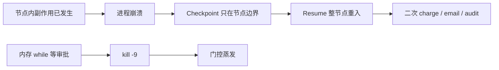

## 1. 问题现象 (Problem Symptoms)

系列前几篇分别钉工具面、评估面、写路径幂等与过程归因。长跑编排还有一层更容易被「看起来绿了」的演示骗过去——**执行持久化层**：接了 checkpointer、手动 restart 后 thread 还能继续，就以为 Agent 已经抗杀进程。它没有。Checkpoint 回答的是「能不能从上次图状态接着跑」；Durable Execution 回答的是「崩溃、重试、多日审批之后，副作用是否仍只生效一次、门控是否还在」。两问不同，混称「已经 durable」是生产里双扣款 / 双发邮件的标准配方。

与 [Agent 写操作的幂等：超时之后凭什么敢重试](posts/agent_write_idempotency.md) 只交叉一句：**那篇管 MCP / 工具调用的重试语义与幂等键；本文管进程死亡、节点重入与工作流事件历史。** 两层都要，勿合并成一篇框架选购清单。

### 现象 A：Postgres checkpointer「看起来活了」——二次 charge

你按文档接上 `PostgresSaver`，`thread_id` 稳定。演示：跑到扣款节点中途 `kill` 进程 → 重启 → `invoke(None, config)` → 图「继续了」。值班同学拍板：已经 crash-proof。

真实世界：节点里先 `charge_card()` 成功，再写审计、再 return 状态。崩溃落在「已扣款、未返回」窗口。Checkpoint 只在 **super-step / 节点边界** 落盘；半截节点没有快照。Resume 整节点从开头重入 → 再扣一次。Demo 测的是「thread 能接着」；没测「节点内副作用是否只发生一次」。

### 现象 B：`interrupt()` 前写审计——审批回来日志翻倍

HITL 节点「看起来合理」：

```python
def approval_node(state):
    audit_id = db.create_audit_log(...)   # 副作用在 interrupt 前
    approved = interrupt({"action": "refund", "amount": state["amount"]})
    if approved:
        refund(...)
    return {"approved": approved}
```

LangGraph 官方规则写得很直：resume 时 **从含 `interrupt` 的节点开头重跑**，`interrupt` 之前的代码会再执行一遍。非幂等的 `create_audit_log` / `send_notification` 于是翻倍。这不是「你没用对 checkpointer」，是恢复粒度就是节点边界。

### 现象 C：进程内 flag 等审批——`kill -9` 后门控蒸发

```python
# ❌ 门控活在进程内存里
approved = False
while not approved:
    time.sleep(1)  # 或 asyncio.Event / 线程 flag
# 然后执行危险工具
```

Redeploy、OOM、`kill -9`：等待循环没了，审批状态也没了。结果二选一都糟——要么重跑危险动作且不再问人，要么工作蒸发、无人知情。事件源运行时的对照很干脆：先落盘 `ToolApprovalRequired`（或等价事件），再停工；parked 状态就是日志本身，杀进程碰不到它。



---

## 2. 根因分析 (Root Cause Analysis)

根因不是「没选对某个框架品牌」，而是 **把三种不同保证叠成了一个词「能 resume」**：

| 层 | 实际保证 | 不保证什么 | 典型误判 |
| --- | --- | --- | --- |
| (1) 图状态快照（Checkpointer） | 在 **super-step / 节点边界** 持久化 channel 状态；同 `thread_id` 可接着跑 | 节点中途崩溃后「从半截行继续」；副作用自动去重；崩溃自动被发现并拉起 | 「PostgresSaver = crash-proof」 |
| (2) 事件历史回放（Workflow Event History） | 每步/Activity 结果进历史；恢复时回放代码，已完成 Activity **返回已落盘结果**而非重调 | 无 Activity 边界的「任意 Python 行」精确续跑（仍要你划边界） | 把 checkpointer 当成 Event History |
| (3) 工具层幂等键 | 同 key 重试收敛到同一业务结果 | 节点重入是否再次发起 `tools/call`；HITL 门控是否存活 | 「工具有 key 了，编排层随便重跑」 |

三句话收束：

1. **Checkpoint 保的是边界之间的图状态，不是节点内部的执行游标。** LangGraph 文档对 interrupt 的规则与 durable-execution 讨论一致：assume nodes re-execute on resume。
2. **`durability` 模式与 Saver 类型决定「有没有中途可恢复的点」，不决定「重入是否安全」。** `exit`：仅在图退出（成功 / 错 / interrupt）时持久化——**无中途崩溃恢复**；`async`：异步写，崩溃窗口仍可能丢最近 checkpoint；`sync`：下一步前同步落盘，一致性最好、仍按节点边界恢复。`InMemorySaver` 进程一死，连边界快照都没了。
3. **HITL 若只是进程内等待，门控与「工作是否还在」绑定在同一生命周期。** Temporal Approval 模式用 Signal + `wait_condition` / `workflow.wait_condition`：等待期 **不占 Worker 算力**；审批数据进 Workflow History，天然可审计。JamJet 一类事件源把 `ToolApprovalRequired` 落盘后再 settle——杀进程碰不到 parked 状态。

并发还有第四刀（常被单机 demo 藏住）：checkpointer 按 `thread_id` 取状态，**不自带「同 thread 只能被一个 worker resume」的租约**。分布式恢复时两个进程同时 `invoke` 同一 `thread_id`，重复副作用再次放大——这是编排协调问题，不是再换一个更贵的 Postgres 能单独解决的。

与本系列其他文的边界：

| 文章 | 层 | 问的是 |
| --- | --- | --- |
| [MCP 工具设计：为什么 Agent 总发出「合法但错误」的调用](posts/mcp_tool_design_valid_but_wrong.md) | 工具面 | schema 绿灯、业务错 |
| [Trajectory Eval：答对了为什么还是假绿](posts/trajectory_eval_false_green.md) | 评估面 | 终答对、路径烂 |
| [Agent 写操作的幂等：超时之后凭什么敢重试](posts/agent_write_idempotency.md) | 运行时写语义 | 超时后敢不敢重试 |
| [长程 Agent：第一个错 ≠ 决定性错误](posts/long_horizon_decisive_error.md) | 过程归因 | 失败后该修哪一步 |
| **本文** | **执行持久化** | 进程死后门控与副作用是否仍正确 |

---

## 3. 机制要点：三层边界与 HITL 等待 (Mechanism)

### 3.1 LangGraph：恢复粒度 = 节点 / super-step 边界

Checkpointer 在每个 super-step 提交完整 `StateSnapshot`；同一 super-step 内成功节点的 pending writes 可避免「兄弟节点」整段重算，但 **正在执行、尚未返回的那个节点** 仍会从函数入口重跑。`interrupt()` 靠特殊异常把执行挂起并持久化；resume 时 runtime **重启整个节点**，不是从 `interrupt` 那一行的下一字节继续。

因此官方 interrupt 规则里有一条生产向硬约束：**`interrupt` 之前的副作用必须幂等，或把副作用挪到 `interrupt` 之后 / 独立节点 / `@task`。** `@task` 把非幂等调用的结果记下来，回放时返回缓存值而不是再打外部 API——这是框架内缩小「节点重入」窗口的杠杆，不是把 checkpointer 变成 Event History。

### 3.2 `durability`：`exit` | `async` | `sync`

| 模式 | 何时落盘 | 中途进程崩溃 | 代价 |
| --- | --- | --- | --- |
| `exit` | 图退出（含 HITL interrupt）时 | **不能**从中间步恢复 | 最快 |
| `async` | 下一步执行同时异步写 | 小窗口可能丢最近 checkpoint | 折中 |
| `sync` | 下一步开始前同步写完 | 边界内一致性最好 | 有写放大 |

生产长跑若仍默认「能 resume 就行」却用 `exit` 或 `InMemorySaver`，等于只对「干净 interrupt / 干净关机」做了演示级持久化。

### 3.3 Temporal / 事件源：Activity 结果进历史；Approval = Signal

Durable Execution 引擎把「已发生的步骤」记进 **Workflow Event History**。恢复时回放 Workflow 代码：已完成的 Activity 从历史取结果，不重调；未完成的再调度。代价是 Workflow 侧要保持确定性——LLM / HTTP / 工具调用进 Activity（或等价边界）。

HITL 对照（机制，不是入门教程）：

- Temporal Approval：`@workflow.signal` 写入审批数据 → `workflow.wait_condition(...)` 阻塞；等待 **零算力**；决策进历史，可 Query 状态。
- 事件源门控：先 append `ToolApprovalRequired`，worker settle 后离开；approve 后再走正常调度——`kill -9` 杀的是进程，不是事件日志。

一句话：**门控必须先成为持久化事实，再允许进程消失。**

### 3.4 对照表（写进设计评审）

| 维度 | Checkpointer（图快照） | Event History / Durable Runtime | 工具层幂等键 |
| --- | --- | --- | --- |
| 恢复粒度 | 节点 / super-step 边界；含 interrupt 的节点从头重跑 | Activity（或事件）边界；已完成步骤回放结果 | 单次（及重试）`tools/call` |
| 副作用去重谁负责 | 你：`@task` / 幂等节点 / 副作用放 interrupt 后 | 运行时对已记录 Activity 不重执行；业务仍建议 Activity 幂等 | Server 键表 replay |
| 并发 resume 同 `thread_id` | 无内置租约；需自建锁 / 外置编排 | 运行时协调，避免双 worker 抢同一 run | 不解决编排并发 |
| 多日 HITL 是否占 Worker | 进程内 wait → 占着或一杀就丢 | Signal / 事件停工 → **不占算力** | 无关 |
| 确定性约束 | 节点逻辑无强制确定性（但重入会放大非幂等） | Workflow 必须确定性；非确定进 Activity | 键稳定复用 |

---

## 4. BAD / GOOD：同一次退款审批 (BAD / GOOD)

场景：Agent 提议退款 → 人工审批 → 扣款冲正 / 发确认邮件。审批可能隔夜；进程会被发布流水线杀掉。

### BAD：「看起来合理」的 checkpointer + 内存门控 + interrupt 前副作用

```python
# ❌ 三件事叠在一起：边界恢复 + 非幂等前置副作用 + 进程内等待心态
from langgraph.checkpoint.postgres import PostgresSaver
from langgraph.types import interrupt

checkpointer = PostgresSaver.from_conn_string(DB_URL)  # 「有 Postgres 了」
graph = builder.compile(checkpointer=checkpointer)

def refund_approval_node(state):
    # 1) 非幂等：每次节点重入多一条审计
    db.create_audit_log(user=state["user_id"], action="refund_pending")
    # 2) 通知也在 interrupt 前 → resume 再发一遍
    notify_slack(f"Approve refund {state['amount']}?")

    approved = interrupt({"amount": state["amount"], "user": state["user_id"]})

    if approved:
        charge_refund(state["payment_id"], state["amount"])  # 若与上半截同节点且中途崩过，仍可能双触
        send_email(state["user_id"], "refunded")
    return {"approved": approved}

# 调用侧还可能：
# graph.stream(..., durability="exit")  # 中途崩溃不可恢复
# 或另写 while not flag: sleep 在图外「等审批」——kill -9 后门控蒸发
```

失败剧本：

1. 第一次跑到 `interrupt` 前已写审计 + Slack；审批挂起。
2. 发布 `kill -9`：若门控只在内存，线程没了；若靠 checkpointer 挂起，resume 后节点从头跑 → 审计 / Slack 翻倍。
3. 扣款写在「长节点」中段且崩溃在 return 前 → 整节点重入再扣（除非工具层有幂等键——见幂等文；编排层仍不该依赖运气）。

### GOOD：副作用过门控之后；等待事件化；危险调用有边界与键

```python
# ✅ interrupt 节点只做门控；副作用在其后独立节点；工具层仍带幂等键
def approval_node(state):
    decision = interrupt({
        "question": "Approve refund?",
        "amount": state["amount"],
        "payment_id": state["payment_id"],
    })
    return {"approved": bool(decision)}

def audit_and_notify_node(state):
    # 仅在 approved 之后执行；节点本身用 upsert / 自然键保证重入安全
    if not state["approved"]:
        return {"status": "rejected"}
    db.upsert_audit(payment_id=state["payment_id"], action="refund_approved")
    notify_slack_once(key=f"refund:{state['payment_id']}", text="approved")
    return {"status": "audited"}

def refund_node(state):
    if state["status"] != "audited":
        return state
    # 与幂等文同一层：编排可重入，Server 同 key 只落一笔
    charge_refund(
        payment_id=state["payment_id"],
        amount=state["amount"],
        idempotency_key=f"{state['thread_id']}:refund:{state['payment_id']}",
    )
    send_email(..., idempotency_key=f"{state['thread_id']}:email:{state['payment_id']}")
    return {"status": "done"}

graph = builder.compile(checkpointer=postgres_saver)
# 长跑生产：显式 sync；并确认不是 InMemorySaver
graph.invoke(inputs, config=config, durability="sync")
```

Temporal 侧对照（机制摘录，非 Hello World）：Workflow 里 `await workflow.wait_condition(lambda: self.decision is not None, timeout=...)`；外部 `signal` 写入决策；等待期间 Worker 不空转占坑。事件源对照：policy 命中 `payments.*` → 写 `ToolApprovalRequired` → settle → 进程可死；`approve` 后再 dispatch。

Tradeoff 写清楚：checkpointer + `@task` + `durability="sync"` + 工具幂等，对**短跑、低并发、副作用已幂等**的图往往够用；多日 HITL、水平扩展多 worker、必须「已完成步骤绝不重打外部世界」时，需要 Event History / 外置编排来接管生命周期——不是再买一次「更强的 Saver」。

---

## 5. 发版前清单：对准崩溃注入点 (Pre-Ship Checklist)

上线任何「可 resume」的长跑 Agent / HITL 图之前，用注入而不是演示证明：

**恢复粒度**

- [ ] 团队口头能区分：checkpoint（节点边界）≠ Event History（步骤/Activity 回放）≠ 工具幂等键
- [ ] 文档写明：resume / interrupt 恢复时，**哪个函数会从头再跑**
- [ ] 含 `interrupt` 的节点：`interrupt` 前无非幂等写；或已拆到后续节点 / `@task`

**Durability 与存储**

- [ ] 生产不是 `InMemorySaver`
- [ ] 需要中途崩溃恢复时，不用 `durability="exit"`；明确 `async` 窗口或改用 `sync`
- [ ] 测过：节点中段 `kill -9` 后 resume，外部副作用次数 = 1（charge / email / audit）

**HITL 门控**

- [ ] 审批状态不活在进程内存 `while` / `Event` / 线程 flag
- [ ] 门控先持久化（checkpointer interrupt 快照 / Signal 进 History / `ToolApprovalRequired` 事件）再允许 worker 消失
- [ ] 多日等待不长期占满 Worker 线程；超时与升级路径有定义

**并发与幂等**

- [ ] 同 `thread_id` 并发 resume：有锁、租约或外置编排；单测/演练过双 worker
- [ ] 危险工具仍带稳定 idempotency key（交叉：[写操作幂等](posts/agent_write_idempotency.md)）——编排层正确 ≠ 可删工具层
- [ ] 审计日志用 upsert / 自然键，禁止「每次进入节点 insert 一条」

**崩溃注入（合并门建议）**

- [ ] 注入点 A：副作用已调用、节点未 return
- [ ] 注入点 B：`interrupt` 已触发、审批未返回时杀进程
- [ ] 注入点 C：审批返回瞬间杀进程（resume 重入窗口）
- [ ] 注入点 D：两个 worker 同时 resume 同一 `thread_id`
- [ ] 断言：外部 mock 上 charge/email/audit **恰好一次**；门控仍在或明确失败关闭

---

## 6. 小结 (Takeaways)

**能 resume 的图 ≠ 扛得住杀进程的执行。** Checkpoint 是边界上的状态快照；Durable Execution 是「历史里已经发生的步骤不会在恢复时再对世界做一遍」，外加门控与调度的生命周期。

- LangGraph：resume / `interrupt` **从节点开头重跑**；`interrupt` 前副作用必须幂等或后移；`durability=exit|async|sync` 与 `InMemorySaver` 决定有没有中途可恢复点。
- 三层分工：图快照管 thread 状态；Event History / Activity 管步骤级回放；工具幂等键管单次写重试——[幂等文](posts/agent_write_idempotency.md)是第 3 层，本文是第 1↔2 层。
- HITL：进程内 wait 一杀就丢；Signal / 事件化审批先落盘再停工，等待零算力。
- 发版证明靠崩溃注入，不靠「手动 restart 看起来活了」的 demo。

系列位置：工具面 → 评估假绿 → 写路径幂等 → 过程归因 → **执行持久化（本文）**。下一坑可转向多 agent 交接的状态所有权，或 discovery 层的工具渐进暴露——都与「生产里到底保证了什么」有关，但杠杆不同。

---

## 参考 (References)

1. LangChain Docs — [Interrupts](https://docs.langchain.com/oss/python/langgraph/interrupts)（resume 从含 `interrupt` 的节点开头重跑；`interrupt` 前副作用须幂等或置于其后 / 独立节点）。
2. LangChain Docs — [Checkpointers](https://docs.langchain.com/oss/python/langgraph/checkpointers)（super-step 边界快照；`durability`：`exit` / `async` / `sync`；`exit` 无中途崩溃恢复）。
3. Temporal Docs — [Durable AI](https://docs.temporal.io/ai)（Durable Execution 与 Approval / Entity 模式入口）。
4. Temporal Docs — [Approval pattern](https://docs.temporal.io/design-patterns/approval)（Signal + `wait_condition`；审批数据进 Workflow History）。
5. Temporal Docs — [Human-in-the-loop AI agent (Python cookbook)](https://docs.temporal.io/ai-cookbook/human-in-the-loop-python)（Signal 审批；等待期不占算力；durable timer）。
6. Temporal Learn — [Durable AI agent tutorial](https://learn.temporal.io/tutorials/ai/durable-ai-agent/)（Activity 结果进入 Event History 的机制引用）。
7. Dex Mareno / dreaming.press — [LangGraph Checkpointing vs Temporal: Why Checkpoints Aren't Durable Execution](https://dreaming.press/posts/langgraph-checkpointing-vs-temporal-durable-execution.html)（节点边界 vs Activity；并发 resume；`@task` / `durability="sync"`）。
8. Yaron Schneider (Diagrid) — [Checkpoints Are Not Durable Execution](https://www.diagrid.io/blog/checkpoints-are-not-durable-execution-why-langgraph-crewai-google-adk-and-others-fall-short-for-production-agent-workflows)（无自动失败检测/恢复；同 `thread_id` 并发无内置协调）。
9. Render — [Human-in-the-loop without the hacks](https://render.com/articles/human-in-the-loop-without-the-hacks-pausing-an-agent-mid-run-for-approval-workfl)（内存等待失败面；resume-as-restart 讨论）。
10. JamJet — [Approvals That Survive kill -9](https://jamjet.dev/blog/approvals-that-survive-kill-9/)（`ToolApprovalRequired` 事件化后再停工）。
11. Zylos Research — [Durable execution for agent runtimes](https://zylos.ai/research/2026-04-24-durable-execution-agent-runtimes/)（会话记忆 ≠ durable execution；journal + 故意 crash 测试）。
12. 本站 — [Agent 写操作的幂等：超时之后凭什么敢重试](posts/agent_write_idempotency.md)（工具层幂等键；与本文执行持久化层分工）。
