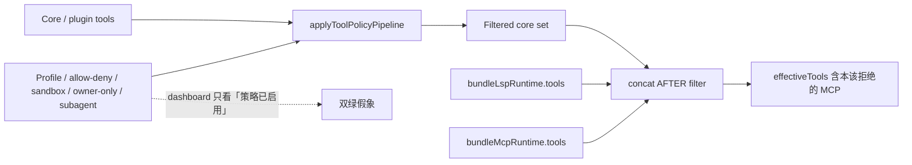

## 1. 问题现象 (Problem Symptoms)

值班打开 Host dashboard：tool profile 已启用、allow/deny 列表已保存、sandbox / owner-only / subagent 策略全绿。同一次会话里，模型仍能列出并调用一条本该被拒的 bundled MCP 工具——例如 `mcp__caldav__create_event`。复盘第一反应几乎总是「策略配错了 / deny 没写全 / 再加一层 prompt 禁止」。多数时候两边都不对——**策略对 core 工具生效了；bundled MCP/LSP 根本没进过滤管道**。

结论先行：**策略正确性取决于「谁最后进 `effectiveTools`」；滤完再拼 = 装配洞，不是配置洞。** 修复不是再写一条 deny，而是对**全部来源**（含 compaction / re-run 重建路径）跑同一套 final effective policy pass。

本文钉的是 **Host tool-policy 装配层**：运维已配置限制策略之后，core / MCP / LSP / plugin / compaction 各路工具如何汇入模型可见集合。不是 OAuth 受众绑定，不是 consent 浏览器绑定，不是「怎么写 OpenClaw deny list」产品说明书。

与相邻文划界（避免主题漂移）：

| 文章 | 层 | 问的是 |
| --- | --- | --- |
| [MCP Auth：Identity ≠ Audience](posts/mcp_auth_identity_not_intent.md) | 远程 OAuth / token 受众 | token 是否绑到**这台** MCP |
| [MCP Consent Binding](posts/mcp_consent_binding_confused_deputy.md) | consent↔callback 浏览器会话 | 同意是否绑到完成 callback 的 UA |
| [Host 渐进发现](posts/mcp_progressive_disclosure.md) | Host discovery / recall | 工具**能不能被找到** |
| [MCP 工具设计：合法但错误](posts/mcp_tool_design_valid_but_wrong.md) | Server 工具面 | schema 绿灯、业务错选 |
| [静默截断](posts/silent_tool_result_truncation.md) | Tool-result fidelity | 已调用结果是否完整送达 |
| **本文** | **Tool-Policy Assembly** | 已进入 Host 的工具是否**仍受策略约束** |

Discovery ≠ policy assembly：那篇管「找得到」；本文管「找得到之后，不该出现的是否仍可选」。Result fidelity 管调用后保真；本文管调用前名单。Auth 两篇管远程凭证边界；本文管**进程内本地授权装配顺序**。

### 现象 A：Dashboard「策略已启用」双绿——bundled MCP 仍进 `effectiveTools`

运维给接待 Agent 配了严格 profile：deny `mcp__*` 写类工具、sandbox 限制、subagent 继承 deny。配置热加载日志绿；UI 显示「Tool policy: enabled」。同会话探针：模型仍能看到 `mcp__vikunja__create_task`，直接调用成功。

公开同构：[OpenClaw GHSA-qrp5-gfw2-gxv4](https://github.com/openclaw/openclaw/security/advisories/GHSA-qrp5-gfw2-gxv4)——bundled MCP/LSP tools 在正常 tool-policy pipeline **过滤完 core 之后**再 append 进有效工具集；受影响版本 `<2026.4.20`。前提：已配置 bundled MCP/LSP 源 + 本应限制该工具的策略。这是**本地 Agent 策略执行绕过**，不是未认证远程网关攻破；Severity Moderate。

误判路径：看见 dashboard 绿 → 怀疑 YAML 缩进 / deny 字符串拼错 / 模型「不听话」→ 再加 prompt「禁止调用 xxx」。更小的本地模型对 prompt 禁令尤其不可靠——工具 schema 仍在集合里，模型就会绕过自然语言禁令（[#65612](https://github.com/openclaw/openclaw/issues/65612) 报告里的实测动机）。

### 现象 B：同名策略对 core 生效、对 MCP 失效——「滤完了」假象

`tools.deny` / `agents.list[].tools.*` 对 built-in 与 plugin 工具立刻生效：`exec`、`write` 从 schema 列表消失。换成 MCP 名：`caldav__create_event`、`mcp__caldav__create_event`——配置热加载成功，工具仍在。工程师对照「策略对 core 管用」→ 断定 MCP 工具不在策略语义里，或去建第二套 gateway / 薄代理 MCP。

根因更短：pipeline 只跑在 core 装配路径上；`materializeBundleMcpToolsForRun()`（及 LSP 对称路径）在下游 concat。**同一份策略函数从未看见 bundled 那一半。**

### 现象 C：Compaction / re-run 重建工具集——修好主路径、旁路再漏一次

即使主 `run` 路径后来补了过滤，compaction、会话压缩后重建、isolated cron / subagent 重生工具表时，若仍走「先滤 core、再裸拼 bundled」的旧装配，洞会在**旁路**复现。GHSA 修复说明明确覆盖：normal runs **与** compaction；fix commit 后续还对齐了 compaction 与 core 的 agentId / sessionKey 策略查找，避免两条路径解析到不同 per-agent 策略。



---

## 2. 根因分析 (Root Cause Analysis)

根因不是「deny 写法不对」，而是团队把 **三种不同保证** 叠进同一个口语「工具策略已经生效」：

| 层 | 实际保证 | 不保证什么 | 典型误判 |
| --- | --- | --- | --- |
| (1) 配置面「策略已启用」 | profile / allow-deny / sandbox / owner-only / subagent **配置被加载并持久化** | 每个注入点上的工具都过了同一过滤函数 | 「dashboard 绿 = 执行面绿」 |
| (2) Core pipeline 过滤 | built-in / 已进入 pipeline 的 plugin tools 按策略裁剪 | 过滤**之后**再 concat 进来的任何来源 | 「core 被 deny 了 = 全家被 deny」 |
| (3) 有效集合 `effectiveTools` | 模型本轮实际可见 / 可调用的 schema 并集 | 并集构造顺序与策略交换律 | 「再加一条 deny 就能堵住后拼进来的源」 |

三句话收束：

1. **`policy(core) ⊕ unfiltered(bundled) ≠ policy(core ∪ bundled)`。** 过滤对加法不交换：后拼的集合绕过了谓词。装配代码写成 `filtered_core + raw_mcp + raw_lsp` 时，数学上就已经错了。
2. **误诊吸引子是「再加一层 deny」。** 配置面多写一行，执行面仍不跑谓词——洞还在。Prompt 禁令、第二套 gateway、外挂 MCP proxy，都是在错误层打补丁。
3. **双绿掩盖装配洞。** 「策略配置已启用」与「core 工具确实被滤」可以同时为真，而 `effectiveTools` 仍含违规 MCP。观测若只打配置位与 core 计数，永远看不见差集。

命名上常见的误合并：把「MCP 工具不受 `tools.deny` 约束」叫做「MCP 协议没有 ACL」（协议不管 Host 装配顺序）；把「子 Agent 继承了 deny」叫做「bundled 也继承了」（继承写在配置对象上，不自动作用到未过滤的 concat）；把 OAuth / consent 远程边界问题与本地名单装配都叫「MCP 安全」（评审时强制拆开上表）。

与 Auth / Consent 的正交一句（不展开机制）：那两篇回答「远程 token / 同意是否绑对主体」；本文回答「本地进程把哪些工具名放进模型上下文」。凭证再正确，名单装配错了，模型仍握着不该握的 schema。

---

## 3. 机制要点：merge-after-filter 与 final pass (Mechanism)

### 3.1 反模式命名：merge-after-filter

把装配写成：

```text
effectiveTools = policy_pipeline(core_tools)
               ⊕ concat(bundleMcpRuntime?.tools ?? [])
               ⊕ concat(bundleLspRuntime?.tools ?? [])
```

即 **merge-after-filter**：策略只作用于先进入管道的子集；后进入的源默认信任。Issue [#65612](https://github.com/openclaw/openclaw/issues/65612) 把同一模式钉在 `runEmbeddedAttempt` 与 `compactEmbeddedPiSessionDirect` 两条路径上——主跑与压缩重建各漏一次。

对称的正确形状：

```text
candidates = core ∪ bundled_mcp ∪ bundled_lsp ∪ …
effectiveTools = final_policy(candidates)   # 或等价：对各新增源再跑同一 policy，再合并
```

关键不变量：**凡能进入模型可见工具表的名字，必须经过与运维配置语义一致的最终谓词**——不论来自 core、bundle、plugin 热插入，还是 compaction 重建。

### 3.2 为何「再写 deny」修不好

Deny / allow / profile 是**谓词定义**；pipeline 是**谓词应用点**。应用点漏了源，定义再完整也是死配置。运维在 YAML 里加 `mcp__*`、在 SOUL.md 写「禁止写日历」，改变的是定义与自然语言，不是应用点。GHSA 的 Impact 写得很直：若运维配置了本应限制该工具的策略，bundled 工具仍可保持可用——这正是「定义在、应用不在」。

### 3.3 GOOD 形状：`applyFinalEffectiveToolPolicy`

公开修复线：[commit `0e7a992`](https://github.com/openclaw/openclaw/commit/0e7a992d3f3155199c1acc2dd9a53c5b3a4d3ada)（`fix(agents): filter bundled tools through final policy`）引入 `applyFinalEffectiveToolPolicy`：在 bundled MCP/LSP **合并进** normal run 与 compaction 所用工具集**之前**，再跑最终有效策略。Advisory 写明覆盖：profile、provider profile、global/agent/group、owner-only、sandbox、subagent。patched `2026.4.20`。

设计上有几条值得 Host 作者抄的约束（来自同 commit 演进，不是产品配置教程）：

| 约束 | 为什么 |
| --- | --- |
| 对 **新增 bundled** 再跑最终 pass，而不是盲目对「已包装过的 core+bundle 全集」重跑整管 | 全量重跑可能弄丢 plugin WeakMap / hook 包装后的元数据，导致 core 误伤（group:plugins / plugin-id allowlist） |
| Compaction 与主路径的 **agentId / sessionKey 策略解析对齐** | 两条路径若解析到不同 per-agent 策略，bundled 与 core 会「一个严一个松」 |
| 单测覆盖 allowlist、显式 deny、继承 subagent、bundle-mcp metadata | 配置热加载绿 ≠ 执行面差集为零；要用集合断言钉死 |
| Owner / group 信号在最终 pass 上 **server-derived、冲突 fail-closed** | 最终过滤若轻信调用方自报的 owner/group，装配修复会被身份伪造抵消（属同一 PR 硬化，本文不展开成身份专题） |

### 3.4 观测：过滤前后集合差

没有差集日志，双绿会永恒。最小可观测契约：

```text
pre_set  = names(candidates)          # 各源汇入后、最终 pass 前
post_set = names(effectiveTools)      # 最终 pass 后
diff     = pre_set \ post_set         # 被策略拿掉的
leak     = post_set ∩ deny_expected   # 本该拒绝却仍在的——应为 ∅
```

Dashboard 至少展示：`|pre|`、`|post|`、`|leak|`（或等价红灯）。只展示「policy enabled: true」是配置面自拍，不是执行面审计。

### 3.5 与相邻层的一句话分工

| 层 | 一句话 |
| --- | --- |
| Discovery | 目录里有没有、搜不搜得到 |
| **Policy assembly（本文）** | 进了 Host 之后，策略是否对**所有注入点**生效 |
| Tool choice | schema 合法但业务选错 |
| Result fidelity | 调用结果是否被静默裁切 |
| OAuth aud / Consent binding | 远程凭证与同意是否绑对主体 |

---

## 4. BAD / GOOD：同一会话的接待 Agent 写日历 (BAD / GOOD)

场景：多 Agent 网关。`receptionist` 只应读日历 / 建工单草稿；写日历与建任务留给 `specialist`。运维在 `receptionist` 上配置 deny（含 `mcp__caldav__*` 写操作 / sandbox / 继承到 subagent）。全程同一 `thread_id` / session。

### BAD：core 滤完 → bundled MCP 裸拼 → 探针仍可写

```text
# ❌ 同 session / thread_id=thr_reception_01
# 1) 运维：profile + deny mcp__caldav__create_event + sandbox + subagent 继承
# 2) Host：createOpenClawCodingTools / core pipeline → exec/write 等被滤掉（看起来「策略生效」）
# 3) materializeBundleMcpToolsForRun() 取出 caldav / vikunja 工具
# 4) effectiveTools = filtered_core ⊕ bundleMcp ⊕ bundleLsp   # 无最终 pass
# 5) Dashboard：policy enabled ✅；core deny 计数 ✅
# 6) 模型列出 mcp__caldav__create_event 并调用成功 → 未授权写副作用
```

```javascript
// ❌ 装配示意（merge-after-filter）——对应 GHSA / #65612 描述的形状
const tools = applyToolPolicyPipeline(coreTools, policy); // 只看见 core
const bundleMcpRuntime = await materializeBundleMcpToolsForRun({ ... });
const bundleLspRuntime = await materializeBundleLspToolsForRun({ ... });

// MCP/LSP 在过滤之后才拼进来 → 策略谓词从未作用到它们
const effectiveTools = [
  ...tools,
  ...(bundleMcpRuntime?.tools ?? []),
  ...(bundleLspRuntime?.tools ?? []),
];
```

失败剧本映射 §3：

| 步骤 | 缺了哪条杠杆 |
| --- | --- |
| bundled 裸 concat | 缺 §3.1 / §3.3 final pass |
| 靠再加 deny 行 / prompt 禁令 | 踩 §3.2 误诊吸引子 |
| Dashboard 只亮「enabled」 | 缺 §3.4 pre/post 差集与 leak=∅ |
| 只修了 run、没修 compaction | 旁路再漏（§1 现象 C） |
| 把问题当成 OAuth / consent | 修错层（§1 划界表） |

次要叠加：若同 Host 还在 discovery 层把 MCP 工具「搜得到」当成「策略已允」，复盘会同时指错 discovery 与配置——两边都绿，洞仍在装配顺序。

### GOOD：合并前对 bundled 跑 `applyFinalEffectiveToolPolicy`

```javascript
// ✅ 同 session / thread_id=thr_reception_01
// 形状对齐公开 fix：对新增 bundled 做最终有效策略 pass，再进入 effectiveTools
const coreTools = applyToolPolicyPipeline(createCoreTools(...), policy);

const bundleMcpRuntime = await materializeBundleMcpToolsForRun({ ... });
const bundleLspRuntime = await materializeBundleLspToolsForRun({ ... });

const bundled = [
  ...(bundleMcpRuntime?.tools ?? []),
  ...(bundleLspRuntime?.tools ?? []),
];

// §3.3：与 core 同一语义族的最终谓词（profile / provider / agent / group /
// owner-only / sandbox / subagent）；compaction 路径同样调用
const bundledFiltered = applyFinalEffectiveToolPolicy(bundled, {
  sessionKey,
  // identity / group 信号由服务端派生，不轻信调用方自报
});

const effectiveTools = [...coreTools, ...bundledFiltered];

// §3.4：审计
auditToolPolicyDiff({
  pre: names(coreTools) + names(bundled),
  post: names(effectiveTools),
  denyExpected: policy.denyGlobs, // 如 mcp__caldav__create_* 
});
```

```text
# ✅ 同会话验收探针（集成测，不是手工点 UI）
# - deny mcp__* 写类之后：bundled 写工具不可见、不可调用
# - allowlist 仅 read 类：写类 schema 不出现在模型工具表
# - subagent 继承 deny：子会话 effectiveTools 差集一致
# - compaction 后重建：leak 仍为 ∅
# - 审计日志：pre\post 非空（证明谓词真的跑过）；post ∩ denyExpected = ∅
```

同一 `thread_id` 上 GOOD 路径的可见差异：dashboard 仍可显示「policy enabled」，但多一列执行面——`|leak|=0`、过滤掉的 MCP 名列表、compaction 路径同构勾选。模型侧工具表不再出现写日历 schema；prompt 里那句「禁止创建_event」变成冗余，而不是唯一防线。

Tradeoff 写清：最终 pass 增加一次策略解析与匹配成本；对「永远只有三个 core 工具、无 MCP」的玩具 Agent 几乎无感。成本不均匀——上了 bundled MCP/LSP、多 Agent 分权、sandbox / owner-only 的团队，用 merge-after-filter 养的是**静默授权扩大**；只测 core deny 的 CI 看不见税。框架若默认「先滤再拼」，Host 集成方必须自己包最终 pass，或升级到已修版本（OpenClaw ≥ `2026.4.20`）。

---

## 5. 发版前清单：对准可注入的失败点 (Pre-Ship Checklist)

上线任何会装配 MCP/LSP/plugin 工具的 Agent Host 之前，用注入证明策略覆盖全集，而不是用「core deny demo 全绿」证明：

**契约与分层**

- [ ] 评审纪要能口头区分：配置已启用 ≠ core 已过滤 ≠ `effectiveTools` 无泄露
- [ ] 写明：本产品的最终谓词作用在「合并后全集」还是「对各新增源再跑同一函数」（两种都可，不可「只滤 core」）
- [ ] 与 [progressive disclosure](posts/mcp_progressive_disclosure.md) 划界：discovery 测试通过 ≠ policy assembly 测试通过
- [ ] 与 Auth / Consent 文划界：OAuth 绿 / consent 绿 ≠ 本地工具名单受策略约束
- [ ] 与 [合法但错误](posts/mcp_tool_design_valid_but_wrong.md) 划界：本文是「不该出现仍可选」，不是「可选但选错」
- [ ] 与 [静默截断](posts/silent_tool_result_truncation.md) 划界：名单对了之后，结果保真仍是下一层

**注入点枚举（必须列全）**

- [ ] Core / built-in 工具创建
- [ ] Bundled MCP runtime 工具表
- [ ] Bundled LSP runtime 工具表
- [ ] Plugin / 动态注册工具
- [ ] Compaction / session rebuild / re-run 重建工具表
- [ ] Subagent / isolated cron / 其它旁路 runner（凡构造 `effectiveTools` 的入口）

**同一 policy 函数**

- [ ] 每个注入点之后（或合并前对新增源）调用与运维配置语义一致的最终过滤
- [ ] 禁止「主路径已修、compaction 仍裸 concat」
- [ ] per-agent / group / sandbox / owner-only / subagent 继承在最终 pass 上可测，而不是只写在配置对象上

**集成测（执行面，不是配置自拍）**

- [ ] 注入点 A：deny `mcp__*`（或项目等价前缀）后，bundled MCP **不可见且不可调用**
- [ ] 注入点 B：allowlist 仅 core read 时，bundled 写工具不进模型工具表
- [ ] 注入点 C：subagent 继承 deny → 子会话 leak=∅
- [ ] 注入点 D：compaction 后重建 → 再次断言 leak=∅
- [ ] 注入点 E：故意只滤 core、裸拼 MCP 的回归夹具 → CI 必须红（防止回退到 merge-after-filter）

**审计与观测**

- [ ] 日志或 span 记录过滤前后工具名集合差（`pre_set` / `post_set` / `leak`）
- [ ] Dashboard 禁止只展示「policy enabled」单灯；至少并排执行面 leak 计数
- [ ] 告警：`leak > 0` 或「配置 deny 非空但 post 仍含匹配名」

**禁止的错误层补丁（发版评审口头否决）**

- [ ] 仅靠 prompt / SOUL「不要调用 xxx」作为策略执行
- [ ] 仅为绕过装配洞而复制整套 gateway / 外挂 MCP proxy（可作隔离加深，不可替代最终 pass）
- [ ] 把现象归因为「再加一条 deny 就好」而不查 concat 点

---

## 6. 小结 (Takeaways)

**「策略滤完了」却仍看见 bundled MCP——先查装配顺序，再查配置拼写。** Deny 行定义谓词；pipeline 应用谓词；merge-after-filter 让后进集合永远不受谓词约束。Dashboard 双绿是配置面与 core 面的自拍，不是 `effectiveTools` 审计。

- 三层误叠：配置已启用 / core 已过滤 / 有效集合无泄露（§2）。
- 反模式：`policy(core) ⊕ unfiltered(bundled) ≠ policy(core ∪ bundled)`（§3.1）。
- 修法：`applyFinalEffectiveToolPolicy`（或等价最终 pass）覆盖全部来源，含 compaction；单测钉 allowlist / deny / subagent / metadata（§3.3；OpenClaw GHSA-qrp5 / `0e7a992` / ≥`2026.4.20`）。
- 同会话业务链：BAD 裸拼 → 未授权写；GOOD 最终 pass + 差集审计对齐 §3（§4）。
- 发版靠注入点枚举与 leak=∅，不靠再加 deny 行（§5）。

系列位置：Server 工具面（[合法但错误](posts/mcp_tool_design_valid_but_wrong.md)）→ Host 发现（[渐进发现](posts/mcp_progressive_disclosure.md)）→ Host 结果保真（[静默截断](posts/silent_tool_result_truncation.md)）→ **Host 工具策略装配（本文，MCP/Host Tool-Policy Assembly 专题首篇）**。Auth 专题（Identity≠Audience、Consent Binding）管远程边界，与本文本地名单正交。下一坑可继续在 Host 安全装配上深挖旁路 runner / plugin 热插入的同类顺序洞——仍坚持「谁最后进集合」这一主线，而不是滑回 OAuth 说明书。

---

## 参考 (References)

1. OpenClaw — [GHSA-qrp5-gfw2-gxv4：Bundled MCP/LSP tools could bypass configured tool policy](https://github.com/openclaw/openclaw/security/advisories/GHSA-qrp5-gfw2-gxv4)（Moderate；affected `<2026.4.20`；patched `2026.4.20`；merge-after-filter → final effective policy pass）。
2. OpenClaw — [commit `0e7a992`：filter bundled tools through final policy](https://github.com/openclaw/openclaw/commit/0e7a992d3f3155199c1acc2dd9a53c5b3a4d3ada)（`applyFinalEffectiveToolPolicy`；normal run + compaction；单测与后续 hardening）。
3. OpenClaw — [Issue #65612：Per-agent MCP tool filtering](https://github.com/openclaw/openclaw/issues/65612)（次要：`tools.deny` / per-agent 配置对 MCP 无效的根因描述与 concat 示意；随后以最终 pass 落地关闭）。
4. 本站 — [Host 渐进发现：工具「搜不到」≠「没这个能力」](posts/mcp_progressive_disclosure.md)（discovery 层划界）。
5. 本站 — [静默截断：工具「成功返回」了半截，模型却自信答完](posts/silent_tool_result_truncation.md)（result fidelity 划界）。
6. 本站 — [MCP 工具设计：为什么 Agent 总发出「合法但错误」的调用](posts/mcp_tool_design_valid_but_wrong.md)（Server 工具面划界）。
7. 本站 — [MCP Auth：Identity ≠ Audience](posts/mcp_auth_identity_not_intent.md)（远程 token 受众划界；本文不复述）。
8. 本站 — [MCP Consent Binding：Confused Deputy](posts/mcp_consent_binding_confused_deputy.md)（consent↔callback 划界；本文不复述）。
