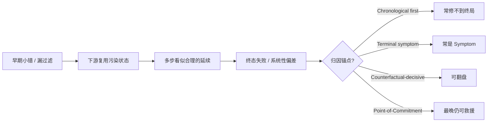

## 1. 问题现象 (Problem Symptoms)

系列前两篇分别钉评估面与写路径：终答绿不等于路径绿（[Trajectory Eval：答对了为什么还是假绿](posts/trajectory_eval_false_green.md)）；超时后无键重试会双写（[Agent 写操作的幂等：超时之后凭什么敢重试](posts/agent_write_idempotency.md)）。长程跑起来之后，还有一层更隐蔽的坑——**过程归因层**：失败已经板上钉钉，但你修的那一步救不了终局。

日志给人两种本能锚点：**时间线上第一个异常**，或 **最后一次失败动作**。两者在短轨迹上偶尔碰巧对；步数一拉长，错误级联，这两个锚点都开始骗人。

### 现象 A：中间表漏过滤——上游小错，下游系统性虚高

HORIZON 把这类失败收进 **History Error Accumulation（历史错误累积）**：早期中间表漏了 `is_deleted = false`，后续分析全部复用该表——上游一个小遗漏，放大成系统性虚高结果。同族的 OS 形态是：静默失败的命令被当成成功，依赖命令继续往下跑，早期错误状态贯穿整条工作流。

你在终态 dashboard 上看到「数字不对」；在 trace 末尾看到「某次 `GROUP BY` / 某次报表生成」。两者都不是决定性步——决定性步是那次漏过滤的建表。修最后一次聚合，只会得到另一份同样虚高的表。

### 现象 B：On-call 钉「第一个红」——修了，任务仍失败

长跑 Agent 第 7 步工具返回一次可行动的 `isError`（参数略偏），第 18 步选错子目标，第 31 步基于污染状态写出终答。值班同学按时间线修了第 7 步的 schema 用法——局部变绿；重放整条轨迹，终局仍挂。第 7 步是 **Chronological first（时间序第一个错）**，不是 **Counterfactual-decisive（反事实决定性错）**。

### 现象 C：钉「最后一次坏动作」——那是症状，不是承诺点

退款 Agent 最后一步调了 `issue_refund`。归因报告写「有害动作在 step 42」。但真正把策略锁死的，往往是更早的「认定用户符合退款条件」决策；后面的工具调用只是执行已承诺的意图。Causal Agent Replay 提醒：执行有害动作的一步，通常不是决定该动作的一步。



---

## 2. 根因分析 (Root Cause Analysis)

根因不是「模型更笨了」，而是 **失败信号在时间轴上的位置 ≠ 失败在因果图上的位置**。长程轨迹把多种归因角色叠在同一条 log 里——它们回答的问题不同，却常被混称「根因」：

| 归因角色 | 问的是什么 | 修它能否翻盘 | 典型误判 |
| --- | --- | --- | --- |
| Chronological first | 时间线最早的异常 / 告警 | 经常不能 | 「先修第一个红」 |
| Terminal symptom | 最后失败动作、错误终答、炸点工具 | 经常不能 | 「有害动作 = 根因」 |
| Butterfly early ablation | 早期步一改，下游随机性全被重掷，显得「很有因果力」 | 常是假阳性 | 把蝴蝶效应当 decisive |
| Counterfactual-decisive（Who&When · FALAT） | 最早、修正后可使失败→成功的一步 | 按定义可以 | 难找；「找第一个错」启发式不可用 |
| Point-of-Commitment（Causal Agent Replay） | 仍可救援的**最晚**一步（之后结局已锁定） | 干预它仍可变分布 | 与「最早 decisive」问题不同 |

三句话收束：

1. **级联使局部正确失去意义**：下游步在局部 trace 上可判定「合理」，只因它们消费了已被污染的中间产物（HORIZON 的 History Error Accumulation）。
2. **「第一个错」是搜索启发式，不是定义**：Who&When 把 decisive error step 形式化为——对失败轨迹，修正该步后可使失败变为成功，并在多个可修复点中取**最早**者；这与「遇到第一个局部错就停」不是一回事。
3. **随机前向重放会制造蝴蝶效应**：对早期无关步做 ablation / resample，也会顺带重掷下游真正关键的随机性——Causal Agent Replay 用 **Point-of-Commitment**（取效应置信区间仍排除零的**最晚**步）压制这种偏置。

与本系列其他文的边界（避免主题漂移）：

| 文章 | 层 | 问的是 |
| --- | --- | --- |
| [MCP 工具设计：为什么 Agent 总发出「合法但错误」的调用](posts/mcp_tool_design_valid_but_wrong.md) | 工具面 | schema 绿灯、业务错 |
| [Trajectory Eval：答对了为什么还是假绿](posts/trajectory_eval_false_green.md) | 评估面 | 终答对、路径烂 |
| [Agent 写操作的幂等：超时之后凭什么敢重试](posts/agent_write_idempotency.md) | 运行时写语义 | 超时后敢不敢重试 |
| **本文** | **过程归因** | 失败后该修哪一步才翻盘 |

---

## 3. 机制要点：轨迹归因协议 (Mechanism)

不要再发明「根因直觉」。生产排查至少显式区分下列可操作判定，而不是混用一个「谁有错」标签。

### 3.1 反事实可修复性（Who&When · decisive error）

Who&When 的操作定义（摘要）：轨迹最终失败；若将某 agent 在时刻 \(t\) 的动作换成正确动作，并允许其后步骤相应调整，能使失败变为成功，则该 \((agent, t)\) 是一个 decisive error；若有多处，取**时间上最早**者作为主因标注。

这意味着：

- 归因问题是 **干预问题**，不是「哪一行看起来最离谱」。
- 「最早可修复点」要求你回答：修这里之后，后续是否仍可能走通——而不是「这里是不是第一个红灯」。

### 3.2 依赖分型：引入 vs 传播 vs 症状（FALAT）

FALAT 强调：失败归因不能做成逐步独立分类。依赖边上要区分 **error-introducing** 与 **propagation**；局部角色常用四类：

| 角色 | 含义 |
| --- | --- |
| Root_Cause | 独立引入决定性错误 |
| Propagation | 把上游错误带入下游推理 / 工具 |
| Symptom | 反映已有错误，对下游计算无实质影响 |
| Contributing | 有问题，但单独不足以造成终局失败 |

并用 **反事实充分性**：修正候选步应能恢复期望输出（此前步骤固定、其后可适应）。没有分型，LLM judge 很容易把下游 Propagation / Symptom 标成根因。

### 3.3 Point-of-Commitment：最晚仍可救援的一步（Causal Agent Replay）

Causal Agent Replay 把 agent run 建成结构因果模型，对某步做 `do(·)` 后按同一随机策略前向重放，看结局分布是否移动。关键 subtleties：

- 重采样步 \(k\) 会连带重掷 \(k\) 之后所有随机步 → 早期无关步也会显示「总效应」（蝴蝶效应 / Butterfly early ablation）。
- **Point-of-Commitment**：因果位点取效应置信区间仍排除零的**最晚**步——在那之后，再改也救不了；在那之前，结局尚未锁定。

这与 Who&When 的「最早 decisive」并不矛盾：一个问 **标注协议上的主因（最早可翻盘）**，一个问 **随机干预下的承诺锁定点（最晚仍可救援）**。工程上两者回答不同的 on-call 问题：「该回滚哪次状态写入」vs「该在监控里卡哪个决策门」。

### 3.4 为什么「找第一个错」启发式不可用（Who&When 数字）

Who&When 在 127 个 LLM multi-agent 系统的失败日志上评了三种自动归因：

| 方法 | 做法 | 相对优势 |
| --- | --- | --- |
| All-at-Once | 一次吃完整 log | Agent 级更强（大感受野） |
| Step-by-Step | 逐步扫，认定局部错即停 | Step 级相对更好 |
| Binary Search | 对半分 log 缩小范围 | 介于两者之间 |

论文报告：最佳方法在识别失败责任 agent 上约 **53.5%**，在精确定位失败步上仅约 **14.2%**；部分设置低于随机；即便 o1 / R1 也难谈实用。更关键的是权衡方向：**All-at-Once 抬 agent 准、砸 step 准；Step-by-Step 相反**——后者正是「停在第一个局部错」的自动化版。结论对生产直白：**把 on-call runbook 写成「从前往后修第一个红」没有实验支持。**

HORIZON（3100+ trajectories、跨域 taxonomy）则从失败形态侧说明：History Error Accumulation 与早期规划级联会把可恢复局部失误变成不可逆任务失败——归因若只盯终态或只盯首错，会系统性地修错杠杆。

（AURA-Eval 偏安全关键决策点，作次要线索即可，不展开成安全评测文。）

---

## 4. BAD / GOOD：同一次长跑的归因协议

场景：数据分析 Agent 拉数 → 建中间表 → 出业务指标。终态「活跃用户虚高 30%」。Trace 里：step 4 建表 SQL 漏 `is_deleted = false`；step 9–20 多次基于该表的聚合（局部看起来都合法）；step 21 生成报告失败告警（或报告「成功」但数字错）。

### BAD：时间序首错 + 终态症状双锚点

```text
# ❌ 两种常见 on-call 脚本
1) grep 第一个 error / isError → 修 step 里「第一次告警」
   （可能是无关的瞬时限流，或可恢复的局部错）
2) 打开最后 span → 「报告生成 / 最后一次 GROUP BY」有问题
   → 改报表模板或重跑最后聚合

结果：中间表仍然含已删除行；下游全绿地复用脏表。
```

再配一个「看起来合理」的 LLM 归因提示：

```text
# ❌ 无反事实、无依赖分型
"Read the full trace and point out the first mistake
 and the final failing tool call. Fix those two."
```

这正好叠上 Who&When 已证明脆弱的两种感受野极端，却没有要求回答：**修哪一步会 failure→success**。

### GOOD：角色表 + 反事实问题 + 分型

```text
# ✅ 归因输出必须填角色，而不是只给一个 step id
For this failed trajectory, label candidates as:
  - Chronological_first
  - Terminal_symptom
  - Butterfly_early_ablation
  - Propagation | Symptom | Contributing | Root_Cause   # FALAT
  - Counterfactual_decisive  # earliest fix → success (Who&When)
  - Point_of_Commitment      # latest still-rescuable (CAR), if replay available

Required answers:
  1) Which intermediate artifacts were reused downstream?
  2) If we patch ONLY step k and re-run forward, does the task succeed?
  3) What is the earliest k that satisfies (2)? What is the latest k
     that still shifts the outcome distribution under replay?
```

对照现象 A：

| 候选步 | 角色 | 只修它？ |
| --- | --- | --- |
| step 4 漏 `is_deleted = false` | Root_Cause / Counterfactual_decisive | 是 → 下游表被重建后指标回正 |
| step 12 某次聚合 | Propagation | 否 → 仍读脏表 |
| step 21 报告 | Terminal_symptom | 否 → 换皮不换骨 |

若你有重放预算：对 step 4 做干预应显著移动结局分布；对更早的无关检索做 resample 若也「看起来有效」，先怀疑蝴蝶效应，再用 Point-of-Commitment（最晚仍显著）过滤。

### 工程落点（不必上完整 CAR 也能用）

1. **产物血缘**：中间表 / 文件 / memory 写入打 `artifact_id` + schema 版本；下游 span 记录输入 artifact——History Error Accumulation 才看得见。
2. **静默失败升级**：OS/工具「非零退出却当成功」直接标 `isError` + 稳定码；禁止依赖步在未知状态上继续（与幂等文的「结果未知」同一家族）。
3. **归因工单字段**：强制 `decisive_step`、`evidence: counterfactual|dependency|replay`、`roles[]`；禁止只填 `first_error_at`。
4. **评估交叉**：trajectory eval 抓假绿路径；本文抓「失败后修错步」——两边都要，但闸门不同。

---

## 5. 发版前清单 (Pre-Ship Checklist)

长程 Agent / 多 agent 协作上线前，把归因协议写进 runbook，而不是靠英雄 on-call：

**定义**

- [ ] 团队对「decisive」有书面定义：反事实可修复（及是否取最早）
- [ ] 区分 Chronological first / Terminal symptom / Butterfly early ablation / Counterfactual-decisive / Point-of-Commitment——禁止混称「根因」
- [ ] 明确本文与假绿评估、写路径幂等的分工，避免一篇 runbook 塞三层

**可观测**

- [ ] Trace 含有序工具名、参数摘要、`isError`/errorCode、中间产物 id
- [ ] 能回答「哪些下游步复用了该产物」（血缘或至少文件路径约定）
- [ ] 静默成功（exit 0 / 空结果当命中）有单独检测

**归因动作**

- [ ] 工单禁止只贴第一个红或最后一个红；必须尝试回答「只修 k 能否翻盘」
- [ ] LLM judge 提示含依赖分型 + 反事实充分性；不只做 all-at-once 散文
- [ ] 若做 step-by-step 扫描：其输出当作**候选**，不是 ground truth（Who&When：step 级≈14.2% 量级）
- [ ] 有重放预算时：用最晚仍可救援步做门控，不单用最早高归因步（防蝴蝶效应）

**修复验证**

- [ ] 补丁后必须整轨迹重放或等价回归，不只重跑终态脚本
- [ ] 对 History Error Accumulation：重建中间产物，而非只改报表
- [ ] 统计层可看「常被标为 decisive 的 agent/工具」；单条 step 命中率保持诚实预期

---

## 6. 小结 (Takeaways)

长程失败里，**第一个错与决定性错误经常不是同一个点**；最后失败动作更常是 Symptom。

- **History Error Accumulation**（HORIZON）：早期中间状态污染被下游全量复用——修终态救不了。
- **Decisive error**（Who&When）：最早、修正后可使失败→成功的一步；All-at-Once vs Step-by-Step 在 agent/step 准确率上反向权衡；最佳约 **53.5% / 14.2%**——「找第一个错」不能当协议。
- **依赖分型 + 反事实充分性**（FALAT）：分开 Root_Cause / Propagation / Symptom / Contributing。
- **Point-of-Commitment**（Causal Agent Replay）：最晚仍可救援的一步；压制早期 ablation 的蝴蝶效应。
- 系列位置：工具面 → 评估假绿 → 写路径幂等 → **过程归因**；下一坑可转向 checkpoint ≠ durable execution（进程死亡与工作流历史，仍与副作用有关但杠杆不同）。

---

## 参考 (References)

1. arXiv:2604.11978 — [The Long-Horizon Task Mirage? Diagnosing Where and Why Agentic Systems Break](https://arxiv.org/abs/2604.11978)（HORIZON；History Error Accumulation，含 DB 中间表漏 `is_deleted = false` 与 OS 静默失败示例；[leaderboard](https://xwang2775.github.io/horizon-leaderboard/)）。
2. arXiv:2505.00212 — [Which Agent Causes Task Failures and When?](https://arxiv.org/abs/2505.00212)（Who&When；decisive error 形式化；All-at-Once / Step-by-Step / Binary Search；最佳方法 agent≈53.5%、step≈14.2%；[项目页](https://ag2ai.github.io/Agents_Failure_Attribution/)）。
3. arXiv:2606.00765 — [FALAT: Tracing Failures in LLM Agent Trajectories via Dependency-Guided Search](https://arxiv.org/abs/2606.00765)（error-introducing vs propagation；反事实充分性；Root_Cause / Propagation / Symptom / Contributing）。
4. arXiv:2606.08275 — [Causal Agent Replay: Counterfactual Attribution for LLM-Agent Failures](https://arxiv.org/abs/2606.08275)（干预式重放；Point-of-Commitment；蝴蝶效应）。
5. arXiv:2608.06909 — [Long-Horizon Agent Trajectory Attribution](https://arxiv.org/abs/2608.06909)（primary attribution vs attribution chain；长程更难）。
6. 本站 — [Trajectory Eval：答对了为什么还是假绿](posts/trajectory_eval_false_green.md)；[Agent 写操作的幂等：超时之后凭什么敢重试](posts/agent_write_idempotency.md)（评估面 / 写语义层，与本文过程归因层分工）。
