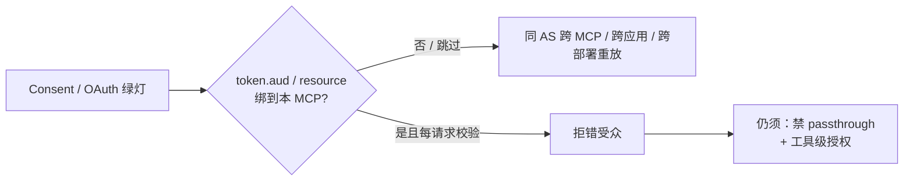

## 1. 问题现象 (Problem Symptoms)

系列里 [工具面](posts/mcp_tool_design_valid_but_wrong.md) 讲「schema 绿灯、业务错」；[记忆特权](posts/agent_memory_poisoning.md) 讲「当轮正常、跨会话复活」。还有一层同样会骗过值班同学——**调用时的 token 绑定层**：浏览器 Consent / OAuth 流程全部绿灯，Bearer 也验签通过，但 token **从未被绑到「正在被调用的这台 MCP」**，于是在同 Authorization Server（AS）下的其他 MCP、其他 Google 应用、甚至另一个 registry 部署上被重放。

常见误判有两种：

1. 「再加一层 OAuth / 把 scope 收紧一点」——身份层已经绿了，问题在 **audience（受众）**，不在「有没有登录」。
2. 「用户点过同意，怎么还能跨服务」——Consent 答的是「谁持有 token」；**RFC 8707 Resource Indicators** 答的是「token 是否发给**这台**资源」。两者不是同一道门。

与已发文 / 另选题的边界（避免主题漂移）：

| 文章 / 选题 | 层 | 问的是 |
| --- | --- | --- |
| [MCP 工具设计：合法但错误](posts/mcp_tool_design_valid_but_wrong.md) | 工具面 | schema 绿灯、业务错 |
| [Agent 记得太久](posts/agent_memory_poisoning.md) | LTM 特权 | 记忆写什么、以什么权威读回 |
| **本文** | **Token audience 绑定** | token 是否发给**这台** MCP |
| `mcp-consent-binding-confused-deputy`（另文） | Proxy consent / deputy | consent 是否绑到完成 callback 的浏览器——**一句划界，本文不展开** |

### 现象 A：同 AS 下，恶意 MCP 偷到的 token 能打良性 MCP

用户把客户端连到一台「看起来像内部工具」的 MCP。OAuth 流程走到同一套 AS（例如公司统一 IdP / 某框架的 OAuth Proxy）。Consent 屏甚至可能显示良性服务名——人眼未必拦得住。完成后，攻击者从恶意 MCP 抽出 access / refresh token，原样打到共享同一 AS、却**未按 client `resource` 发 aud** 的良性 MCP——工具与资源接口返回 200。

这不是「没做 OAuth」，而是 **签发时 aud 写死成 proxy 的 `base_url`，忽略了客户端提交的 `resource`**。FastMCP OAuth Proxy 在 `<2.14.2` 正是这条路径（GHSA-5h2m-4q8j-pqpj / CVE-2025-69196；fix ≥2.14.2）。

### 现象 B：任意「有效 Google token」就能进 MCP

运维打开了 `mcpEnabled: true`，以为「走 Google 登录就安全了」。配置里却没写 `audience` / `clientId`。对 **opaque Google access token**，校验管道直接 **跳过 aud**——任何为别的 Google 生态应用签发、且仍有效的 access token，都能进工具与后端。

这是 Google mcp-toolbox CVE-2026-14541（约 1.4.0 线；fix ≥1.5.0）：**mcpEnabled 打开 ≠ audience 强制**。OAuth「绿」只说明 token 真是 Google 发的，不说明它是发给你这台 toolbox 的。

### 现象 C：透明 JWT 模式——iss 恒真、aud 不查

MCP / HTTP 路由开了 transparent auth，指望 jose 验签 + issuer allowlist。实现却把 **未验证 payload 里的 `iss` 拼进 allowlist**，issuer 检查变成恒真；验签成功后又只查 scope、**从不验 `aud`**。结果：同一 JWKS 下、为服务 A 签发的合法 token，原样打服务 B 也过。

FrontMCP `@frontmcp/auth` / `@frontmcp/sdk` GHSA-hvvp-67p3-j379（公开 advisory 指向 1.4.0；fix ≥1.5.4）把两条缺口叠在一起：**身份看起来严，受众边界为零**。

### 旁证：共享 audience 字符串 → 跨部署重放

MCP Registry 的 GitHub OIDC 发行 / 校验曾绑死全局 audience `mcp-registry`，与具体 `--registry` URL 无关。在 staging / 自托管 / 攻击者可控 registry 上合法拿到的 OIDC token，可被重放到另一部署换 publish JWT（GHSA-95c3-6vvw-4mrq / CVE-2026-44428；fix ≥1.7.6）。危级不高，但把原则说死了：**audience 必须是部署级资源标识，不能是产品名口号。**



---

## 2. 根因分析 (Root Cause Analysis)

根因不是「OAuth 实现得不够多」，而是把三道不同的门当成了一道：

| 门 | 问题 | 绿灯只证明 |
| --- | --- | --- |
| Identity | 谁持有 / 谁签发 | subject / 签名 / 有时还有 issuer |
| Audience | token 是否发给**这台资源** | `resource` → `aud`（RFC 8707）匹配本 MCP canonical URI |
| Authorization / Intent | 持有者在本资源上能做什么 | scope、工具 ACL、参数策略、draft-then-commit |

生产里把 1 当成 2、把 2 当成 3，就会出现「OAuth 全绿、仍可重放 / 仍可越权调高危工具」。

四类具体缺口（对照上面现象）：

| 缺口 | 机制 | 典型后果 |
| --- | --- | --- |
| 签发忽略 `resource` | JWT `aud` 写死 `base_url`，不跟客户端 resource | 同 AS 跨 MCP 重放（FastMCP） |
| 校验跳过 `aud` | opaque 路径无 audience/clientId 就跳过 | 任意有效生态 token 可进（mcp-toolbox） |
| 校验逻辑自废 | 把 token 自报 `iss` 并入 allowlist；不查 `aud` | 跨服务重用（FrontMCP） |
| 受众粒度不够 | 全局字符串 `mcp-registry` | 跨部署重放（Registry） |

一句话收束：

> **OAuth 答「谁持有 token」；RFC 8707 答「是否发给这台 MCP」。缺后者，前者再绿也挡不住重放。**

---

## 3. 机制要点：resource → aud，以及 MUST NOT passthrough (Mechanism)

### 3.1 MCP Authorization 规范里的硬要求

[MCP Authorization（2025-11-25）](https://modelcontextprotocol.io/specification/2025-11-25/basic/authorization) 把 MCP Server 定位成 OAuth 2.1 **resource server**，并点名：

1. **Clients MUST** 在 authorization / token 请求里带 RFC 8707 `resource`，且值为该 MCP 的 **canonical URI**（例如 `https://mcp.example.com/mcp`）。
2. **Servers MUST** 校验 access token 是专门为自己签发的 intended audience；失败按 OAuth 2.1 资源请求错误处理（通常 401）。
3. **Servers MUST only accept tokens valid for their own resources**；**MUST NOT accept or transit any other tokens**。
4. 若 MCP 再调上游 API，上游要用**另一张**、由上游 AS 签发的 token——**禁止把客户端 Bearer 原样转发**（规范 Security Considerations / Access Token Privilege Restriction；换票见 RFC 8693 Token Exchange 一类模式）。

这四条里，值班同学最常漏的是 2 和 4：验了签名就算过；或「反正都是公司 token」直接透传给 GitHub / 内部 API。

### 3.2 Identity ≠ Audience 的对照

| | Identity 绿 | Audience 绿 |
| --- | --- | --- |
| 典型检查 | 签名、`exp`、有时 `iss` | `aud` / resource 指标 == 本 MCP canonical URI |
| 防的是 | 伪造 token、过期票 | **合法票打错柜台** |
| 失败形态 | 401 invalid_token | 同 AS 重放、跨应用、跨部署 |
| 误修 | 「再加 OAuth」 | **无**：应修绑定与校验 |

Consent 屏、PKCE、Client ID Metadata 都很重要，但它们不自动产生「这张票只能打 `https://billing-mcp.internal/mcp`」这条不变量。那条不变量来自 **签发绑 resource + 接收方每请求验 aud**。

### 3.3 Passthrough：失败必须闭

「client Bearer 原样转发上游」是独立 anti-pattern（规范明确禁止）。经典「把用户 GitHub token 原样塞进 MCP 再打 GitHub」在公开材料里**仍缺一条可点名、与本文主线同构的 CVE**——正文只标 anti-pattern，**不捏造 CVE**。

可作脚注的是另一类 passthrough 失败：LiteLLM GHSA-7488-6r32-c95q（`<1.84.0`）在 OAuth2 passthrough 回退路径上，把失败的 LiteLLM key 校验换成空的 `UserAPIKeyAuth()`，任意 Bearer 也能建起「已认证」MCP 会话。教训与受众绑定正交但同方向：**passthrough / fallback 失败必须 fail-closed**，不能静默降成「空身份放行」。

---

## 4. BAD / GOOD (BAD / GOOD)

### BAD#1：忽略 client `resource`，按 `base_url` 发 aud（FastMCP）

```text
❌ OAuth Proxy 签发（示意，对齐 advisory 描述）

JWTIssuer(
  issuer  = base_url,
  audience = base_url.rstrip("/") + "/mcp",  # 初始化时写死
)
# 客户端在 authorize/token 请求里提交的 resource 被忽略
# → 同 AS 多台 MCP 共享可互换的 aud
```

**GOOD：** 签发 `aud` / resource 指标 = 客户端声明且通过校验的 **canonical MCP URI**；接收方每请求比对，错受众直接 401。升级 FastMCP ≥2.14.2。

### BAD#2：`mcpEnabled` 无 audience/clientId → opaque 跳过 aud（mcp-toolbox）

```yaml
# ❌ 看起来「开了 Google MCP 鉴权」
kind: authService
type: google
mcpEnabled: true
# 缺少 audience / clientId
# → ValidateMCPAuth 对 opaque token 跳过 audience 校验
# → 任意有效 Google access token 可进
```

**GOOD：**

```yaml
kind: authService
type: google
audience: ${YOUR_GOOGLE_CLIENT_ID}   # 或等价 clientId
mcpEnabled: true
scopesRequired:
  - https://www.googleapis.com/auth/userinfo.email
```

启动期就拒绝「mcpEnabled 却无 audience/clientId」的配置（≥1.5.0 的修法方向）；不要把「能验 Google 签名」当成「绑到本资源」。

### BAD#3：iss 恒真 + 不查 aud（FrontMCP transparent）

```text
❌ verifyTransparentToken（示意）

draft = decodeJwtPayloadSafe(token)          # 未验证
jwtVerify(token, JWKS, {
  issuer: [configuredIssuer, draft.iss]      # 自报 iss → 恒真
})
# session:verify 成功后只查 scope，从不 validateAudience
```

**GOOD：** issuer 只认配置值；transparent 成功后 **强制** `aud` ∈ expectedAudiences（可由 baseUrl 派生）；缺 `aud` 当失败。升级 ≥1.5.4。

### BAD#4（旁证）：共享 audience 字符串（Registry）

```text
❌ publisher 恒请求 audience=mcp-registry
❌ 服务端只验同一字符串，再按 repository_owner 发 publish JWT
→ staging 上拿到的 OIDC token 可打生产 registry
```

**GOOD：** audience = 部署级标识（origin / client id / registry URL 派生）；客户端请求与服务器校验必须是**同一实例**的值。升级 ≥1.7.6。

### GOOD 总表（发 token / 验 token / 上游）

| 环节 | 要求 |
| --- | --- |
| 签发 | 绑 **canonical MCP URI**（RFC 8707 `resource` → `aud`） |
| 接收 | **每请求**验 aud/resource；拒错资源 |
| 上游 | **禁止** client Bearer 原样转发；换票（RFC 8693 等）或服务身份 |
| 模式开关 | passthrough / fallback **失败须闭**（LiteLLM 脚注） |
| 工具层 | `scopesRequired` 等授权在**全部**协议版本路径生效（见 §6 coda） |

---

## 5. 发版前清单 (Pre-Ship Checklist)

上线任何「MCP + OAuth / OIDC / 透明 JWT」之前，对准 **audience 绑定**，而不是再加一句「请先登录」：

**签发与发现**

- [ ] Client 在 authorize / token 请求带 `resource` = 本 MCP canonical URI
- [ ] AS / Proxy 签发的 `aud`（或等价 resource 指标）跟该 URI 一致，**不**写死成无关 `base_url` / 产品口号
- [ ] Protected Resource Metadata（RFC 9728）与真实 MCP 端点 URI 一致

**校验**

- [ ] 每条 MCP HTTP 请求验：签名 / `exp` / `iss`（配置值）/ **`aud`**
- [ ] opaque token 路径不得因「没配 audience」而跳过；缺配置应 **拒启动或拒请求**
- [ ] 禁止把未验证 payload 的 `iss`/`aud` 并入 allowlist
- [ ] 错受众 → 401（或规范等价）；不要降级成「只打日志」

**Passthrough 与上游**

- [ ] MCP **不**把客户端 Bearer 原样转发 GitHub / 内部 API（anti-pattern；无具名经典 CVE 也不要做）
- [ ] 上游调用使用独立 token（换票或 workload identity）
- [ ] 任何 passthrough / fallback：校验失败 → **fail-closed**，禁止空身份对象放行

**部署级隔离**

- [ ] audience / clientId / OIDC audience 按**部署**区分（prod ≠ staging ≠ 第三方 registry URL）
- [ ] 回归测试：同 AS 下 MCP-A 的 token 打 MCP-B 必须失败；跨部署 OIDC 重放必须失败

**观测**

- [ ] 日志能回答：期望 aud、实际 aud、拒因（缺 aud / 错 aud / 跳过路径）
- [ ] 告警：「aud 校验被跳过」类代码路径在生产配置中为 0

---

## 6. 短 coda：Audience 绿 ≠ 工具授权绿 (Coda)

修完 `aud` 只说明「票是打给这台 MCP 的」。**在这台 MCP 上能调哪些工具**，仍是另一道门。

mcp-toolbox CVE-2026-11719 / GHSA-5gf6-gc35-xjpc：`scopesRequired` 在 2025-11-25 协议路径上生效，但更老的协议 handler（2025-06-18 / 2025-03-26 / 2024-11-05）漏检；客户端只要改 `MCP-Protocol-Version` 或缺省到旧版本，低权限 token 就能打高权限工具。fix 落在 1.4.0 线——与 CVE-2026-14541（aud，≥1.5.0）不是同一补丁。

Intent / 参数策略（高影响 draft-then-commit、对象级 ACL）同属这第三道门；本文只钉到：**不要用收紧 scope 的幻觉去代替 aud 绑定，也不要用 aud 绿灯代替工具授权。** 展开留给工具面与授权面专文。

---

## 7. 小结 (Takeaways)

**OAuth 绿了，只说明「有人拿着一张真票」；没绑 audience，这张票还能打错柜台。**

- **主线：** RFC 8707 `resource` → `aud` 绑定 + 每请求拒错受众 + MUST NOT passthrough（RFC 8693 换票；失败闭）。
- **BAD 对照：** FastMCP 忽略 resource（CVE-2025-69196）；mcp-toolbox opaque 跳过 aud（CVE-2026-14541）；FrontMCP iss 恒真 + 无 aud（GHSA-hvvp-67p3-j379）；Registry 共享 audience（CVE-2026-44428）。
- **误判：** 「再加 OAuth / 收紧 scope」修的是 Identity / 第三道门，不是 Audience。
- **划界：** proxy consent-skip / confused deputy（另文 `mcp-consent-binding-confused-deputy`）管的是 consent 绑到哪次浏览器 callback，不是 token 绑到哪台 MCP——机制相邻，杠杆不同。
- **coda：** aud 修好 ≠ `scopesRequired` / 工具授权修好（CVE-2026-11719）。

下一坑可落到 Host 渐进发现（搜不到 ≠ 没能力），或上述 consent-deputy 专文——都是「绿了但绑错信任对象」的近亲。

---

## 参考 (References)

1. PrefectHQ/fastmcp — [GHSA-5h2m-4q8j-pqpj](https://github.com/PrefectHQ/fastmcp/security/advisories/GHSA-5h2m-4q8j-pqpj) / [CVE-2025-69196](https://www.cve.org/CVERecord?id=CVE-2025-69196)（OAuth Proxy 忽略 client `resource`，按 `base_url` 发 aud；fix ≥2.14.2）。
2. Google mcp-toolbox — [CVE-2026-14541](https://www.cve.org/CVERecord?id=CVE-2026-14541)（`mcpEnabled` 无 audience/clientId 时 opaque 跳过 aud；fix ≥1.5.0）。
3. agentfront/frontmcp — [GHSA-hvvp-67p3-j379](https://github.com/agentfront/frontmcp/security/advisories/GHSA-hvvp-67p3-j379)（transparent JWT：自报 `iss` 并入 allowlist + 不查 `aud`；fix ≥1.5.4）。
4. modelcontextprotocol/registry — [GHSA-95c3-6vvw-4mrq](https://github.com/modelcontextprotocol/registry/security/advisories/GHSA-95c3-6vvw-4mrq) / [CVE-2026-44428](https://www.cve.org/CVERecord?id=CVE-2026-44428)（共享 OIDC audience `mcp-registry` → 跨部署重放；fix ≥1.7.6）。
5. Model Context Protocol — [Authorization (2025-11-25)](https://modelcontextprotocol.io/specification/2025-11-25/basic/authorization)（RFC 8707 `resource`、audience 校验、禁止 accept/transit 他票与 client token passthrough）。
6. BerriAI/litellm — [GHSA-7488-6r32-c95q](https://github.com/BerriAI/litellm/security/advisories/GHSA-7488-6r32-c95q)（OAuth2 passthrough fallback 失败未闭；脚注，非经典上游转发 CVE）。
7. mcp-toolbox — [GHSA-5gf6-gc35-xjpc](https://osv.dev/vulnerability/GHSA-5gf6-gc35-xjpc) / CVE-2026-11719（旧协议路径跳过 `scopesRequired`；coda：aud ≠ 工具授权）。
8. 本站 — [MCP 工具设计：为什么 Agent 总发出「合法但错误」的调用](posts/mcp_tool_design_valid_but_wrong.md)；[Agent 记得太久](posts/agent_memory_poisoning.md)（信任边界近亲；本文为调用时 audience 层）。
