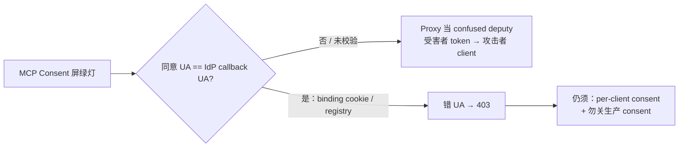

## 1. 问题现象 (Problem Symptoms)

[上一篇 Identity ≠ Audience](posts/mcp_auth_identity_not_intent.md) 钉的是 **token audience / RFC 8707 resource→aud**；本文钉的是 **consent approval ↔ IdP callback 的浏览器会话绑定**——两道门相邻，杠杆不同。

生产里另一种「OAuth 全绿、token 却落错人」长这样：MCP Proxy 自己的 Consent 屏点过同意了，上游 Identity Provider（IdP）也顺利回调了，`state` 对得上、authorization `code` 也能换票——但 **发 callback 的浏览器，并不是刚才在 Proxy 上点同意的那一台**。受害者的上游会话被拿来完成攻击者开的那条授权流，最终 MCP 侧 token 进了攻击者注册的 client。

常见误判有三种：

1. 「再加一层 OAuth / 把 scope 收紧一点」——身份层与 scope 往往已经绿了；缺口在 **consent→callback 是否绑到同一 User-Agent（UA）**。
2. 「怪 IdP 跳过 consent」——对已授权过的同 client / 同 scope，IdP **合法地**跳过二次同意；问题不在 IdP，在 Proxy 当了 **confused deputy（混淆代理）**（CWE-441）。
3. 「我们 consent 页已经有 CSRF / signed cookie 了」——那只证明「有人点了同意」；**不等于**「稍后带着 `code` 回来的就是同一浏览器」。

与系列其他层的划界（避免主题漂移）：

| 文章 / 选题 | 层 | 问的是 |
| --- | --- | --- |
| [MCP 工具设计：合法但错误](posts/mcp_tool_design_valid_but_wrong.md) | 工具面 | schema 绿灯、业务错 |
| [Agent 记得太久](posts/agent_memory_poisoning.md) | LTM 特权 | 记忆写什么、以什么权威读回 |
| [Identity ≠ Audience](posts/mcp_auth_identity_not_intent.md) | Token audience | token 是否发给**这台** MCP |
| **本文** | **Proxy consent → IdP callback** | 同意是否绑到**完成 callback 的浏览器** |

### 现象 A：Consent 在 A 浏览器，callback 在 B 浏览器，token 仍签发

值班同学看到的链路往往「每段都合理」：

- 攻击者在自己的浏览器上，对良性 MCP 的 OAuth Proxy 走完 **MCP 侧 consent**（Proxy 记下「这个 client 被同意了」，并准备上游 authorize URL）。
- 上游 authorize URL 被截获 / 转交后，落到一名 **已登录同一 IdP、且曾授权过该静态 client** 的受害者浏览器。
- IdP 因既有授权 **跳过 consent**，把带 `code` 的回调打回 Proxy。
- Proxy 的 `_handle_idp_callback`（或等价处理器）只校验交易里的 `state` + `code` 是否配对，**不校验「当前 UA 是否刚完成过这次 consent」** → 向攻击者 client 的 `redirect_uri` 吐出可用的 MCP authorization code，进而换到受害者账户下的 access token。

公开 advisory 把这条路径钉在 FastMCP OAuthProxy：[GHSA-rww4-4w9c-7733](https://github.com/PrefectHQ/fastmcp/security/advisories/GHSA-rww4-4w9c-7733) / [CVE-2026-27124](https://www.cve.org/CVERecord?id=CVE-2026-27124)（affected `<3.2.0`；fix `≥3.2.0`）。机制细节与复现步骤以 advisory 为准——**本文只讲架构缺口，不复述攻击菜谱。**

### 现象 B：Consent CSRF「绿了」，跨浏览器流仍通

团队已经按清单做了 consent 页 CSRF token、signed cookie、甚至 `frame-ancestors` 防 clickjacking。审计绿灯。上线后仍能复现「同意在攻击者 UA、换票在受害者 UA」。

根因对照表一行就能说清：

| 控件 | 证明什么 | 不证明什么 |
| --- | --- | --- |
| Consent 页 CSRF / 签名 cookie | 这次 POST 来自打开 consent 的会话 | IdP **callback** 也来自同一 UA |
| OAuth `state`（若在同意前就写入可被攻击者持有的 cookie） | 请求参数未在传输中被简单篡改 | 「同意」与「回调」属于同一次浏览器意图 |
| IdP 侧「已授权则跳过同意」 | IdP 对**静态 proxy client_id** 的 UX 策略 | MCP 侧 **动态注册的那个 client** 已获用户明确同意 |

### 现象 C：关掉 `require_authorization_consent` 之后，「绑定」根本无处可挂

为了本地调试或「内网已经信任」，有人把 `require_authorization_consent=False`。此时 `authorize()` 直接返回上游 URL **字符串**——没有 HTTP 响应用于 `Set-Cookie`，consent binding 检查也会被跳过。PR [#3201](https://github.com/PrefectHQ/fastmcp/pull/3201) 明示：这条路径上原攻击面仍在。生产里「关 consent = 关 binding」是部署级残留坑，不是「暂时省一步 UI」。



---

## 2. 根因分析 (Root Cause Analysis)

根因不是「OAuth 实现得不够多」，也不是「IdP 不该跳过 consent」，而是 Proxy 把两件不同的事揉成了一件：

| 门 | 问题 | 绿灯只证明 |
| --- | --- | --- |
| MCP-level consent | 用户是否同意**这个** MCP client 经 Proxy 访问上游 | 某次同意动作发生过（常落在攻击者自己的 UA） |
| IdP callback binding | 带着 `code` 回来的 UA，是否就是刚同意的那台 | **同一浏览器会话**完成了 consent→IdP→callback |
| Token audience（另文） | 换到的票是否发给**这台** MCP | `resource` → `aud`（RFC 8707） |

缺第二道门时，Proxy 对上游表现为「已获用户同意的合法 client」，对下游却把受害者的授权结果交给攻击者——经典 **CWE-441 Unintended Proxy / Confused Deputy**。NVD / advisory 均按此归类。

把「看起来合理」的实现拆开，缺口通常有三类：

| 缺口 | 机制 | 典型后果 |
| --- | --- | --- |
| Callback 只验 `state`+`code` | `_handle_idp_callback` 不要求浏览器侧 consent binding | 跨 UA 完成流（CVE-2026-27124） |
| Consent 控件 ≠ session binding | CSRF/签名只护 consent POST | 审计以为「有 cookie」就够了 |
| Consent 关闭 | 无响应可 `Set-Cookie` → 跳过 binding | 生产关开关 = 退回原攻击面（PR #3201） |

一句话收束：

> **IdP 跳过二次同意是合法 UX；Proxy 若不把「谁点了 MCP consent」绑到「谁完成 IdP callback」，自己就变成 confused deputy。**

---

## 3. 机制要点：consent ↔ callback 绑定，以及规范里的 per-client consent (Mechanism)

### 3.1 MCP Security Best Practices 在说什么

[MCP Security Best Practices — Confused Deputy](https://modelcontextprotocol.io/docs/tutorials/security/security_best_practices) 把场景写死了：MCP Proxy 对上游用 **静态 client_id**，对下游允许 **动态 client 注册**；上游 IdP 可能在首次同意后种下 consent cookie，之后对同一静态 client 跳过同意屏。若 Proxy **没有**自己的 per-client consent，攻击者就能借受害者浏览器里的上游 cookie，把 MCP authorization code 拐到恶意 `redirect_uri`。

规范要求的保护（与本文主线对齐的几条）：

1. **Per-client consent registry**：按用户维护已批准的 `client_id`；进上游 authorize 前先查；同意决策落服务端库或服务端会话。
2. **Consent UI**：标明 client 名、上游 scopes、注册的 `redirect_uri`；CSRF；禁 iframe（`frame-ancestors` / `X-Frame-Options: DENY`）。
3. **Consent cookie（若用）**：`__Host-` 前缀；`Secure` / `HttpOnly` / `SameSite=Lax`；密码学签名或服务端会话；**必须绑具体 `client_id`**，不能只记「用户同意过某事」。
4. **`state` 时机**：cryptographically random；**仅在 consent 批准之后**再写入可追踪的 cookie/session，并在即将 redirect 上游前设置；callback 精确匹配；一次性 + 短过期。**禁止在同意批准前写 state cookie**——否则攻击者可绕过 consent 屏。

### 3.2 Consent CSRF ≠ Consent Binding

FastMCP 修法（PR #3201）把两者拆开写进实现：

| | Consent 页控件 | Consent Binding |
| --- | --- | --- |
| 时机 | 用户点批准 / 自动批准时 | 同一时刻签发，在 **IdP callback** 校验 |
| 载体 | CSRF token、consent 决策 cookie | 签名的 `MCP_CONSENT_BINDING`（txn_id → token），浏览器绑定 |
| 失败形态 | 伪造同意 POST | 另一 UA 带着合法 `state`+`code` 回 callback → 应 **403** |
| 防的是 | 跨站替用户点同意 | **跨浏览器完成授权流**（confused deputy） |

修法示意（架构级，非 PoC）：

```text
同意时（同一 HTTP 响应）：
  txn.consent_token = random()
  Set-Cookie: MCP_CONSENT_BINDING=<signed(txn_id, token)>  # 生产宜 __Host- 前缀

IdP callback：
  if cookie 缺失或不匹配 txn：
      403
  else：
      继续换票；成功后清除 binding cookie
```

PR 描述的失败路径一句话：**攻击者浏览器 consent → cookie 种在攻击者 UA → 截获上游 URL → 受害者 UA 无 cookie → callback 必须 403。** 缺校验时，受害者 UA 仍能走完。

### 3.3 与 Identity ≠ Audience 的正交关系

| | 本文（consent binding） | 上篇（audience） |
| --- | --- | --- |
| 信任对象 | **哪一次浏览器会话**完成了 Proxy consent | **哪一台 MCP 资源**该收这张票 |
| 失败形态 | 受害者 token → 攻击者 client | 合法票打错 MCP / 跨应用 / 跨部署 |
| 主杠杆 | binding cookie + per-client registry | RFC 8707 `resource` → `aud` |
| 误修 | 「再加 OAuth / 怪 IdP」 | 「再加 OAuth / 收紧 scope」 |

两篇都修完，仍要第三道门（工具级授权 / `scopesRequired`）——上篇 coda 已钉过，本文不展开。

---

## 4. BAD / GOOD (BAD / GOOD)

### BAD#1：IdP callback 不验「同意浏览器」（FastMCP OAuthProxy）

```text
❌ _handle_idp_callback（示意，对齐 advisory / PR 描述）

# 校验 state 属于某笔 txn，code 可向上游换票
# 不检查：当前 User-Agent 是否持有该 txn 的 consent binding
# → 任意持有 state+code 的浏览器都能完成流
# → 受害者 IdP 会话 + 攻击者已批准的 MCP client = confused deputy
```

**后果：** High；CWE-441。[GHSA-rww4-4w9c-7733](https://github.com/PrefectHQ/fastmcp/security/advisories/GHSA-rww4-4w9c-7733) / [CVE-2026-27124](https://www.cve.org/CVERecord?id=CVE-2026-27124)。Advisory 写明：在 GitHubProvider 上实锤；源码层面凡「IdP 允许跳过 consent」的集成都落同一模式。

**GOOD：** 升级 FastMCP **≥3.2.0**。同意时签发并下发签名 `MCP_CONSENT_BINDING`；callback 匹配失败一律 403；成功后清除。自建 Proxy 对齐同一不变量，不要只抄「有个 consent HTML」。

### BAD#2：把 Consent CSRF 当成 Binding

```text
❌ 「consent POST 校验了 CSRF，所以整条 OAuth 安全了」
   CSRF 护的是同意动作本身
   不护：同意之后、IdP 回来之前，授权 URL 换浏览器执行
```

**GOOD：** 两道控件并列上线——consent CSRF **以及** callback 上的 browser binding；再加服务端 **per-client consent registry**（规范 MUST）。Cookie 属性按规范：`__Host-` / `Secure` / `HttpOnly` / `SameSite=Lax` / 签名；绑定 `client_id`（及 txn），不是布尔「已同意」。

### BAD#3：同意批准前就写 state / 追踪 cookie

```text
❌ 打开 /authorize 立刻 Set-Cookie(state=...)
   → 攻击者可诱导受害者带着「尚未同意」的 state 直跳上游
   → MCP consent 屏形同虚设
```

**GOOD：** 规范原文——**state 相关 cookie/session 只能在用户批准 consent 之后、redirect 上游之前写入**；callback 精确匹配；单次使用 + 短 TTL。

### BAD#4（残留）：生产关闭 `require_authorization_consent`

```text
❌ require_authorization_consent=False
   authorize() 返回 URL 字符串 → 无法 Set-Cookie
   callback 跳过 binding 校验
   → GHSA-rww4-4w9c-7733 原向量仍在（PR #3201 明示）
```

**GOOD：** 生产强制 consent + binding。调试若必须关，隔离在非生产部署，并承认该环境**无** confused-deputy 防护；不要把「内网」当成绑定替代品。

### GOOD 总表

| 环节 | 要求 |
| --- | --- |
| Consent 决策 | Per-user、per-`client_id` registry；进上游前必查 |
| Consent UI | Client 名 / scopes / `redirect_uri`；CSRF；禁 iframe |
| Binding | 同意时签名 cookie（`MCP_CONSENT_BINDING` / `__Host-`）；callback 匹配否则 403 |
| `state` | 同意**后**再绑定到会话；callback 校验；一次性 |
| `redirect_uri` | 与注册值精确匹配（无通配） |
| 开关 | 生产勿关 `require_authorization_consent`（或等价） |
| 受众层 | 另文：RFC 8707 aud——本文修完仍要做 |

---

## 5. 发版前清单 (Pre-Ship Checklist)

上线任何「MCP OAuth Proxy / 静态上游 client + 动态下游 client」之前，对准 **consent↔callback 浏览器绑定**，而不是再加一句「请先登录」：

**Consent 与注册表**

- [ ] 每个 MCP `client_id` 有独立同意记录（按用户）；未批准不得 redirect 上游
- [ ] Consent 页展示 client 名、上游 scopes、最终 `redirect_uri`
- [ ] CSRF + 禁 iframe；同意决策服务端持久化或等价安全会话

**Binding**

- [ ] 批准同意的响应里设置签名 binding cookie（宜 `__Host-` + `Secure`/`HttpOnly`/`SameSite=Lax`）
- [ ] IdP callback：**强制**校验 binding；缺失/不匹配 → **403**（不要只打日志）
- [ ] 成功后清除 binding；token / txn 短过期、单次使用
- [ ] 回归：consent UA ≠ callback UA 必须失败（自动化即可，勿把 advisory 步骤当内部 runbook 扩散）

**State 与 redirect**

- [ ] `state` 在同意批准**之后**写入；callback 精确匹配
- [ ] `redirect_uri` 精确匹配注册值；变更须重新注册 / 重新同意

**部署开关**

- [ ] 生产 `require_authorization_consent`（或等价）为开；配置扫描拒绝「关 consent 的 prod」
- [ ] 关 consent 的环境不得承接真实用户 IdP 会话

**与受众层正交自检（防误修）**

- [ ] 本清单全绿 ≠ RFC 8707 aud 已绿——两套测试都要有
- [ ] 告警文案区分：「consent binding 失败」vs「aud 不匹配」vs「scope 不足」

---

## 6. 小结 (Takeaways)

**Consent 绿了，只说明「有人点过同意」；没把同意绑到完成 IdP callback 的那台浏览器，Proxy 就会把受害者的授权结果交给攻击者 client。**

- **主线：** consent approval ↔ IdP callback 的浏览器会话绑定（signed `MCP_CONSENT_BINDING` / `__Host-`）+ per-client consent registry + `state` 不得早于同意写入。
- **BAD 对照：** FastMCP OAuthProxy callback 不验同意浏览器（CVE-2026-27124 / GHSA-rww4-4w9c-7733，fix ≥3.2.0）；CSRF≠binding；关 `require_authorization_consent` 残留（PR #3201）。
- **误判：** 「再加 OAuth / 收紧 scope / 怪 IdP 跳过 consent」——IdP skip 合法；根因是 Proxy 作 CWE-441 confused deputy。
- **划界：** [Identity ≠ Audience](posts/mcp_auth_identity_not_intent.md) = token 是否发给这台 MCP；本文 = 同意是否绑到完成 callback 的浏览器。
- **残留：** 关 consent 的路径无法 Set-Cookie → binding 被跳过；生产禁止。

本文是 **MCP-Auth 系列**在 audience 文之后的下一篇。下一坑可落到 Host 渐进发现（搜不到 ≠ 没能力），或工具授权 / step-up scope——都是「绿了但信任对象绑错」的近亲。

---

## 参考 (References)

1. PrefectHQ/fastmcp — [GHSA-rww4-4w9c-7733](https://github.com/PrefectHQ/fastmcp/security/advisories/GHSA-rww4-4w9c-7733) / [CVE-2026-27124](https://www.cve.org/CVERecord?id=CVE-2026-27124)（OAuth Proxy IdP callback 缺 consent 浏览器校验 → confused deputy；CWE-441；fix ≥3.2.0）。机制与步骤以 advisory 为准，本文不复述。
2. PrefectHQ/fastmcp — [PR #3201](https://github.com/PrefectHQ/fastmcp/pull/3201)（`MCP_CONSENT_BINDING` cookie；`require_authorization_consent=False` 时无法 Set-Cookie、binding 跳过）。
3. Model Context Protocol — [Security Best Practices](https://modelcontextprotocol.io/docs/tutorials/security/security_best_practices)（Confused Deputy；per-client consent；consent cookie MUST bind `client_id`；`state` 不得在同意前写入）。
4. NVD — [CVE-2026-27124](https://nvd.nist.gov/vuln/detail/CVE-2026-27124)（CWE-441 归类入口）。
5. 本站 — [MCP Auth：Identity ≠ Audience](posts/mcp_auth_identity_not_intent.md)（系列上篇：RFC 8707 aud；与本文划界）；[MCP 工具设计：合法但错误](posts/mcp_tool_design_valid_but_wrong.md)（工具面近亲）。
