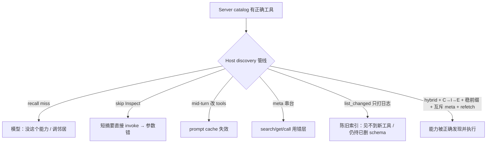

## 1. 问题现象 (Problem Symptoms)

[MCP 工具设计：为什么 Agent 总发出「合法但错误」的调用](posts/mcp_tool_design_valid_but_wrong.md) 已钉 **Server 面** schema / description / lazy `get_taxonomy`。本文立刻转到 **Host 运行时发现层**：lazy / Tool Search 上线之后，失败从「塞太多」变成「检索漏召回、缓存失活、元工具路由错、通知到了目录没刷」。

结论先行：**工具「搜不到」≠「没这个能力」。** 模型看到的候选集是 Host 检索与缓存管线的产物；召回 miss、Inspect 跳过、mid-turn 改 `tools`、元工具混淆、`list_changed` 后陈旧索引——都会让「能力明明在」变成「Agent 坚持说没有 / 瞎调邻居 / 用过期 schema 调」。省 token 的数字（Anthropic Tool Search ~72K→~8.7K、Opus MCP eval 49%→74%、filesystem disclosure 150K→2K）只是背景：token 压力缓和之后，生产坑迁到了 **discovery 正确性**。

与相邻选题划界（避免主题漂移）：

| 文章 / 选题 | 层 | 问的是 |
| --- | --- | --- |
| [MCP 工具设计：合法但错误](posts/mcp_tool_design_valid_but_wrong.md) | Server 工具面 | schema 绿灯、业务错；taxonomy 设计 |
| [Identity ≠ Audience](posts/mcp_auth_identity_not_intent.md) | 授权受众 | token 是否发给**这台** MCP |
| [Consent Binding](posts/mcp_consent_binding_confused_deputy.md) | Proxy consent↔callback | 同意是否绑到完成 callback 的浏览器 |
| **本文** | **Host discovery / cache / meta-tool** | 能力能否被正确发现、展开、保持新鲜 |

### 现象 A：Recall miss——catalog 有，候选集没有，「没这个能力」

客服 bot 挂了 CRM MCP，catalog 里明明白白有 `crm_search_order`。用户问「查一下 ORD-8821 能不能退」。Host 走 Tool Search / BM25 / regex，本轮候选只吐出 `crm_list_tickets`、`crm_get_customer`——名字语义邻近，但不是退款预览链上该用的那把。

模型的推理很「合理」：候选里没有订单检索 → 结论「当前没有查单能力」→ 要么空回复，要么发明邻居工具的参数乱调。值班同学去 Server 侧对 schema：工具在、描述对、鉴权绿。根因不在 Server，在 **检索没把正确工具送进候选集**。

公开对照（同模型 Claude Sonnet 4.5、~2792 tools）：纯 Tool Search 选择准确率约 34%、召回约 48%；hybrid 检索约 94% / 98%。差距不是「模型突然变笨」，是 **retrieval@k 没把对的工具放进 k**。

### 现象 B：Inspect skip——Catalog 摘要直接 Invoke

MCP 客户端最佳实践把发现拆成 **Catalog → Inspect → Execute**。Catalog 给短名 + 一行摘要；Inspect（`get_tool` / 等价）拉全量 `inputSchema` / 约束；Execute 才 `call_tool`。

生产里常见捷径：模型（或 Host 胶水）看到 catalog 短描述里有个 `order_id`，直接 `call_tool("crm_invoke_refund_preview", {...})`，**跳过 Inspect**。结果：漏必填字段、枚举写错 canonical token、把 preview 当成 commit——全部是「schema 层面本可避免」的错，却以业务故障出场。这不是再讲一遍 Server 的 taxonomy 设计，而是 Host 管线允许 **未展开定义就 invoke**。

### 现象 C：Prompt-cache break——会话中途改 `tools` 数组

为了「动态能力」，Host 在 turn 中间把新发现的工具 **整表重排 / 替换** 进请求的 `tools` 数组。文档写得很直：改 tools 定义会使依赖该前缀的 **整段 prompt cache 失效**。你用 `defer_loading` / Tool Search 省下来的定义 token，被一次 mid-session 注入吃回；延迟与账单同时抬头，且模型看到的工具集合在对话中途「抖」了一下——后续选择更漂。

对照路径是：`defer_loading` 保前缀；发现后用 conversation 内 `tool_reference` 展开且 **前缀不变**；或只暴露稳定 meta-`call_tool`，业务工具不进可变前缀；若必须追加，只在 cache breakpoint **之后** append，禁止整表替换与重排。

### 现象 D：Meta-tool 混淆——`search_tools` / `get_tool` / `call_tool` 串台

Host 暴露三层元工具：`search_tools`（召回候选）、`get_tool`（Inspect）、`call_tool`（Execute）。系统提示若写糊——「需要时使用工具」——模型会：

- 把 `search_tools` 当业务工具，对用户说「我已搜索订单」却从未 `call_tool`；
- `call_tool` 时 `name` 填成搜索查询字符串；
- 对已 Inspect 过的工具再次 `search_tools` 空转，或反过来未 Inspect 就 Execute。

三层职责必须 **互斥** 写进 Host 系统提示，并在运行时拒绝「用错层」的调用形状——不能指望模型从名字猜协议。

### 现象 E：`list_changed` 到了，Host 目录仍陈旧

Server 已发 `notifications/tools/list_changed`（工具增删改）。Host handler **只打日志**，不 refetch、不重建 deferred 索引。长会话里模型仍持有已删工具的旧 schema，或永远看不到刚上线的 `crm_invoke_refund_preview`。

这不是假想症：Codex [#33266](https://github.com/openai/codex/issues/33266)（`list_changed` 不 invalidate deferred cache / 不 refetch）、[#37417](https://github.com/openai/codex/issues/37417)（会话内 tool-list 变更永不生效；handler 只打日志；Desktop 长任务同症）；Zed 曾缺处理，[PR #42453](https://github.com/zed-industries/zed/pull/42453) 才补上 reload。一句话：**通知 ≠ 刷新**；订阅了 notification 却不驱动 catalog/index 更新，等于假装实时。



---

## 2. 根因分析 (Root Cause Analysis)

根因不是「模型不懂 MCP」，而是团队把 **五件不同的事** 叠进同一个口语「工具发现已经做了」：

| 层 | 实际保证 | 不保证什么 | 典型误判 / 误合并名 |
| --- | --- | --- | --- |
| (1) Server 工具面 | schema / description / 业务边界正确 | Host 一定能检索到它 | 「Server 绿了 = Agent 用得上」（范文已覆盖，此处不展开） |
| (2) Catalog 检索 / Tool Search | 从全量名录召回 top-k 候选 | recall@k = 1；selection accuracy | 「上了 Tool Search = 不会漏工具」 |
| (3) Inspect（定义展开） | 把全量 schema 送进模型可见上下文 | 未 Inspect 也能安全 invoke | 「catalog 摘要够填参」 |
| (4) Prompt 前缀 / cache 策略 | `defer_loading` 等使定义可不进稳定前缀 | mid-turn 整表改 `tools` 仍命中 cache | 「动态注入工具不影响延迟」 |
| (5) 元工具路由 + 变更订阅 | search / get / call 分层；`list_changed` 可观测 | 分层自动互斥；通知自动 refetch | 「有 meta 工具 / 订了 notification = 目录新鲜」 |

五句话收束：

1. **召回是门槛，不是装饰。** selection 指标好看之前，先问正确工具是否进入候选集；Stacklok 对照说明 hybrid 补的是 retrieval，不是「换个更聪明的 system prompt」 alone。
2. **Catalog 摘要 ≠ 可执行契约。** 跳过 Inspect 等于用广告文案当 API 合同。
3. **缓存友好与「会话中任意改工具表」互斥。** 省定义 token 的收益，建立在前缀稳定之上；整表替换是主动拆自己的 cache。
4. **元工具是控制面，不是业务面。** 名称相近时，模型会串台——必须靠系统提示 + Host 校验双闸。
5. **`list_changed` 是事件，不是状态同步。** 事件到达后若不 refetch + 重索引 deferred catalog，Host 持有的仍是会话开始时的快照。

命名上常见的误合并：把 Server 侧 lazy taxonomy（范文）叫做「渐进发现」却不再做 Host 检索门控；把「接了 Tool Search」叫做「progressive disclosure 已完成」却允许 skip Inspect；把「handler 订阅了 `list_changed`」叫做「热更新」却只 `log.info`。评审时强制拆开上表五层，禁止用一个词盖过去。

---

## 3. 机制要点：Host 发现五杠杆 (Mechanism)

### 3.1 召回门控：hybrid + recall@k，而不是只看 selection

生产指标至少拆成两截：

- **recall@k**：正确工具是否出现在检索返回的 k 条内；
- **selection accuracy**：模型是否在候选里选对。

只盯 selection，会掩盖「根本没进候选」的 miss——模型再强也选不出集合外的名字。实践杠杆：

- 查询改写 / 同义词（订单 / order / refund / 退款）进检索，而不是只丢用户原句；
- hybrid（稀疏 + 稠密 / 或规则路由 + 语义）补纯 Tool Search 的盲区；
- **硬门控**：关键业务意图（退款预览、下单、删资源）若 recall 未命中主工具，禁止直接答「没能力」，改为扩大 k、换检索器、或降级到人工 / 明确「检索失败」而不是「能力不存在」。

Token 背景再次强调边界：Advanced Tool Use / Tool Search 把定义从约 72K 压到约 8.7K、评测上升，证明 **披露策略** 有效；Stacklok 在两千级工具上的召回鸿沟证明 **披露之后仍要检索正确性**。两件事串行，不是互相替代。

### 3.2 Catalog → Inspect → Execute：禁止跳级

按 [MCP client best practices](https://modelcontextprotocol.io/docs/2025-11-25/develop/clients/client-best-practices) 固化三步：

| 步 | Host / 元工具 | 模型可见物 | 允许的下一跳 |
| --- | --- | --- | --- |
| Catalog | `search_tools` / list 摘要 | name + 短描述 | 仅 → Inspect |
| Inspect | `get_tool` / 拉全定义 | 完整 `inputSchema`、约束、副作用提示 | → Execute 或再 Catalog |
| Execute | `call_tool` | 工具结果 | 业务继续；必要时再 Catalog |

Host 侧可做机械拒绝：`call_tool(name)` 时若本 session 未 Inspect 过 `name`（或 cache 中无全定义），返回可行动错误「先 get_tool」，而不是把残缺参数打到 Server。这与 Server 把 description 写清楚正交——**跳级是 Host bug**。

### 3.3 前缀稳定：`defer_loading` / meta-`call_tool` / breakpoint 后追加

Anthropic 文档路径：

- 工具标记 `defer_loading`，初始请求不把全量定义塞进稳定前缀；
- Tool Search 命中后以 conversation 内 `tool_reference` 展开，**前缀不变**，cache 可继续命中；
- 改 tools 定义会废掉依赖该前缀的 cache——因此禁止 turn 中途「为了方便」整表替换或重排。

三条可落地策略（按侵入性递增选）：

1. **全员 defer + Tool Search**：业务工具默认 deferred；前缀只留 search/meta。
2. **稳定 meta-`call_tool`**：请求里 `tools` 几乎不变，真正 name 当参数；定义走旁路缓存（仍要 Inspect 语义）。
3. **Breakpoint 后 append**：若必须把展开后的工具定义写进 `tools`，只 append、不 reorder、不 delete-renumber；并接受「从此 cache 以新前缀为准」的显式断点。

### 3.4 元工具职责互斥（写进系统提示 + 运行时校验）

系统提示最小契约（示意）：

```text
search_tools：只用于发现候选工具名；禁止当作业务操作；禁止向用户声称「已完成查询/退款」。
get_tool：在 call_tool 之前拉取完整 schema；同一 name 可缓存至 list_changed。
call_tool：唯一允许产生业务副作用/读业务数据的入口；name 必须是已 Inspect 的工具名，禁止填搜索词。
```

Host 校验示例形状：`call_tool` 的 `name` ∈ 已 Inspect 集合；`search_tools` 返回值不得被业务策略当成「已执行」。互斥写在 prompt 里是软约束；校验是硬约束——两者都要。

### 3.5 `list_changed` → refetch + 重索引（含 deferred）

订阅通知之后的状态机应是：

1. 收到 `notifications/tools/list_changed`；
2. 调用 `tools/list`（或等价）拉取权威目录；
3. **重建** search 索引 **与** deferred 工具缓存（Codex #33266 的缺口正在「deferred 不 invalidate」）；
4. 使本 session 的「已 Inspect 集合」对删除/改名工具失效；
5. 再允许后续 search/get/call。

「只打日志」是明确的缺陷模式（#37417）。Zed PR #42453 的方向是对照：通知必须驱动 reload。长任务 / Desktop 会话尤其危险——生命周期越长，陈旧窗口越大。

### 3.6 对照表（写进设计评审）

| 维度 | 错法 | 改法（映射本节） |
| --- | --- | --- |
| 检索 | 单路 BM25；只看 selection | hybrid + recall@k 门控（§3.1） |
| 调用链 | 摘要直接 invoke | Catalog→Inspect→Execute + 未 Inspect 拒 call（§3.2） |
| Cache | mid-turn 整表改 `tools` | `defer_loading` / 稳 meta / breakpoint 后 append（§3.3） |
| 元工具 | 提示糊成「使用工具」 | 互斥职责 + Host 校验（§3.4） |
| 变更 | 订了 notification 只 log | refetch + 重索引 deferred（§3.5） |

---

## 4. 同一条业务链：退款预览会话 (BAD → GOOD)

场景：支持 bot，`session_id=sup-20260925-8821`，`thread_id=thr-refund-8821`。用户：「ORD-8821 能退多少？先预览不要真退。」  
工具面：业务 `crm_search_order`、`crm_get_order_schema`、`crm_invoke_refund_preview`；元工具 `search_tools` / `get_tool` / `call_tool`。同一 thread 贯穿错法与改法。

### BAD：五坑叠在同一次退款预览

```python
# ❌ session_id=sup-20260925-8821  thread_id=thr-refund-8821
# Host 伪代码：看起来「已经 progressive disclosure」

TOOLS_PREFIX = [search_tools, get_tool, call_tool]  # 开局还算稳

def handle_turn(user_text, session):
    # 坑1：单路检索，recall miss → 模型以为没查单能力
    hits = bm25_search(user_text, k=3)  # 未命中 crm_search_order
    # 模型可见候选：crm_list_tickets, crm_get_customer, ...
    # 模型结论：「没有订单工具」→ 调用邻居或空答

    # 坑2：偶尔搜到了 preview，但跳过 Inspect
    call_tool(
        "crm_invoke_refund_preview",
        {"order": "ORD-8821", "mode": "yes"},  # 字段名/枚举未对照 schema
    )

    # 坑3：中途把「发现」到的工具整表塞进 tools，重排废 cache
    session.tools = TOOLS_PREFIX + hits_as_full_defs  # 整表替换 + 重排
    # 下一请求：prompt cache miss；延迟与成本反弹

    # 坑4：系统提示未互斥 → 模型把 search_tools 当「已查单」
    # search_tools("退款 ORD-8821") 后直接回复用户「已查询」，从未 call_tool

    # 坑5：Server 热更上线了修正版 preview；发了 list_changed
    def on_list_changed(_notif):
        log.info("tools changed")  # 不 refetch、不重建 deferred 索引
    # 长会话仍持旧 schema / 仍看不到新工具
```

失败剧本（同一 `thread_id`）：

1. 检索 miss → 用户听到「暂时没法查订单」或邻居工具乱调（§1A → 缺 §3.1）。
2. 某次碰巧点到 preview 名 → 未 Inspect 就 invoke → 参数错 / 误伤（§1B → 缺 §3.2）。
3. 为「修复」动态注入工具定义 → cache 失效，本会话后面每轮变慢（§1C → 缺 §3.3）。
4. 元工具串台 → 日志里只有 search，业务零副作用，用户以为查过了（§1D → 缺 §3.4）。
5. 热更后仍用旧定义 → 或永远看不到新工具（§1E → 缺 §3.5）。

### GOOD：同一 thread，五杠杆对齐

```python
# ✅ 同一 session_id / thread_id；映射 §3.1–§3.5

META = [search_tools, get_tool, call_tool]  # 稳定前缀；业务工具 defer_loading
inspected = {}  # name -> full schema；list_changed 时失效

def retrieve(query, k=8):
    # §3.1 hybrid + 意图同义词；返回 candidates
    return hybrid_search(expand_synonyms(query), k=k)

def ensure_recall(intent, hits, required):
    # §3.1 硬门控：退款预览意图必须召回主工具
    names = {h.name for h in hits}
    if intent == "refund_preview" and required not in names:
        raise DiscoveryMiss(
            f"recall miss: {required}; not「no such capability」"
        )

def get_tool(name):
    # §3.2 Inspect
    schema = fetch_full_definition(name)
    inspected[name] = schema
    return schema

def call_tool(name, args):
    # §3.2 + §3.4：未 Inspect 拒执行；name 禁止是搜索词
    if name not in inspected:
        return error("Inspect required: call get_tool first")
    if name in ("search_tools", "get_tool", "call_tool"):
        return error("meta-tools are not business targets")
    return mcp_call(name, validate(args, inspected[name]))

def on_list_changed(_notif):
    # §3.5 通知 → 权威目录 → 重索引（含 deferred）→ 清 Inspect 缓存
    catalog = tools_list()
    rebuild_search_index(catalog)
    rebuild_deferred_cache(catalog)
    inspected.clear()

def handle_turn(user_text, session):
    # 前缀始终 META；不在 mid-turn 替换 session.tools（§3.3）
    hits = retrieve(user_text)
    ensure_recall("refund_preview", hits, "crm_search_order")

    # Catalog
    # Inspect
    get_tool("crm_search_order")
    order = call_tool("crm_search_order", {"order_id": "ORD-8821"})

    get_tool("crm_invoke_refund_preview")
    preview = call_tool(
        "crm_invoke_refund_preview",
        {"order_id": "ORD-8821", "dry_run": True},
    )
    # 若需把定义暴露给模型：tool_reference / 仅在 cache breakpoint 后 append
    # 禁止：session.tools = META + full_defs 的整表重排
    return preview
```

系统提示侧（§3.4）与上表一致：三层元工具互斥；对用户话术禁止在仅 `search_tools` 后声称业务完成。  
Tradeoff 写清楚：硬召回门控会增加「检索失败」显式错误率——这是特性：把静默「没能力」变成可观测的 DiscoveryMiss，便于扩同义词与调 k，而不是让模型在邻居工具上即兴发挥。

---

## 5. 发版前清单：对准可注入失败点 (Pre-Ship Checklist)

上线任何「Tool Search / defer_loading / 元工具」Host 之前，用注入证明 discovery 正确，而不是演示「能搜到几个工具」：

**召回与话术**

- [ ] 指标拆分：recall@k 与 selection accuracy 分开看板；发布门禁含关键意图的 recall 下限
- [ ] 注入：从 catalog 删除检索别名 / 扰动 query，确认 Host 报 DiscoveryMiss 或扩检索，**而不是**模型回复「没有该能力」
- [ ] Stacklok 式对照可作为回归：同工具池上 hybrid 不得回退到纯 keyword 的召回塌方

**Catalog → Inspect → Execute**

- [ ] 文档写明三步；Host 对「未 Inspect 的 call_tool」返回可行动错误
- [ ] 注入：去掉 get_tool 权限或清空 inspected 缓存，断言 call 被拒且无 Server 副作用
- [ ] catalog 摘要故意缺字段名，确认模型路径仍先 Inspect 而非猜参

**Prompt cache / 工具数组**

- [ ] 生产路径使用 `defer_loading` 或稳定 meta-`call_tool`；代码审里禁止 mid-turn 整表替换 / 重排 `tools`
- [ ] 注入：一轮对话中动态 inject 工具定义，断言 cache hit rate 与延迟；对照「仅 breakpoint 后 append」
- [ ] 读过 [tool-use-with-prompt-caching](https://platform.claude.com/docs/en/agents-and-tools/tool-use/tool-use-with-prompt-caching) 与 [tool-search-tool](https://platform.claude.com/docs/en/agents-and-tools/tool-use/tool-search-tool) 的前缀不变约束

**元工具互斥**

- [ ] 系统提示逐条写出 search / get / call 禁令
- [ ] 注入：强制模型（或测试替身）用 search_tools「完成」退款；断言无业务副作用且用户可见状态非「已退款/已查询完成」
- [ ] `call_tool.name` 填搜索弦时被 Host 拒绝

**`list_changed` 新鲜度**

- [ ] handler 路径：notif → `tools/list` → 重建 search 索引 → 重建 deferred 缓存 → 失效 inspected
- [ ] 注入：会话中途 Server 增删改工具并发 `list_changed`；断言后续 search 见新工具、call 旧名失败、无「只打日志」
- [ ] 对照已知缺陷模式：Codex #33266 / #37417；实现方向对照 Zed #42453
- [ ] 长会话 / Desktop 长任务单独回归（陈旧窗口更大）

**与 Server 范文的边界**

- [ ] 评审纪要写明：本文不重复 Confusion+Bloat / AWS V1–V4；Server schema 问题仍回 [合法但错误](posts/mcp_tool_design_valid_but_wrong.md)
- [ ] Token 节省数字只作背景，门禁主指标是 discovery 正确性而非「定义 token 又降了多少」

---

## 6. 小结 (Takeaways)

**搜不到 ≠ 没能力。** Progressive disclosure 在 Host 侧是一条管线：检索召回、定义展开、前缀稳定、元工具路由、变更刷新——任一环静默失败，模型都会用一本正经的错话术掩盖。

- 召回门控先于选择准确率；hybrid + recall@k，关键意图禁止「假阴性能力宣告」（§3.1）。
- 强制 Catalog→Inspect→Execute；未 Inspect 拒 call（§3.2）。
- `defer_loading` / 稳定 meta / breakpoint 后 append 保 prompt cache；禁止 mid-turn 整表改 `tools`（§3.3）。
- search / get / call 职责互斥：提示 + Host 校验双闸（§3.4）。
- `list_changed` 必须驱动 refetch 与 deferred 重索引；通知 ≠ 刷新（§3.5）。
- Token 从数万到数千、评测分数上升，只说明披露策略赢了；之后的生产坑在 discovery 正确性——用注入清单证明，不靠「接了 Tool Search」的演示。

系列位置：Server 工具面（[合法但错误](posts/mcp_tool_design_valid_but_wrong.md)）→ **Host 发现 / 缓存 / 元工具（本文）**。授权受众与 consent 绑定是相邻安全门，不替代本层的检索与缓存纪律。

---

## 参考 (References)

1. Anthropic Engineering — [Advanced tool use](https://www.anthropic.com/engineering/advanced-tool-use)（Tool Search / `defer_loading`；约 72K→8.7K；评测提升；deferred 与 prompt cache）。
2. Anthropic Engineering — [Code execution with MCP](https://www.anthropic.com/engineering/code-execution-with-mcp)（filesystem progressive disclosure 约 150K→2K）。
3. Claude Docs — [Tool search tool](https://platform.claude.com/docs/en/agents-and-tools/tool-use/tool-search-tool)（`defer_loading`；`tool_reference` 展开且前缀不变）。
4. Claude Docs — [Tool use with prompt caching](https://platform.claude.com/docs/en/agents-and-tools/tool-use/tool-use-with-prompt-caching)（改 tools 定义使 cache 失效；`defer_loading` 保 cache）。
5. MCP Spec — [Client best practices (2025-11-25)](https://modelcontextprotocol.io/docs/2025-11-25/develop/clients/client-best-practices)（Catalog→Inspect→Execute；`list_changed` 重索引；mid-conversation 改 `tools` 与 cache）。
6. AWS Machine Learning Blog — [MCP tool design: practical approaches and tradeoffs](https://aws.amazon.com/blogs/machine-learning/mcp-tool-design-practical-approaches-and-tradeoffs/)（Server 侧 lazy taxonomy；**prior art，细节见本站范文**）。
7. OpenAI Codex — [Issue #33266](https://github.com/openai/codex/issues/33266)（`list_changed` 不 invalidate deferred cache / 不 refetch）。
8. OpenAI Codex — [Issue #37417](https://github.com/openai/codex/issues/37417)（会话内 tool-list 变更不生效；handler 只打日志）。
9. Zed — [PR #42453](https://github.com/zed-industries/zed/pull/42453)（Host 补 `list_changed` → reload）。
10. Stacklok — [MCP Optimizer vs Anthropic Tool Search](https://stacklok.com/blog/stackloks-mcp-optimizer-vs-anthropics-tool-search-tool-a-head-to-head-comparison/)（~2792 tools：Tool Search 选择/召回 vs hybrid）。
11. 本站 — [MCP 工具设计：为什么 Agent 总发出「合法但错误」的调用](posts/mcp_tool_design_valid_but_wrong.md)（Server 面；与本文 Host 发现层分工）。
