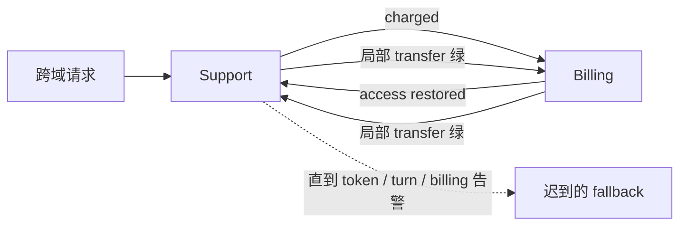

## 结论先行

**Handoff 不是一句「对方更合适」，而是一层 routing fabric（路由结构）。** 单个专员把消息成功发给下一个专员，只证明一条边可走；它不证明整条路径有进展，更不证明路径会终止。

生产里要防的不是某个 Agent 偶尔选错，而是多个局部合理的路由决策合成全局环。可靠修复需要四个协议原语：**per-conversation handoff ledger、reject-and-explain、独立的 handoff budget，以及可判定的 termination predicate**。Dashboard、trace、token 告警只能告诉你环已经在烧钱；真正的刹车必须在下一次 dispatch 之前拒绝继续。

本文只讲 routing protocol primitives 与 termination predicate。不是 Multi-Agent System（MAS）入门，也不展开 MAST 的 14 类模式。

---

## 1. 问题现象：每次 transfer 都绿，整段会话却没有出口

### 现象 A：Analyzer ↔ Verifier 跑了 264 小时，账单先发现

Vectara 的 agent failure 案例库记录了一起四 Agent 市场研究流水线事故：Analyzer 与 Verifier 连续往返 **264 小时（11 天）**，累计约 **47,000 美元** API 成本，没有产出可用结果；异常最终由 billing dashboard 暴露，而不是由 Agent 内部的 progress / termination 机制截停。

循环本身并不复杂：Verifier 持续要求进一步分析，Analyzer 每次都补一轮；Verifier 再按同一组模糊质量标准找出下一点。每一轮都能解释成「正常 refinement」，所以没有一次调用天然像 error。真正缺失的是两样东西：**“完成”能否由运行时判定，以及未完成最多还能往返几次。**

证据边界要写清：这里采用的是 Vectara failure collection 的二手 case study 所列数字与时间线，不把其中转述当作原始事故方声明，也不扩写未公开的公司、模型或调用量。

### 现象 B：support ↔ billing 的所有权 seam

Tian Pan 给出的 seam 场景更能说明为什么双边 dashboard 会同时绿。用户说：「我为没有收到的支持服务付了费，还要恢复访问权限。」

- Support 看到 `charged`，按本地规则转给 Billing；`transfer_out=success`。
- Billing 看到 `access restored`，按本地规则转回 Support；`transfer_out=success`。
- Supervisor 只是忠实投递，没有会话级路由历史；两个团队都看到自己的专员正确拒绝了非本域请求。

这不是两个 Agent 都失灵，而是**所有权交界处没有联合处置协议**。两个局部函数分别正确：

```text
route_support(charged ∧ access_issue) = billing
route_billing(charged ∧ access_issue) = support
```

组合后却得到：

```text
support → billing → support → billing → …
```

局部正确不具备可组合性。`transfer_out` 和 `task_received` 同时增长，只说明消息在移动，不说明任务在收敛。

### 次要旁证：非 Handoff 的同型控制错误

Mastra issue #21897 记录了一个运行时同型问题：零输出 stream 以 `finishReason: "other"` 结束时，因为它不在 terminal reason 集合里，agentic loop 会把同一请求再次发出；controller session 的默认 `maxSteps` 为 1000，因此一次 silent EOF 最多可变成上千次相同调用。该问题后来由 PR #22273 修复：零输出的 `other` 被转成 error-shaped outcome，走有界重试并停止。

它不是多 Agent handoff 案例，但暴露同一个控制面错误：**“不是已知 terminal”被误写成“可以继续”**。继续执行必须有正向条件，不能靠排除少数 finish reason。



---

## 2. 根因：把路由决策当成回答质量问题

Closed-loop handoff 的根因不是「模型不够聪明」，而是控制平面缺协议。

### 2.1 Handoff 是路由边，不是自然语言建议

一次 handoff 至少改变三件事：当前 owner、可用工具/权限、后续终止责任。若实现只传一段自由文本——「这个问题更适合 Billing」——系统就丢掉了最关键的结构：为什么转、谁接管、接管后哪个状态会改变、何时不得再转回。

把每个 Agent 的路由器写成局部函数并不能保证全局无环。只要存在 `A→B` 与 `B→A` 都合法的输入区域，运行时拓扑就可能成环；prompt 里多写一句 “avoid loops” 不会产生全局不变量。

MAST（arXiv:2503.13657）可作为一个锚点：其 1,642 条轨迹中将 step repetition 与 unaware of termination conditions 明确列为系统设计失败。本文不复述整套 taxonomy；这里要落地的是：**这类失败应由路由协议约束，而不是留给某个 Agent 自觉识别。**

### 2.2 「Verifier 满意」不是 termination predicate

可判定终止谓词应当是运行时对结构化状态求值的布尔函数：

```text
terminal(conversation_state) -> true | false
```

它至少要满足：输入字段明确、同一状态重复求值结果稳定、无需再发一次 LLM 请求才能知道是否结束。

下面这些不是合格谓词：

- 「Verifier 认为足够好了」
- 「没有更多值得补充的内容」
- 「把请求交给最合适的专员」

它们都是新的开放式生成任务。Verifier 总能再发现一个角度；路由器总能再找到一个“更合适”的人。把自然语言满意度放在循环 guard 上，等于让 guard 自己继续生成工作。

可判定版本应改成有限状态与硬边界的组合。例如市场报告：

```text
terminal :=
  required_sections.all(status == "verified")
  AND unresolved_findings == 0

fail_closed :=
  verifier_rounds >= 3
  OR handoff_count >= 5
  OR wall_clock >= 30min
```

`verified` 仍可能由模型建议，但写入前要经过固定 rubric / 外部检查；即使质量判定不确定，硬边界也必须可执行。到达 `fail_closed` 不是伪装成成功，而是进入明确的 `needs_human_review` / `incomplete_with_reasons` 终态。

对 support + billing 的跨域请求，终止条件可以是：

```text
terminal :=
  billing_obligation in {dispute_filed, charge_explained, resolved}
  AND access_obligation in {restored, denied_with_reason}
```

这会迫使系统承认「一个请求包含两个 obligation」，而不是让两个队列争夺唯一 owner。

### 2.3 Observability ≠ Enforcement

Trace、成本曲线与转交热力图解决的是「看见」。Inline guard、预算与拒绝 dispatch 解决的是「停止」。两者不可互换：

- Billing alert 在调用完成后聚合；钱已经花了。
- Token cap 对所有推理统一计费；等它触发时，可能已完成几十次短 handoff。
- Cycle detector 有 false positive / false negative；不能成为唯一刹车。
- `maxSteps` 若数值过大，只是把无限循环改成长循环。

可靠顺序应是：**先以确定性 guard 限制下一跳，再用观测信号诊断为什么撞 guard。**

---

## 3. 机制：把 Handoff 做成可拒绝、可计数、可终止的协议

### 3.1 Per-conversation handoff ledger

Ledger 必须在 Agent context 之外，由 supervisor / routing middleware 持久化。每次 attempt 与结果都记录，而不只记成功 transfer：

```json
{
  "conversation_id": "conv-42",
  "seq": 4,
  "from": "billing",
  "to": "support",
  "reason_code": "ACCESS_REMEDIATION_REQUIRED",
  "unresolved_obligations": ["access"],
  "expected_state_delta": ["access_obligation.status"],
  "decision": "rejected",
  "rejection_code": "RECENT_REENTRY",
  "state_version_before": 7,
  "state_version_after": 7
}
```

Ledger 的用途不是多存一份 log，而是让 router 在 dispatch 前执行不变量：

1. 目标 Agent 是否刚刚出现在路径中？
2. 同一 obligation 是否在 owner 不变、state version 不变时再次转交？
3. `A→B→A` 是否已出现？
4. 本次转交声称会改变哪个结构化字段？上次同理由是否真的改变了它？

只记录 `from/to` 能抓显式环；把 obligation 与 state delta 一起记，才能区分「同一路径上的有效 refinement」和「消息换了措辞但状态没动」。

### 3.2 Reject-and-explain：拒绝不是静默转回

Agent B 收到不该接的 handoff 时，不能直接再调用 `handoff(A)`。它应返回结构化拒绝：

```json
{
  "type": "handoff_rejected",
  "reason_code": "OWNERSHIP_CONFLICT",
  "explanation": "Access must be restored by Support; charge dispute remains with Billing.",
  "proposed_resolution": "split_obligations",
  "required_owner": ["support", "billing"]
}
```

Supervisor 收到拒绝后只能走有限分支：拆分 obligation、指定 primary owner、合并结果，或人工升级。**不得把拒绝文本原样包成一条新 handoff 送回来源。** 否则只是把环从 agent tool call 搬到 supervisor prompt。

拒绝 attempt 也应消耗 handoff budget；不然系统会从 transfer loop 退化为 reject loop。

### 3.3 Handoff budget ≠ token budget

Token budget 控成本总量；handoff budget 控路由拓扑深度。两者单位不同、触发位置不同，必须分开：

```text
before_dispatch(next_agent):
  assert handoff_attempts < MAX_HANDOFFS
  assert pair_reentry_count(current, next_agent) < MAX_PAIR_REENTRY
  assert next_agent not in forbidden_recent_path
```

预算耗尽时，router 在**下一次模型调用之前**进入失败终态，保留 unresolved obligations 与 ledger，交给人工或单一 fallback owner。预算不应被框架默认值偷偷决定；它应按拓扑显式配置，并在增加新 Agent 时重新评审。

注意：handoff budget 是保险丝，不是正确性证明。把上限从无限改成 5，只能保证 bounded termination；它不能保证前 5 次路由正确。因此还需要 termination predicate 与 ownership contract。

### 3.4 Structural guard + semantic detection

运行时热路径先用确定性结构 guard：最近路径、pair re-entry、handoff count、state version。语义相似度用于发现「Agent 名称或消息略变，实际仍无进展」的隐性环，但不应单独承担强制终止。

arXiv:2511.10650 在一个 LangGraph 股票应用的 **1,575 条轨迹**上报告：DAG 结构方法对 bad-cycle 类的 F1 为 **0.08**，语义方法为 **0.28**，call-stack 结构方法为 **0.45**；结构候选再做语义确认的 hybrid 方法达到 **F1 0.72（precision 0.62、recall 0.86）**。这组数字只适用于该数据集与阈值，不能外推成通用 SLA；它足以说明「有 trace」不等于「只看重复边就能可靠识别环」。

### 3.5 信号与刹车必须成对设计

| 常见做法 / 信号 | 为什么会假绿 | 应配套的全局判定或 enforcement |
| --- | --- | --- |
| `transfer_out=success` | 只证明本地 dispatch 成功 | conversation 级 progress + terminal state |
| handoff depth p99 | 能看到长尾，不能停下一跳 | `MAX_HANDOFFS` 在 dispatch 前硬拒绝 |
| A↔B 对称热力格 | 适合发现 pair 环，属于事后聚合 | pair re-entry counter + recent-path guard |
| re-entry counter | 可精确定位会话 / agent pair | 超阈值进入 `routing_conflict`，禁止自动回送 |
| DAG structural-only F1 0.08 | 重复边也可能是有效工作，隐性环也会换形 | hybrid 检测作诊断；硬预算保证最坏边界 |
| token / cost cap | 单位太粗，通常 bill before brake | 独立 handoff budget，且 attempt 也计数 |
| 「Verifier 满意」 | 新一轮主观生成，不可稳定求值 | 固定 rubric 字段 + unresolved=0 + hard cutoff |

---

## 4. BAD / GOOD：同一个 Support–Billing 路由器

### BAD：Agent 自己决定下一位，平台只负责送达

```python
# ❌ 局部路由全绿；平台没有会话级不变量
def run_agent(agent, message):
    result = agent.generate(message)

    if result.handoff_to:
        metrics.inc("transfer_out_success", agent=agent.name)
        return run_agent(AGENTS[result.handoff_to], result.handoff_message)

    return result.answer
```

这段代码看起来合理：目标 Agent 存在、调用成功、每次都有 trace。它仍缺少：路径历史、所有权冲突、终止谓词、attempt budget，以及拒绝 handoff 的结构化返回。任何 `A→B→A` 都会被当成三次独立成功。

### GOOD：先判终止与路由不变量，再允许 dispatch

```python
# ✅ routing plane 持有 ledger；Agent 只能提出 route proposal
MAX_HANDOFFS = 5
MAX_PAIR_REENTRY = 1


def route(conversation, proposal):
    state = conversation.state
    ledger = conversation.handoff_ledger

    if terminal(state):
        return Final(state.render_result())

    if ledger.attempt_count >= MAX_HANDOFFS:
        return RoutingConflict(
            code="HANDOFF_BUDGET_EXHAUSTED",
            unresolved=state.unresolved_obligations,
        )

    if ledger.pair_reentry_count(proposal.from_agent, proposal.to_agent) >= MAX_PAIR_REENTRY:
        ledger.append_rejection(proposal, code="PAIR_REENTRY_LIMIT")
        return RoutingConflict(
            code="PAIR_REENTRY_LIMIT",
            unresolved=state.unresolved_obligations,
        )

    if proposal.expected_state_delta == []:
        ledger.append_rejection(proposal, code="NO_PROGRESS_CONTRACT")
        return RoutingConflict(code="NO_PROGRESS_CONTRACT")

    ledger.append_attempt(proposal, state_version=state.version)
    return dispatch(proposal.to_agent, proposal.to_envelope())
```

Agent 的自然语言判断仍可参与 proposal，但它不再拥有无条件改写控制流的权限。Router 只接受带 `reason_code`、unresolved obligation 与 expected state delta 的提案；任何预算或 re-entry 冲突都先落 ledger，再进入确定终态。

对联合请求，GOOD 设计往往不是「选一个更聪明的 owner」，而是显式拆分：

```text
conversation
  ├─ obligation: billing_dispute  → Billing
  └─ obligation: access_restore  → Support

terminal = both obligations terminal
```

这把所有权 seam 从 prompt 猜测变成状态机。

---

## 5. Adversarial-seam eval：断言 bounded termination

每个专员自己的 benchmark 都过，不代表 seam 能过。发版前要专门构造跨域意图：一句话同时触发两个专员的路由词，或让 Verifier 能无限提出微小改进。

测试重点不是钉死唯一金路径，而是断言一组全局性质：

```python
def assert_bounded_handoff(run):
    assert run.reached_terminal_state
    assert run.handoff_attempts <= MAX_HANDOFFS
    assert run.max_pair_reentry <= MAX_PAIR_REENTRY
    assert run.all_handoffs_have_reason_code
    assert run.all_rejections_have_resolution
    assert run.unbounded_llm_judgment_not_used_as_loop_guard
```

建议至少覆盖：

1. **双意图 seam**：`charged` + `access restored` 同时出现；断言 obligation 被拆分或明确指定 primary owner。
2. **同义改写**：每轮 message 换措辞但 state version 不变；断言 no-progress 被识别。
3. **三节点环**：`A→B→C→A`；不能只测 pair loop。
4. **拒绝环**：B reject A，A 又把原信封发回 B；attempt budget 仍应下降。
5. **恢复与并发**：resume 后 ledger 不归零；两个 worker 不能各自认为还有完整预算。这一点与 [Checkpoint 不等于 Durable Execution](posts/durable_agent_execution.md) 的边界直接相连。
6. **检测器失手**：即使 semantic detector 给出 false negative，硬 handoff budget 仍保证 bounded termination。

这与 [Trajectory Eval：答对了为什么还是假绿](posts/trajectory_eval_false_green.md) 的关系是：那篇给 path 加门禁；本文进一步规定 handoff path 的控制面不变量。最终答案正确也不能豁免超预算回环，最终答案缺失更不能靠 dashboard 事后解释。

---

## 6. 上线前清单

### 路由协议

- [ ] 每次 handoff 都有 `conversation_id / from / to / reason_code / unresolved_obligations / expected_state_delta`
- [ ] Ledger 存在 supervisor / middleware 侧，不依赖某个 Agent 在 context 中“记得”
- [ ] Attempt、accept、reject 分开记录；reject 同样消耗预算
- [ ] 接收方只能结构化 reject-and-explain，不能静默转回来源
- [ ] 跨域请求可拆 obligation，不强迫所有请求只有一个 owner

### 终止与进展

- [ ] `terminal(state)` 是对结构化字段的稳定求值，不需要再问一次 LLM
- [ ] 模型质量判断写入固定 rubric；硬 cutoff 独立存在
- [ ] 定义 `needs_human_review / routing_conflict / incomplete_with_reasons` 等失败终态
- [ ] Progress 绑定 state delta / obligation 状态，不把「又生成一段文字」当进展

### Enforcement

- [ ] Handoff budget 与 token / cost / wall-clock budget 分开配置
- [ ] Budget 与 re-entry guard 在下一次 dispatch **之前**执行
- [ ] Pair re-entry 与最近路径能抓 `A↔B`；测试也覆盖 `A→B→C→A`
- [ ] Resume / retry 不会重置 ledger；并发 router 对计数原子更新

### 观测与评估

- [ ] 看 handoff depth p50/p95/p99，不只看平均值
- [ ] 有 source→destination heatmap，告警对称亮格
- [ ] 有 conversation 级 pair re-entry counter 与 unresolved obligation 数
- [ ] Hybrid cycle detection 用于发现隐性无进展；不把论文 F1 当通用保证
- [ ] Adversarial-seam eval 的合并门断言 bounded termination，而不只断言回答质量

---

## 7. 小结

Closed-loop escalation 最危险的地方，是它没有明显失败动作：Analyzer 在分析，Verifier 在验证，Support 与 Billing 都在把请求交给“更合适”的专员。**每条边都成功，图仍然可以失败。**

把 handoff 当 routing fabric 后，修复边界会清楚很多：

- termination predicate 必须可判定；「Verifier 满意」不是协议；
- per-conversation ledger 让全局路径进入控制面；
- reject-and-explain 把所有权冲突交给 supervisor，而不是静默打回；
- handoff budget 在路由次数这个正确单位上先刹车；
- heatmap、p99、hybrid detector 帮你看见问题，但 inline guard 才能阻止下一跳。

这不是要求所有多 Agent 工作流都改成 DAG。有效 refinement 可以有环；要求是：**环必须有进展契约、有可判定出口，并且最坏情况下有硬上界。** 否则账单总会比刹车更早到。

---

## 参考 (References)

1. Tian Pan — [The Closed-Loop Escalation Bug: When Your Specialist Agents Route in Circles](https://tianpan.co/blog/2026-05-02-closed-loop-escalation-bug-multi-agent-routing-cycles)（Support↔Billing seam 场景；routing fabric、ledger、handoff depth / heatmap）。
2. Vectara Awesome Agent Failures — [The $47,000 LangChain A2A Multi-Agent Infinite Loop](https://github.com/vectara/awesome-agent-failures/blob/main/docs/case-studies/langchain-a2a-47k-infinite-loop.md)（二手 case study：264 小时、约 47,000 美元、billing dashboard 发现；非原始事故声明）。
3. Cemri et al. — [Why Do Multi-Agent LLM Systems Fail?](https://arxiv.org/abs/2503.13657)（MAST；1,642 条轨迹；本文仅作 termination / repetition 的 taxonomy 锚点）。
4. George et al. — [Unsupervised Cycle Detection in Agentic Applications](https://arxiv.org/abs/2511.10650)（1,575 条 LangGraph 轨迹；DAG structural F1 0.08、semantic 0.28、call-stack 0.45、hybrid F1 0.72 / recall 0.86）。
5. Maxim AI — [Multi-Agent System Reliability: Failure Patterns, Root Causes, and Production Validation Strategies](https://www.getmaxim.ai/articles/multi-agent-system-reliability-failure-patterns-root-causes-and-production-validation-strategies/)（分布式 trace、循环依赖与 adversarial validation）。
6. Mastra issue [#21897](https://github.com/mastra-ai/mastra/issues/21897) / fix [#22273](https://github.com/mastra-ai/mastra/pull/22273)（次要旁证：零输出 `finishReason: other` 被当作可继续，重复请求至 `maxSteps`；已修复）。
7. 本站 — [Trajectory Eval：答对了为什么还是假绿](posts/trajectory_eval_false_green.md)；[长跑 Agent 挂了：Checkpoint 不等于 Durable Execution](posts/durable_agent_execution.md)；[长程 Agent：第一个错 ≠ 决定性错误](posts/long_horizon_decisive_error.md)。
