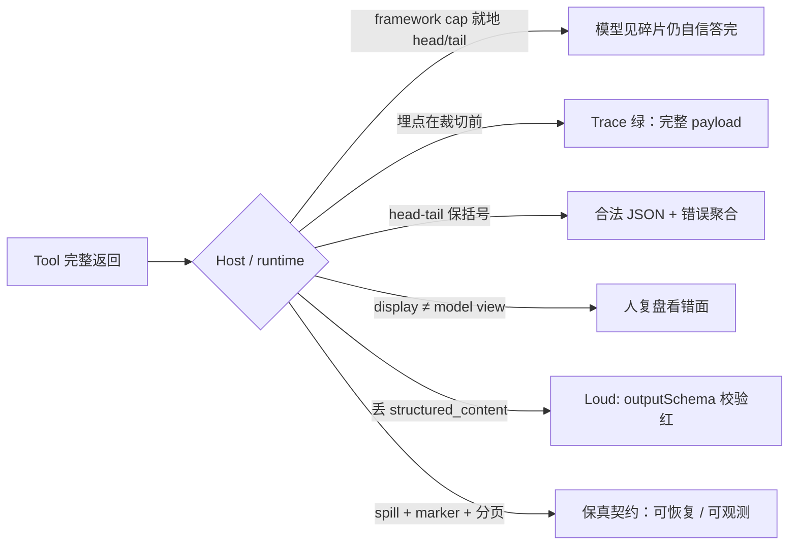

## 1. 问题现象 (Problem Symptoms)

值班同学打开 APM：工具 span 绿、`isError=false`、payload 看起来完整；用户侧却是一条自信写完的错答案。复盘常落到「模型又忽略证据 / hallucination」。多数时候两边都不对——**证据在进模型之前就被 Host / runtime 裁掉了**；trace 记的是裁切前的完整返回，模型读的是裁切后的碎片。

结论先行：**limit 必须存在，但「drop overflow and continue」对概率推理器是错误默认。** 确定性解析器遇到半截 JSON 会炸；reasoner 不会炸——它补洞、聚合、答完，还带着高置信。失败模式从 stack trace 换成「看起来合理的终答」，正是这层坑难查的原因。

本文钉的是 **Host / runtime 的 tool-result fidelity（结果保真）层**：工具已经返回完整 payload 之后、模型可见上下文之前，谁裁了、裁成什么样、模型与观测是否看到同一份。不是 context window 入门，也不是「把 cap 调大一点」。

与相邻文划界（避免主题漂移）：

| 文章 | 层 | 问的是 |
| --- | --- | --- |
| [Host 渐进发现：工具「搜不到」≠「没这个能力」](posts/mcp_progressive_disclosure.md) | Host discovery | Catalog / search / Inspect / `list_changed`——**能不能找到工具** |
| [MCP 工具设计：为什么 Agent 总发出「合法但错误」的调用](posts/mcp_tool_design_valid_but_wrong.md) | Server 工具面 | schema 绿灯、业务错选 |
| [Trajectory Eval：答对了为什么还是假绿](posts/trajectory_eval_false_green.md) | 评估面 | 终答对、路径烂；本文提供一类**假绿根因**（证据进模型前被剪） |
| [Agent 记得太久](posts/agent_memory_poisoning.md) | LTM 特权 | 跨会话记忆写读权威；本文是**单轮/同会话**结果保真 |
| **本文** | **Tool-Result Fidelity** | 找到并调用之后，结果是否完整到达 reasoner |

Discovery ≠ result path：那篇管「工具能否被召回」；本文管「调用结果是否完整送达」。两层都绿才谈得上「工具链可信」。

### 现象 A：Trace 绿 / 答案错——完整 CRM JSON 进了 Host，模型只见前缀

客服 Agent 同 `thread_id` 调 `crm_get_order_audit`，Server 返回 ~140KB 订单审计 JSON（含中段退款明细）。Host 默认 `tool_output_token_limit` / 字节 cap 就地 head/tail 裁切，中间夹一行 `…N tokens truncated…`。模型被问「本单退款合计与第 150 条明细金额」——它只看见数组头尾，仍输出一个完整数字。

APM / wrapper 埋点在裁切**之前**：span 里是完整 payload、status success。工程师对照 trace：「工具明明返回了」→ 怪模型。模型侧从未见过中段。这不是幻觉偏好，是 **观测面与模型面不是同一份字符串**。

公开同构：Codex [#14206](https://github.com/openai/codex/issues/14206)——超 `tool_output_token_limit` 就地 truncate，无 artifact / handle；[#14466](https://github.com/openai/codex/issues/14466)——上游 MCP 已完整返回，Codex 仍显示 truncated。非幂等工具更糟：中段一丢，同参数重跑可能已不可复现。

### 现象 B：Head-tail 保住合法 JSON——聚合错、结构对

框架常采用「留头留尾、丢中段」以塞进 cap（Codex / smolagents / OpenHands 一类）。对 JSON 数组，开头 `[` 与结尾 `]` 还在，残片仍是**合法 JSON**。确定性解析器不炸；reasoner 对可见元素做 count / sum / max，答出结构正确、数值错误的结论。

LatentEval 把这点写得很直：危险的不是「半截炸了」，而是「半截还能 parse」。Eval 若只验「终答是合法 JSON / 字段齐全」，假绿；若 oracle 依赖 cap 之后的证据，才暴露保真问题。

### 现象 C：Display 与 description 的旁证——人看全文，模型看 truncated

两条旁证，机制相邻、面不同：

1. **Display vs model view（结果面的观测错位）**：UI / transcript 只展示前几百字符，工程师以为「工具就返回这么多」；或反过来——wrapper 记完整、runtime 再裁，人看完整、模型看碎片。两种不对称都会把复盘指错层。
2. **Description 静默截断（描述面，次要）**：Claude Code [#81268](https://github.com/anthropics/claude-code/issues/81268) 客户端对 tool `description` / `instructions` 按 2048 不可见裁切；`/mcp` 显示全文，模型收 truncated。[#41593](https://github.com/anthropics/claude-code/issues/41593) 更狠：`code_executor` 描述里嵌入的函数签名被砍掉大半，模型幻觉不存在的函数名。

划界一句：**description 截断破坏的是「怎么调」；result 截断破坏的是「调完看见什么」。** 本文主战场是后者；前者只作「静默裁切 + UI/模型视图分裂」的旁证，不展开成 description 写作课。

### 现象 D（loud 变体）：裁切后丢掉 `structured_content`

并非所有裁切都静默。FastMCP [#3717](https://github.com/PrefectHQ/fastmcp/issues/3717) 的 `ResponseLimitingMiddleware`：超 `max_size` 后新建只含 text 的 `ToolResult`，`structured_content` / `meta` 变 `None` → 带 `outputSchema` 的工具触发 `outputSchema defined but no structured output returned`。这是 **loud** 失败：协议校验直接红。对照 silent 路径——silent 更危险，因为没有红灯可点。



---

## 2. 根因分析 (Root Cause Analysis)

根因不是「没设 context window」，而是团队把 **三件不同的裁切** 与 **一种观测落点** 叠进同一个口语「工具结果已经回来了」：

| 层 | 实际保证 | 不保证什么 | 典型误判 / 误合并名 |
| --- | --- | --- | --- |
| (1) Framework cap | 按字节 / token / 行上限裁进模型可见历史；常 head+tail + 行内 marker | 中段可恢复；marker 必被模型当控制信号；非幂等结果可重取 | 「有 `…truncated…` 字样 = 模型会去补全」 |
| (2) Transport buffer | 子进程 `maxBuffer`、gRPC/消息上限、stdio 缓冲 | 上游已写出的完整文件一定进模型 | 「工具写了 temp 文件 = Agent 看见了」 |
| (3) Display vs model view | UI / APM / transcript 的展示长度 | 展示内容 = 模型上下文；或 wrapper 日志 = post-cap 观测 | 「我在 dashboard 看到完整 JSON = 模型也看到了」 |
| (附) Observability 落点 | 在工具函数 return 处记一份 | 该份一定是模型最终读到的那份 | 「trace 完整 = fidelity 完整」 |

四句话收束：

1. **Limit 是容量契约，不是信息契约。** 容量说「不能无限灌进 context」；信息保真说「若必须丢，丢的事实要对模型与指标同时可见，且最好可恢复」。把前者实现成后者的静默默认，是错配。
2. **Parser 炸、reasoner 补。** 半截对确定性消费者是异常；对 LLM 是「较少约束的生成条件」。同一 cap 策略，在脚本管道里会红灯，在 Agent 管道里会假绿。
3. **Head-tail 优化的是「看起来像完整文档」，牺牲的是中段证据。** 日志、审计、测试失败栈、大 JSON 数组——答案常在中段。保两端是 UI 友好，不是 reasoner 友好。
4. **观测落在裁切错误侧 = 工业级误导。** LatentEval 写明：多数 instrumentation 包在工具函数外，记录的是 runtime 施加 cap **之前** 的返回值；框架即使有 in-band marker，日志层仍可把它洗成「完整成功」。

命名上常见的误合并：把「调大 `MAX_MCP_OUTPUT_TOKENS`」叫做「修了 truncation bug」（只推迟撞墙）；把「trace 里有完整 body」叫做「模型已消费完整证据」；把 discovery 层的 progressive disclosure（[搜不到 ≠ 没能力](posts/mcp_progressive_disclosure.md)）与 result 层的 fidelity 都叫「工具链路 OK」。评审时强制拆开上表，禁止一个词盖过去。

与评估假绿的交点（不合并成一篇）：[Trajectory Eval](posts/trajectory_eval_false_green.md) 问「路径是否可接受」；本文指出一类 **终答假绿的上游根因**——oracle 依赖的证据在进模型前被剪，终答 eval 与 trajectory eval 都可能绿，因为模型「合理使用了它看见的全部证据」。假绿在评估面显现，剪刀在 Host 结果面。

---

## 3. 机制要点：保真契约与五条杠杆 (Mechanism)

### 3.1 保真契约（fidelity contract）

写进 Host 设计评审的一句话：

> **工具成功返回之后，模型可见内容与「声称已交付的证据」必须可对账；若发生损失，损失必须是显式、可度量、且优先可恢复的。**

推论：

- 「丢溢出并继续」可以是 **UI preview** 的默认，不应是 **machine-consumed tool result** 的默认。
- 行内自然语言 marker（`…N tokens truncated…`）是弱信号：模型可忽略；指标管道也难稳定解析。优先要 **结构化字段**。
- 非幂等工具：就地 truncate 且无 spill = **永久信息损失**（Codex #14206 讨论区原话级共识：output can be lost permanently）。

### 3.2 结构化 `result_truncated` 字段

工具包装器 / Host ingress 在裁切时写出模型可读且指标可图的字段，例如：

```json
{
  "result_truncated": true,
  "original_size_bytes": 142336,
  "returned_size_bytes": 25000,
  "original_token_estimate": 38000,
  "strategy": "head_tail",
  "artifact_handle": null
}
```

要求：

- 进 **模型可见** 的 tool message（或并列 structured content），不是只写 debug log；
- 进 metrics：`truncation_rate{tool=...}`；
- 禁止只靠正文里夹一句英文提示充当唯一信号。

有字段，模型才有机会改走分页 / 读 artifact；值班才有机会在「答案错」之前看到曲线。

### 3.3 Spill-to-artifact + handle（可恢复默认）

超 cap 时：**完整 payload 落本地 artifact（或对象存储）**，模型收到 envelope：

- `artifact_id` / 路径
- `content_type`、原始 size
- 短 preview（可 head/tail）
- 显式 `preview_only: true`
- 允许 follow-up：全文读、range 读、grep、结构化再取

Claude Code / Gemini CLI 等已有「超阈值落盘 + 文件引用」路径；Codex #14206 诉求正是把就地 truncate 换成 auto-spill。关键性质是 **recoverability**：工具成功瞬间，全文仍在某处，模型可按需取回——而不是「唯一副本已被改写成预览」。

Tradeoff：spill 有磁盘与权限面；不 spill 的就地 truncate 更「省事」。生产上对 CRM / 日志 / 审计类工具，省事税是客户升级单。

### 3.4 分页 / `nextCursor` 作为一等契约

读类工具返回一页 + opaque cursor；系统提示写明：「若答案依赖未取完的页，显式再调并带 cursor」。MCP 在 `tools/list` 等处已有 `nextCursor` 语义；业务 `tools/call` 同样可把分页做成契约，而不是靠 Host 事后砍。

对照 Anthropic [Code execution with MCP](https://www.anthropic.com/engineering/code-execution-with-mcp)：大结果改在 code-exec 环境过滤 / 蒸馏，再把小结送回模型上下文——截断决策移到模型可改写的代码里，而不是框架静默丢。filesystem progressive disclosure（约 150K→2K）是 **主动蒸馏**，与 **被动丢中段** 不是同一策略。

### 3.5 Harness marker 断言 + per-tool 截断率告警

检测纪律（在「修架构」之前先让问题可见）：

1. **Fixture**：每把会吐大结果的工具，至少一条 eval 的 oracle **依赖 cap 之后的证据**。截断后仍能「答对」→ 测的不是保真。
2. **断言 runtime marker**：对比 `tool_return`（函数返回）与 `tool_msg.content`（模型最终所见）；对 OpenHands / smolagents / Codex 等已知 marker 做 `assert marker not in observed` 或「若 marker 出现则任务不得静默 PASS」。
3. **Per-tool truncation rate**：布尔截断旗进时序指标；阈值（如 >1%）按 tool 告警。截断高度聚集——少数工具贡献多数 clip。

LatentEval 的可靠性探测还提示：有 cue 的损失模型多半能察觉，**silent** 损失几乎抓不住——所以「只靠模型自觉」不是控制措施。

### 3.6 Loud vs Silent：协议层对照

| 形态 | 表现 | 为何仍要修 |
| --- | --- | --- |
| Silent in-place truncate | Trace 绿、答案错 | 无红灯；reasoner 补洞 |
| Loud drop `structured_content`（FastMCP #3717） | `outputSchema` 校验失败 | 有红灯，但说明 middleware 与 schema 契约未一起设计 |
| Spill + handle | 模型见 preview + 可再读 | 默认应对齐此形态 |
| Pagination | 模型显式续页 | 从根上减少「一次塞爆」 |

Loud 不是成功——它只是把「静默丢保真」变成「协议违规」。修好的标准仍是保真契约，不是「至少报错了」。

---

## 4. BAD / GOOD：同一 `thread_id` 的客服审计链 (BAD / GOOD)

场景：用户：「汇总 ORD-8821 的退款合计，并核对审计日志第 150 条是否为 `partial_refund`。」Agent 调 MCP `crm_get_order_audit` → 大 JSON 数组 → 聚合 + 抽检。全程同一 `thread_id`。

### BAD：完整返回 → Host 就地 head/tail → 自信错答

```text
# ❌ 同 thread_id=thr_ord_8821
# 1) Server 成功返回完整 audit JSON（~N 条，答案在中段）
# 2) Host 超 tool_output_token_limit → 就地 head/tail + 「…K tokens truncated…」
# 3) 无 artifact_handle；非幂等审计流可能无法原样重放
# 4) Wrapper/APM 记裁切前全文 → Trace 绿
# 5) 模型对可见元素 sum / 抽样 → 输出确定数字与错误状态码解释
```

```python
# ❌ Host ingress：看起来像「保护 context」，实为永久丢中段
def ingress_tool_result(raw: str, limit_tokens: int) -> str:
    if estimate_tokens(raw) <= limit_tokens:
        return raw
    # 就地改写唯一副本；中段审计行消失
    return head_tail_truncate(raw, limit_tokens, marker="…tokens truncated…")

# 模型侧（示意）：未见 result_truncated 字段，把残片当全集
# → 「退款合计 = 可见项之和」「第 150 条」可能越界或指错行
```

失败剧本映射 §3：

| 步骤 | 缺了哪条杠杆 |
| --- | --- |
| 就地 truncate、无 handle | 缺 §3.3 spill |
| 只有行内英文 marker | 缺 §3.2 结构化字段 |
| 一次要全量数组 | 缺 §3.4 分页 |
| Trace 仍绿、CI 终答「有数字」即过 | 缺 §3.5 marker 断言与大 fixture |
| （若中间件丢 structured_content） | 落入 §3.6 loud 变体，仍未给可恢复路径 |

次要叠加：若同 Host 还对 `crm_get_order_audit` 的 **description** 做了 2048 静默裁（#81268 形态），模型可能连「应使用 cursor / 应读 artifact」的说明都看不到——描述面与结果面同时静默，复盘更指错人。

### GOOD：spill + 结构化旗 + 分页 + harness

```python
# ✅ 同 thread_id=thr_ord_8821；ingress 保真
@dataclass
class ToolIngressResult:
    model_visible: dict
    artifact_path: str | None

def ingress_tool_result(raw: bytes, tool: str, limit_bytes: int) -> ToolIngressResult:
    if len(raw) <= limit_bytes:
        return ToolIngressResult(
            model_visible={
                "result_truncated": False,
                "original_size_bytes": len(raw),
                "returned_size_bytes": len(raw),
                "content": decode_json(raw),
            },
            artifact_path=None,
        )
    path = spill_to_artifact(raw, prefix=tool)  # §3.3
    preview = head_tail_bytes(raw, limit_bytes)
    return ToolIngressResult(
        model_visible={
            "result_truncated": True,               # §3.2
            "original_size_bytes": len(raw),
            "returned_size_bytes": len(preview),
            "strategy": "spill_preview",
            "artifact_handle": path,
            "preview_only": True,
            "content_preview": preview.decode("utf-8", "replace"),
            "next_actions": [
                "read_artifact(handle, offset, limit)",
                "crm_get_order_audit(order_id, cursor=...)",  # §3.4
            ],
        },
        artifact_path=path,
    )
```

```python
# ✅ 工具契约自带分页，而不是靠 Host 砍全量
@mcp.tool()
def crm_get_order_audit(order_id: str, cursor: str | None = None, page_size: int = 50):
    page, next_cursor = db.fetch_audit(order_id, cursor, page_size)
    return {
        "order_id": order_id,
        "items": page,
        "nextCursor": next_cursor,  # 模型显式续取
        "page_size": page_size,
    }
```

```python
# ✅ Harness：大响应 fixture + marker / 字段断言（§3.5）
def test_audit_oracle_past_cap(run_agent, huge_audit_fixture):
    # oracle 依赖 cap 之后的第 150 条与全量合计
    result = run_agent("汇总 ORD-8821…", fixture=huge_audit_fixture)
    observed = last_tool_message(result)
    assert observed.get("result_truncated") is True or observed.get("nextCursor")
    # 禁止：无 handle / 无续页却直接给出「最终合计」
    assert result.final_answer_depends_on_full_evidence()
    assert metrics.truncation_rate["crm_get_order_audit"]  # 可图、可告警
```

同一 `thread_id` 上 GOOD 路径的可见差异：第一次 call 可能仍触 cap，但模型收到 `result_truncated=true` + `artifact_handle` / `nextCursor`，第二、三步显式续取中段；终答对齐全量证据。Trace 对账字段：`original_size` vs `returned_size`、是否 spill、续呼次数——而不是只有一个绿勾。

Tradeoff 写清：spill + 分页增加工具作者与 Host 工作量；对「永远 2KB 内」的 `get_user_profile` 类工具，默认 cap 很少开火。成本不均匀——碰日志 / 审计 / 大文档的团队用静默 drop 养事故；小工具团队看不见税。框架默认优化的是后者；前者必须自己 wrap。

---

## 5. 发版前清单：对准可注入的失败点 (Pre-Ship Checklist)

上线任何会返回大 payload 的 Agent / MCP Host 之前，用注入证明保真，而不是用「小工具 demo 全绿」证明：

**契约与分层**

- [ ] 评审纪要能口头区分：framework cap ≠ transport buffer ≠ display 截断 ≠ 模型上下文
- [ ] 写明：本产品的 machine-consumed 默认是 spill/分页，还是就地 truncate（若是后者，需签风险）
- [ ] 与 [progressive disclosure](posts/mcp_progressive_disclosure.md) 划界：discovery 测试通过 ≠ result fidelity 测试通过

**Ingress 行为**

- [ ] 超限时写出结构化 `result_truncated` / `original_size` / `returned_size`（模型可见 + metrics）
- [ ] 超限时 spill-to-artifact（或等价对象存储）并返回 handle；禁止「唯一副本被 head/tail 改写且不可再读」
- [ ] 读类大工具提供 `nextCursor` / 等价续取；系统提示要求答案依赖未取完页时必须续呼
- [ ] 中间件若做 size limit：保留 `structured_content` / `meta`，或对 `outputSchema` 工具显式失败并给出可恢复路径（对照 FastMCP #3717）

**观测落点**

- [ ] APM 同时记录：工具函数返回大小、**post-cap 模型可见**大小、是否 truncated、artifact handle
- [ ] Dashboard 默认展示 post-cap 视图，或明确并排「wrapper vs model」两列，禁止只展示裁切前
- [ ] per-tool `truncation_rate` 告警已挂；发布后回看聚集工具名单

**Harness / Eval 注入**

- [ ] 注入点 A：返回体 > framework 默认 cap，oracle 依赖中段字段 → 不得静默 PASS
- [ ] 注入点 B：head-tail 后仍为合法 JSON 的数组 → 断言聚合结果不得当「全量」
- [ ] 注入点 C：非幂等工具超限 → 必须有 artifact，禁止「再 call 一次碰运气」
- [ ] 注入点 D：人为把埋点放在裁切前 → 回归测试须仍能从 model-visible 消息检出 truncated
- [ ] 注入点 E（旁证）：超长 `description` 时 `/mcp` 与模型所见一致或显式标记截断（#81268 形态）
- [ ] 对照 [trajectory 假绿](posts/trajectory_eval_false_green.md)：终答绿时仍检查是否出现截断旗却未续取

**描述面 vs 结果面（避免修错层）**

- [ ] description / instructions 预算有服务端自检或 Host 可观测日志；不与 result spill 方案混为一谈
- [ ] 内存摘要器若会丢 `ToolMessage`，单独门禁（属会话记忆面，交叉记忆文，不在本文展开）

---

## 6. 小结 (Takeaways)

**Trace 绿、答案错，先查结果保真，再查模型是否「忽略证据」。** Limit 必要；把溢出静默丢掉并对 reasoner 假装成功，是 Host 层的错误默认——解析器会炸，推理器会补洞。

- 三层裁切：framework cap / transport / display≠model；外加观测落在裁切前的错位（§2）。
- 保真契约：损失须显式、可度量、优先可恢复（§3.1）。
- 五条杠杆：结构化截断字段、spill+handle、分页/`nextCursor`、harness marker + 大 fixture、per-tool 截断率（§3.2–§3.5）；loud 丢 `structured_content` 是对照，不是目标态（§3.6）。
- 同 `thread_id` 业务链：BAD 就地 truncate → 自信错聚合；GOOD spill/分页/断言对齐 §3（§4）。
- 发版靠注入失败点，不靠小工具演示（§5）。

系列位置：Server 工具面（[合法但错误](posts/mcp_tool_design_valid_but_wrong.md)）→ Host 发现（[渐进发现](posts/mcp_progressive_disclosure.md)）→ **Host 结果保真（本文，MCP/Host Tool-Result Fidelity 专题首篇）**。评估假绿文给终态症状；本文给一类上游剪刀。下一坑可转向 Host 工具策略装配顺序（merge-after-filter）——那是「不该出现的工具仍可选」，与「可选工具的结果被剪半」相邻而不同层。

---

## 参考 (References)

1. Tian Pan — [Silent Tool Truncation: The Default Cap Your Agent Reasons Over Without Knowing](https://tianpan.co/blog/2026/05/10/silent-tool-truncation-8kb-default-agent-reasons-blind)（limit 必要但 silent drop 对 reasoner 错误；framework / transport / display；结构化截断信号与分页）。
2. LatentEval — [Tool output truncation: per-framework limits and what breaks](https://latenteval.ai/research/tool-output-truncation)（多 runtime 默认 cap；观测落在裁切前；head-tail 合法 JSON；harness marker 断言）。
3. OpenAI Codex — [Issue #14206](https://github.com/openai/codex/issues/14206)（超 `tool_output_token_limit` 就地 truncate；诉求 auto-spill + handle；非幂等不可补回）。
4. OpenAI Codex — [Issue #14466](https://github.com/openai/codex/issues/14466)（上游 MCP 已完整返回，Host 仍显示 truncated）。
5. Anthropic Claude Code — [Issue #81268](https://github.com/anthropics/claude-code/issues/81268)（`description` / `instructions` 2048 静默截断；`/mcp` 全文 vs 模型 truncated）。
6. Anthropic Claude Code — [Issue #41593](https://github.com/anthropics/claude-code/issues/41593)（描述面截断导致 code_executor 签名丢失与幻觉函数；与 #81268 同属描述面旁证）。
7. PrefectHQ FastMCP — [Issue #3717](https://github.com/PrefectHQ/fastmcp/issues/3717)（`ResponseLimitingMiddleware` 裁切后丢 `structured_content` → `outputSchema` 校验失败；loud 变体）。
8. Anthropic Engineering — [Code execution with MCP](https://www.anthropic.com/engineering/code-execution-with-mcp)（大结果改 code-exec 蒸馏；主动压缩 vs 被动丢中段）。
9. 本站 — [Host 渐进发现：工具「搜不到」≠「没这个能力」](posts/mcp_progressive_disclosure.md)（discovery 层；与本文 result path 分工）。
10. 本站 — [Trajectory Eval：答对了为什么还是假绿](posts/trajectory_eval_false_green.md)（评估面假绿；本文提供一类证据被剪的上游根因）。
11. 本站 — [MCP 工具设计：为什么 Agent 总发出「合法但错误」的调用](posts/mcp_tool_design_valid_but_wrong.md)（Server 工具面划界）。
12. 本站 — [Agent 记得太久](posts/agent_memory_poisoning.md)（跨会话 LTM；与本文单轮结果保真划界）。
