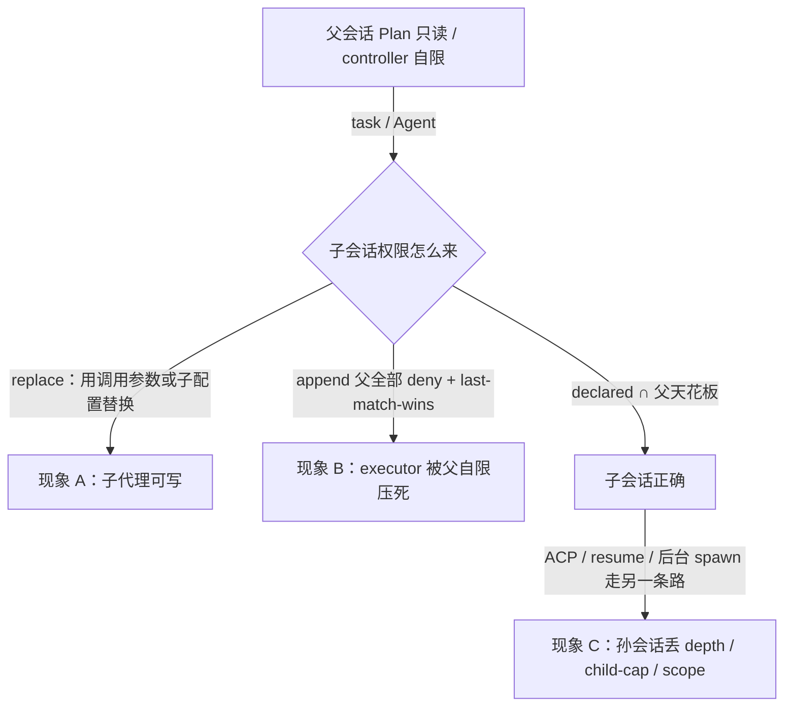

## 1. 问题现象 (Problem Symptoms)

结论先行：**子代理的权限 = 它自己声明的权限 ∩ 父会话下传的天花板，不是「替换」也不是「把父的 deny 全抄一遍」。** 前者让子代理穿透 Plan 只读，后者让 deny-by-default 的 controller 委派不出去；两边修来修去，是因为没人把「后代天花板」和「父的自限」拆成两种约束。再往下一层，孙会话如果不从父会话持久化的 envelope 派生，深度和子代理数量上限就一起丢了。

本文钉的是 **Host 委派层的子会话权限包络（delegation envelope）**：父会话经 `task` / `Agent` / ACP spawn 派生子会话时，权限边界怎么从父传到子、再传到孙。它是 MCP/Host Tool-Policy Assembly 专题的续篇 #2。

与相邻文划界（本文不复述它们的机制）：

| 文章 | 层 | 问的是 |
| --- | --- | --- |
| [工具策略「滤完了」：merge-after-filter](posts/host_tool_policy_merge_after_filter.md)（专题 #1） | 单会话内的工具来源装配 | core / MCP / LSP 哪些工具进入**这一个会话**的 `effectiveTools`，策略是否覆盖全部来源 |
| **本文**（专题 #2） | 会话**之间**的约束传递 | 父 → 子 → 孙，约束按 replace / append / intersect 哪种代数传；哪些约束下传、哪些只管父自己；envelope 是否逐层落盘 |
| [Handoff 环](posts/multi_agent_closed_loop_handoff.md) | 转交路由的终止性 | 专员互转会不会成环；本文的 depth / child-cap 只作安全上限，不讲环检测 |
| [MCP Auth](posts/mcp_auth_identity_not_intent.md) / [Consent Binding](posts/mcp_consent_binding_confused_deputy.md) | 远程 token / consent | 凭证与同意是否绑对主体；本文只管本地进程内权限 |
| [Agent 记得太久](posts/agent_memory_poisoning.md) | 跨会话长期记忆 | 摘要被写成跨会话特权；本文是派生会话的特权 |

一句话分工：merge-after-filter 问「**这个会话**的工具表里有谁」；本文问「**下一个会话**的工具表由谁定、上限从哪来」。前者修好了，每个会话自己的 final pass 都对，子会话照样可以拿着一份更宽的输入去跑那个 pass。

### 现象 A：父会话 Plan 只读，子代理「顺手」把文件改了

用户把会话切到 Plan 模式做发版评审：主代理调用 `edit` / `write` 被拒，报错清楚。随后模型调用 `task` 派出一个 `general` 子代理，让它「顺手改一下 CHANGELOG」——写入成功。

公开同构：opencode [#26514](https://github.com/anomalyco/opencode/issues/26514) 给出的四步复现正是这样：Plan 模式下主代理 `edit` 被拒，经 `task` 派 `general` 子代理后 `edit` / `write` 成功；修复 PR [#26597](https://github.com/anomalyco/opencode/pull/26597) 的说明点出原因：Plan 的 deny 挂在父 **agent** 的规则集上，`task` 只把父 **session** 的权限转给子会话，于是 `edit: deny` 根本没到子会话。

更早一层是 **replace 语义**：opencode [#7474](https://github.com/anomalyco/opencode/issues/7474) 报告 `SessionPrompt.prompt()` 的 `tools` 参数**替换**了 session 权限而不是合并，`ToolRegistry.tools()` 也不按 agent 规则过滤，配了 `bash: {"git*": allow, "*": deny}` 的子代理能跑任意命令。（该 issue 最终以 not planned 关闭，附带的 [PR #7473](https://github.com/anomalyco/opencode/pull/7473) 未合入；这里只引用它对机制的描述。）

旁证在 Claude Code：[#25000](https://github.com/anthropics/claude-code/issues/25000) 报告 Task 子代理绕过 `settings.local.json` 里的 Bash deny，跑了 22+ 条没有逐条审批的命令（该 issue 已作为 [#21460](https://github.com/anthropics/claude-code/issues/21460) 的 duplicate 关闭，后者讲 PreToolUse hook 对子代理调用不生效）。

误判路径：「模型越狱了」→ 在 Plan 提示里再加一句「子代理也不许写」。提示词不是权限，子会话的工具表里有 `edit`，模型就会用。

### 现象 B：修成「父 deny 全下传」，controller 委派不动了

现象 A 的修法直觉是：父有的 deny，子也要有。opencode #26597 就是这样做的：新增 `deriveSubagentSessionPermission()`，把父 agent 的**全部** deny 规则追加进子会话权限。

[#26700](https://github.com/anomalyco/opencode/issues/26700) 报告的回归随之出现（`1.14.41` 正常，`1.14.46` 回归）：deny-by-default 的三层配置 `controller → executor → worker`，controller 只被允许 `task` 到 executor，自己的 `read` / `bash` / `edit` 全 deny；executor 显式 allow `read` / `grep` / `bash` / `task worker`。升级后 executor 继承了 controller 的 `* * deny`、`read * deny`、`bash * deny`、`task * deny`，这些规则在 `Permission.merge(subagent.permission, session.permission)` 里排在 executor 自己的 allow **之后**，而求值是 last-match-wins，于是 executor 只剩一个每次调用都被拒的 `bash`，读不了文件、派不出 worker，流水线停在第二层。

误判路径：「executor 的配置写错了」→ 反复改 executor 的 allow，越改越多，结果不变，因为覆盖它的规则不在它自己的配置里。

后续：[PR #27201](https://github.com/anomalyco/opencode/pull/27201) 合入，关闭 #26700 时的评论说明修法是保留 Plan 下传的 edit 限制，不再把 `read` / `bash` / `task` 这类父的自限覆盖到子代理。但同一 issue 后续评论指出 edit 类 deny 仍无条件下传，「父不能 edit、子可以 edit」的 controller/worker 配置仍跑不通；为此提出的 #27654、#29235、#29778 截至本文写作时都已关闭且未合入。这正说明：只靠「哪些工具类别下传」的硬编码清单，天花板和自限两头都会出错。

### 现象 C：一层修好，孙会话又逃出去了

子会话的权限修对了，子代理再派生一层：换一个 spawn 入口（ACP child session、resume、后台任务），新会话从配置或默认值重建权限，而不是从父会话已经落盘的约束派生。

公开同构：OpenClaw [GHSA-q3jj-46pq-826r](https://github.com/openclaw/openclaw/security/advisories/GHSA-q3jj-46pq-826r)（Moderate；受影响 `<= 2026.4.21`，修复 `2026.4.22`）。Advisory 的 Impact 原文：受限 subagent 派生 ACP child session 时，可能没有带上仅属于 subagent 的约束，例如 depth、child-count 上限、control scope、target-agent 限制。Fix 段写的是：ACP spawn 现在会解析并持久化子会话的 subagent envelope 字段，强制执行最大深度和 active-child 上限，并把继承的 control scope 应用到子 ACP 会话。

还有一种更安静的版本：约束根本没进 envelope。Claude Code [#27099](https://github.com/anthropics/claude-code/issues/27099)（以 not planned 关闭）报告 agent frontmatter 把 `tools:` 写成 skill 用的 `allowed-tools:`，字段被静默忽略，子代理继承了父会话全部工具。拼错一个字段名，结果是 fail-open。



---

## 2. 根因分析 (Root Cause Analysis)

根因不是「deny 没写全」，而是团队把四种不同的约束都叫作「父会话的权限」，再用一个「继承」开关决定要不要往下抄：

| 约束 | 例子 | 应该作用于 | 抄错的后果 |
| --- | --- | --- | --- |
| (1) 子代理自己的声明 | executor 的 `read allow`、worker 的 `edit allow` | 子会话本身，且**不能高于** (2) | 被 replace 语义当成全部权限 → 现象 A |
| (2) 后代天花板（descendant ceiling） | Plan 只读、用户级 settings deny、会话级 sandbox | 父及其全部后代 | 不下传 → 现象 A；下传但只传一层 → 现象 C |
| (3) 父的自限（self restriction） | controller 自己 `read * deny`、`edit * deny` | 只管父自己做什么 | 当成 (2) 下传 → 现象 B |
| (4) 谱系上限（lineage limits） | depth、active-child cap、control scope、target-agent | 整棵派生树 | 只在第一层检查 → 现象 C |

三句话收束：

1. **替换和追加都不是交集。** replace：`child = declared`，父天花板消失。append + last-match-wins：`child = declared ++ parent_denies`，结果取决于规则顺序，而且把 (3) 当成 (2)。只有 `child = declared ∩ ceiling(parent)` 与顺序无关，也只吃 (2)。
2. **「继承」把天花板和自限叠成了一个词。** controller 不能读文件，是因为我们只想让它做调度，不是因为整棵树都不许读。Plan 只读不同：用户要的是「这段时间谁都别写」。两者在配置里都是一条 `deny`，语义完全不同；不打标签，任何下传策略都会错一边。
3. **约束是存在会话上的数据，不是 spawn 那一刻的计算。** 只在 `task` 入口算一次交集，另一个 spawn 入口重新从配置读权限，孙会话就拿到一份不受父约束的新包络。谱系上限更是如此：depth 本身就是「我在第几层」，不存下来就无从判断。

还有一个常见的误合并：把现象 A 叫作「越狱」。模型做的事完全合规——工具在它的表里，它用了。问题在 Host 给子会话装配权限的代数，不在模型。

---

## 3. 机制要点：envelope + 交集 (Mechanism)

### 3.1 交集代数：`effective = declared ∩ ceiling`

每个子会话的有效权限由两部分算出，且求值与规则顺序无关：

```text
child.effective = child.declared ∩ parent.envelope.ceiling
child.envelope.ceiling = parent.envelope.ceiling ∩ child.declared_descendant_ceiling
```

- `declared` 是子代理配置里的 allow / deny，**只能收窄，不能扩大**父的天花板。
- 交集按「是否允许某个具体调用」定义：天花板拒、或子声明拒，结果就是拒。不要把两份规则拼成一张表再交给 last-match-wins 求值器——那样结果取决于谁排在后面（#26700 正是这么坏的）。
- 子代理自己能把天花板继续收紧（例如 executor 规定 worker 不许联网），但不能放宽。

参照：Claude Code 子代理文档写明 Bash deny 规则同时作用于主会话和子代理；子代理在 frontmatter 声明 `bypassPermissions` 时保持主会话的权限模式，不能借定义升权。但同一份文档也写了，主会话在 `plan` 时子代理按自己声明的 `permissionMode` 运行（`bypassPermissions` 等情况除外）——「不能升到 bypass」不等于「Plan 是天花板」，自建 Host 不要照搬成后者。

### 3.2 天花板 vs 自限：给每条约束标 scope

父会话的每条约束带一个 `scope`：

```text
constraint.scope ∈ { self, descendants }
```

- `descendants`：Plan 只读、用户 / 组织级 settings deny、会话 sandbox、审批模式。进入 `envelope.ceiling`，一路往下传。
- `self`：某个 agent 定义里给自己设的 deny（controller 不读文件、不跑 bash）。只参与这个 agent 自己的 `effective`，**不进 ceiling**。

默认值要显式选：agent 定义里的 deny 默认 `self`，模式和用户级规则默认 `descendants`。#26700 的讨论里也有人提出类似方向（让 agent 显式声明哪些 deny 是后代天花板）。Tradeoff：标签多一个维度，配置评审要多问一句「这条是管你自己，还是管你派出去的所有人」；换来的是 Plan 只读和 controller 自限可以同时成立。

### 3.3 Envelope 持久化：每个 spawn 入口都从父会话的 envelope 派生

Envelope 是随会话落盘的对象，不是一次函数调用的局部变量：

```text
envelope = {
  ceiling,          # 3.2 中 scope=descendants 的约束（已与祖先取交集）
  depth,            # 本会话所在层，根 = 0
  max_depth,        # 整棵树共享，只能被后代收紧
  max_children,     # 本会话同时存活的子会话上限
  control_scope,    # 本会话能控制 / 消息 / 终止哪些会话
  target_agents,    # 允许派生的 agent 类型
  parent_session_id
}
```

规则：

- **所有** spawn 入口（`task`、ACP child、resume、后台任务、fork）都调用同一个 `deriveEnvelope(parent.envelope, child.declared)`，从**父会话已持久化的 envelope** 读，不从配置文件重建。
- 派生时检查：`parent.depth + 1 > max_depth` → 拒绝；`active_children(parent) >= max_children` → 拒绝；`child.agent ∉ target_agents` → 拒绝。拒绝是不可重试的结构化错误，不是静默降级。
- 子会话的 envelope 写入会话存储后才开始执行；resume 时从存储读，不重新推导。

这正是 OpenClaw advisory 修复描述的形状：解析并持久化子会话 envelope 字段、强制最大深度和 active-child 上限、应用继承的 control scope。

### 3.4 Fail-closed 解析与逐层审计

- **未知 / 拼错字段 fail-closed**：agent 定义里出现不认识的权限字段（`allowed-tools:` 之于 agent），要么拒绝启动，要么至少告警并按「零额外权限」启动；绝不能回落为「继承全部」（#27099 的机制）。
- **逐层审计**：每次 spawn 记一条结构化日志——`session_id`、`parent_session_id`、`depth`、`declared` 工具集、`ceiling` 工具集、`effective` 工具集，以及被拒原因 `denied_by ∈ {parent_ceiling, self_declared, depth_limit, child_cap, target_agent}`。

与 merge-after-filter 的 `pre/post/leak` 不同：那一组差集看的是**同一会话**里各来源过滤前后；这里看的是**谱系上每一层**相对父层的差集。两者都要有，互不替代。

---

## 4. 同一张工单 `REL-2041`：怎么接、错在哪、改完怎么走

贯穿全文的都是发版评审工单 `REL-2041`。流程分两段：先在 Plan 只读模式下评审变更（谁都不该写），评审通过后切到执行段，由 deny-by-default 的三层代理完成：`controller`（只能 `task` 到 executor）→ `executor`（`read` / `grep` / `bash git *,npm *` / `task` 到 worker）→ `worker`（`edit` / `write` CHANGELOG 和版本号）。

### 4.1 BAD v1：replace 语义，Plan 只读被子代理穿透

```ts
// ❌ REL-2041 / Plan 段。示意，形状对应 #7474 / #26514 描述
async function spawnSubagent(parent: Session, agent: AgentDef, prompt: string) {
  const child = await sessions.create({
    parentId: parent.id,
    // 子会话权限 = 子代理配置本身；父 agent 上的 Plan 只读没传下来
    permission: agent.permission,
  });
  return runPrompt(child, prompt, { tools: agent.tools }); // tools 参数替换 session 权限
}
```

```text
# REL-2041 Plan 段
parent(plan): edit CHANGELOG.md → denied ✅
parent: task(general, "顺手把 CHANGELOG 的版本号改成 2.8.0")
child(general): edit CHANGELOG.md → ok ❌   # Plan 只读被穿透
```

缺的是 §3.1：子会话权限没有和父天花板取交集。

### 4.2 BAD v2：父 deny 全下传，执行段的 controller 委派不动

团队按现象 A 的直觉修：把父的 deny 全部追加给子会话。

```ts
// ❌ REL-2041 / 执行段。示意，形状对应 #26700 描述的 deriveSubagentSessionPermission + last-match-wins
function deriveChildPermission(parentAgent: AgentDef, child: AgentDef): Rule[] {
  const inherited = parentAgent.permission.filter(r => r.action === "deny");
  return [...child.permission, ...inherited];   // 父 deny 排在子 allow 之后
}
const decide = (rules: Rule[], call: Call) =>
  rules.findLast(r => r.matches(call))?.action ?? "deny";   // last-match-wins
```

```text
# REL-2041 执行段
controller: task(executor, "按 REL-2041 的评审结论发 2.8.0")
executor 有效规则: read * allow, ..., read * deny(继承自 controller)
executor: read RELEASE_NOTES.md → denied ❌
executor: task(worker, ...) → denied ❌      # task * deny 也被继承
# 流水线停在第二层；Plan 段的问题倒是修好了
```

缺的是 §3.2：controller 的 `read * deny` 是自限，被当成了后代天花板；§3.1 也只做了一半——用规则拼接 + 求值顺序冒充交集。

### 4.3 BAD v3：只修 `task` 入口，孙会话丢了 envelope

团队再修：给约束加 scope，`task` 入口做交集。executor 能读、能派 worker 了。随后 executor 为了并行校验 `REL-2041` 的三个包，改用 ACP child session 派生校验代理：

```ts
// ❌ REL-2041 / 执行段。示意：我们自己 Host 的第二个 spawn 入口
async function spawnAcpChild(parent: Session, agent: AgentDef) {
  return sessions.create({
    parentId: parent.id,
    permission: loadAgentConfig(agent.name).permission, // 从配置重建，不读 parent.envelope
    // 没有 depth / max_children / control_scope
  });
}
```

```text
# REL-2041 执行段
executor(depth=1) → acp child(verify-pkg-a) → acp child(verify-pkg-a-deps) → …
# 每层都从配置重建权限：Plan 段若还在，ceiling 也丢了
# depth 不增长、active-child 不计数 → 扇出无界；校验代理能 message / stop 不属于它的会话
```

缺的是 §3.3：envelope 没有随会话持久化，第二个 spawn 入口没走同一个 `deriveEnvelope`。

### 4.4 GOOD：envelope 随 `REL-2041` 每一层落盘

```ts
// ✅ REL-2041。所有 spawn 入口（task / acp / resume / background）共用
type Envelope = {
  ceiling: Rule[];        // 只含 scope=descendants 的约束
  depth: number; maxDepth: number; maxChildren: number;
  controlScope: SessionId[]; targetAgents: string[]; parentId: SessionId | null;
};

async function spawnChild(parent: Session, agent: AgentDef, via: SpawnKind) {
  const env = await envelopes.load(parent.id);                       // §3.3 从存储读
  if (env.depth + 1 > env.maxDepth) throw rejectSpawn("depth_limit");            // §3.3
  if ((await activeChildren(parent.id)) >= env.maxChildren) throw rejectSpawn("child_cap");
  if (!env.targetAgents.includes(agent.name)) throw rejectSpawn("target_agent");
  const declared = parseAgentDef(agent);                              // §3.4 未知字段 → throw

  const childEnv: Envelope = {
    ceiling: intersect(env.ceiling, declared.descendantRules),        // §3.1 / §3.2
    depth: env.depth + 1,
    maxDepth: Math.min(env.maxDepth, declared.maxDepth ?? env.maxDepth),
    maxChildren: Math.min(env.maxChildren, declared.maxChildren ?? env.maxChildren),
    controlScope: [],                    // 只能控制自己派出的会话
    targetAgents: declared.canSpawn.filter(a => env.targetAgents.includes(a)),
    parentId: parent.id,
  };
  const child = await sessions.create({ parentId: parent.id, via });
  await envelopes.save(child.id, childEnv);                           // 先落盘再执行
  audit.spawn({                                                       // §3.4
    ticket: "REL-2041", child: child.id, depth: childEnv.depth,
    declared: names(declared.selfRules), ceiling: names(childEnv.ceiling),
    effective: names(effective(declared.selfRules, childEnv.ceiling)),
  });
  return child;
}

// 调用时：拒 = 天花板拒 ∨ 自己声明拒；与规则顺序无关（§3.1）
const allowed = (s: Session, call: Call) =>
  !denies(envelopeOf(s).ceiling, call) && permits(declaredOf(s).selfRules, call);
```

`REL-2041` 上 GOOD 的走法：

```text
# Plan 段：root envelope = {ceiling: plan-readonly, depth: 0, maxDepth: 2, maxChildren: 3}
parent: task(general, 改 CHANGELOG) → child.edit → denied (denied_by: parent_ceiling)
child 只能返回 diff 草案给评审

# 执行段：用户退出 Plan，ceiling 去掉 plan-readonly；controller 的 deny 均为 scope=self
controller(depth 0) → executor(depth 1)：read / grep / bash git,npm / task worker 全部保留
executor → worker(depth 2)：edit CHANGELOG.md、package.json → ok
worker 试图再派 verify 代理(depth 3) → rejected (depth_limit)，worker 自己跑完校验
executor 同时第 4 个 ACP 校验子会话 → rejected (child_cap)，等前面的结束再派
```

| 相对 BAD | 改了什么 | 回扣 |
| --- | --- | --- |
| v1：子会话用 replace 语义 | `effective = declared ∩ ceiling`，Plan 只读进 ceiling | §3.1 |
| v2：父 deny 全下传 + last-match-wins | deny 标 `scope`；自限不进 ceiling；交集按调用求值，不拼规则表 | §3.2、§3.1 |
| v3：第二个 spawn 入口从配置重建 | 所有入口共用 `spawnChild`；envelope 落盘；depth / child-cap / target / control scope 在派生时检查 | §3.3 |
| 全程：出事只能翻聊天记录 | 每次 spawn 一条审计，带 `denied_by` 与 declared / ceiling / effective 三个集合 | §3.4 |

Tradeoff：envelope 多一次存储读写，spawn 多几项检查，对单层子代理几乎无感。代价落在配置评审上：每条 deny 要回答 scope 是什么；`maxDepth` / `maxChildren` 取多少要按业务定（Claude Code 文档给的默认是子代理最多嵌套三层、整个会话同时运行 20 个（会话总数上限，不是按父会话计的 `maxChildren`），可调）。不做的代价是两头出事：要么 Plan 形同虚设，要么受限 controller 什么都派不出去。

---

## 5. 发版前清单：对准可注入的失败点 (Pre-Ship Checklist)

上线任何支持子代理 / 多层委派的 Host 之前，用注入证明 envelope 在每一层都成立，而不是用「单层子代理 demo 跑通了」证明。

**可注入失败点（三条必须进 CI）**

- [ ] **注入 1：父会话 Plan / 只读，诱导模型经 `task` 派子代理执行 edit / write / 写类 bash。** 期望：子代理工具表里没有写工具，或调用被拒；审计记 `denied_by: parent_ceiling`。对子代理的子代理再测一遍。
- [ ] **注入 2：deny-by-default 的 controller 委派给显式 allow 的 executor。** 期望：executor 保留自身 `read` / `task` / `bash`；controller 的自限（`read * deny`）不下传；executor 还能再派 worker。
- [ ] **注入 3：子代理再派生 ACP / 孙会话，超出深度或子代理数量上限；或 agent 定义写了未知字段 `allowed-tools:`。** 期望：
  - 第 N+1 层（`depth + 1 > maxDepth`）：spawn 被拒，错误码 `depth_limit`，不可重试；最好在已到上限的会话里直接不提供 spawn 工具（Claude Code 在深度上限处也是收回 `Agent` 工具）。
  - 超过 active-child cap：spawn 被拒，错误码 `child_cap`，提示等待已有子会话结束，不自动重试、不排队绕过。
  - 未知字段：启动失败并告警，或按零额外权限启动并告警；**不静默回落为全量继承**。

**契约与分层**

- [ ] 评审纪要能区分：子代理声明 / 后代天花板 / 父自限 / 谱系上限四种约束（§2 表）
- [ ] 每条 deny 有 `scope`；默认值写在文档里（agent 定义 deny 默认 `self`，模式与用户级规则默认 `descendants`）
- [ ] 权限求值是交集，不依赖规则排列顺序；有一个单测把同一组规则打乱顺序，结果不变
- [ ] 与 [merge-after-filter](posts/host_tool_policy_merge_after_filter.md) 划界：单会话 final pass 全绿 ≠ 子会话输入正确

**Spawn 入口枚举（必须列全，每个都走同一个 `spawnChild`）**

- [ ] `task` / `Agent` 工具
- [ ] ACP child session
- [ ] resume 已结束的子会话（从存储读 envelope，不重新推导）
- [ ] 后台任务 / fork / 定时任务派生
- [ ] 回归夹具：故意让某个入口从配置重建权限 → CI 必须红

**审计**

- [ ] 每次 spawn 一条日志：`depth`、`parent_session_id`、declared / ceiling / effective 三个集合
- [ ] 每次拒绝带 `denied_by`
- [ ] 告警：任何会话 `effective ⊄ ceiling`，或 `depth > maxDepth`、`active_children > maxChildren`

**发版评审口头否决**

- [ ] 用 prompt「子代理也不许写」代替 ceiling
- [ ] 用「父 deny 全下传」修 Plan 穿透（会复现现象 B）
- [ ] 只在 `task` 入口做交集

---

## 6. 小结 (Takeaways)

**子代理一派生，先问三件事：子会话权限是替换、追加还是交集；父的这条 deny 是天花板还是自限；孙会话的 envelope 从哪读。**

- 现象：Plan 只读被子代理穿透（replace）；修成全下传后 controller 委派不动（append + last-match-wins）；一层修好、孙会话丢 depth / child-cap / scope（§1）。
- 根因：四种约束被叫成同一个「继承」（§2）。
- 修法：`effective = declared ∩ ceiling`；约束标 `scope`，自限不下传；envelope 随会话落盘，所有 spawn 入口共用派生函数；未知字段 fail-closed；逐层审计（§3）。
- `REL-2041` 一条线从 BAD v1 → v2 → v3 → GOOD，每处改动对应 §3.1–§3.4（§4）。
- 发版靠三个注入点，尤其是第 N+1 层和超过子代理数量上限的拒绝路径（§5）。

系列位置：**MCP/Host Tool-Policy Assembly** 专题——#1 [工具策略「滤完了」](posts/host_tool_policy_merge_after_filter.md) 管单会话内工具来源与 final pass 的先后；**#2 本文**管父 → 子 → 孙之间的约束传递。再往前是 Host 发现（[渐进发现](posts/mcp_progressive_disclosure.md)）与结果保真（[静默截断](posts/silent_tool_result_truncation.md)）。多 Agent 转交的终止性见 [Handoff 环](posts/multi_agent_closed_loop_handoff.md)。

---

## 参考 (References)

1. OpenClaw — [GHSA-q3jj-46pq-826r：ACP child sessions inherit subagent security envelope constraints](https://github.com/openclaw/openclaw/security/advisories/GHSA-q3jj-46pq-826r)（Moderate；affected `<= 2026.4.21`；patched `2026.4.22`；修复内容按 advisory 原文：ACP spawn 解析并持久化子 envelope 字段，强制最大深度与 active-child 上限，应用继承的 control scope；fix commit `31160dc`）。
2. opencode — [Issue #7474：Subagent permissions not enforced](https://github.com/anomalyco/opencode/issues/7474)（`tools` 参数替换 session 权限；以 not planned 关闭，[PR #7473](https://github.com/anomalyco/opencode/pull/7473) 未合入）。
3. opencode — [Issue #26514：Subagents bypass Plan Mode READ-ONLY restrictions](https://github.com/anomalyco/opencode/issues/26514) 与 [PR #26597](https://github.com/anomalyco/opencode/pull/26597)（父 agent deny 下传的修复）。
4. opencode — [Issue #26700：Subagent parent deny inheritance over-constrains delegated agents](https://github.com/anomalyco/opencode/issues/26700)（#26597 回归；append + last-match-wins；`1.14.41` → `1.14.46`）与 [PR #27201](https://github.com/anomalyco/opencode/pull/27201)（部分修复：保留 Plan 的 edit 限制，停止下传 `read` / `bash` / `task` 自限；后续评论指出 edit 类仍下传）。
5. Claude Code — [Issue #25000](https://github.com/anthropics/claude-code/issues/25000)（旁证：子代理绕过 Bash deny；已作为 [#21460](https://github.com/anthropics/claude-code/issues/21460) 的 duplicate 关闭）。
6. Claude Code — [Issue #27099](https://github.com/anthropics/claude-code/issues/27099)（仅引用机制：agent frontmatter 中 `allowed-tools:` 被静默忽略 → 子代理继承全部工具；以 not planned 关闭）。
7. Claude Code — [Subagents 文档](https://code.claude.com/docs/en/sub-agents)（deny 规则作用于主会话与子代理；`bypassPermissions` 不能经子代理定义升权；嵌套深度上限与并发子代理上限）。
8. 本站 — [工具策略「滤完了」：MCP/LSP 却在过滤之后才拼进来](posts/host_tool_policy_merge_after_filter.md)（专题 #1；单会话工具装配，本文不复述）。
9. 本站 — [专员互相转交都「成功」：无终止谓词的 Handoff 环](posts/multi_agent_closed_loop_handoff.md)（转交终止性划界）。
10. 本站 — [MCP Auth：Identity ≠ Audience](posts/mcp_auth_identity_not_intent.md)、[MCP Consent Binding](posts/mcp_consent_binding_confused_deputy.md)（远程凭证边界划界）。
11. 本站 — [Agent 记得太久](posts/agent_memory_poisoning.md)（跨会话长期记忆特权划界）。
