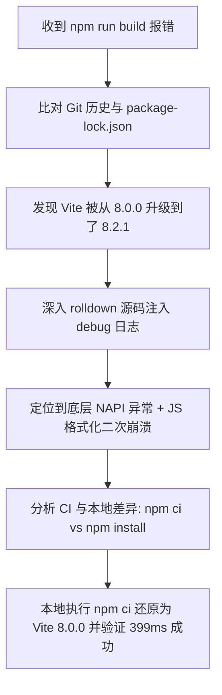

## 1. 问题现象 (Problem Symptoms)

在项目迭代过程中，遇到了以下两个关联构建异常：

### 现象 A：本地 `npm run build` 运行时抛出未知错误
执行 `npm run build`（即 `tsc -b && vite build`）时，构建中断并抛出以下错误：

```text
failed to load config from /workspace/demo/vite.config.ts
error during build:
Error: Build failed with 2 errors:

TypeError: Cannot convert undefined or null to object
    at aggregateBindingErrorsIntoJsError (file:///workspace/demo/node_modules/rolldown/dist/shared/error-BzLGqhSQ.mjs:48:18)
    at unwrapBindingResult (file:///workspace/demo/node_modules/rolldown/dist/shared/error-BzLGqhSQ.mjs:18:128)
```

### 现象 B：GitHub Actions CI 与本地环境行为不一致
- **GitHub Actions CI**（执行 `npm ci`）：远端运行通过，无任何构建错误。
- **本地环境**（执行 `npm run build`）：报错崩溃。

---

## 2. 根本原因分析 (Root Cause Analysis)

### 原因一：依赖版本漂移 (Version Drift)
1. 项目的 [package.json](file:///workspace/demo/package.json) 中配置为 `"vite": "^8.0.0"`（`^` 允许自动更新次版本）。
2. 旧的提交 [package-lock.json](file:///workspace/demo/package-lock.json) 将 `vite` 精确锁定在 **`8.0.0`**。
3. 当在本地运行 `npm install`（而非 `npm ci`）时，npm 自动将本地 `node_modules` 里的 `vite` 升级到了最新发行的 **`8.2.1`** 版本。
4. **GitHub Actions CI** 使用 `npm ci` 严格按 lockfile 安装，依然使用 **`8.0.0`**（构建成功）；而**本地环境**因 `npm install` 被漂移升级为 **`8.2.1`**（构建崩溃）。

### 原因二：Rolldown 引擎的“错误格式化二次崩溃”Bug (Double-Fault in Rolldown)
1. Vite 8.2.1 引入了全新的 Rust 引擎 **Rolldown** 作为配置文件打包器。
2. 在打包 `vite.config.ts` 时，Rolldown 的原生 Rust 绑定层（Node-API / NAPI）在解析 TypeScript 对象时遇到了解包异常。
3. 在 [node_modules/rolldown/dist/shared/error-BzLGqhSQ.mjs:37](file:///workspace/demo/node_modules/rolldown/dist/shared/error-BzLGqhSQ.mjs#L37) 中，Rolldown 的错误格式化函数 `aggregateBindingErrorsIntoJsError` 缺少对空对象/未定义属性的防护处理：
   ```javascript
   function aggregateBindingErrorsIntoJsError(rawErrors) {
       const errors = rawErrors.map(normalizeBindingError);
       ...
       summary += getErrorMessage(errors[i]); // 💥 格式化工具对 null/undefined 调用造成二次崩溃
   }
   ```
4. 格式化工具自身的崩溃反向抛出了 `TypeError: Cannot convert undefined or null to object`，掩盖了真实的编译信息。

### 原因三：跨项目对比——为什么 `Vite 8.2.0 + Rolldown 1.2.2` 的项目未报错？
在部分项目中，使用 `Vite 8.2.0`（搭配 `Rolldown 1.2.2`）并未引发构建崩溃，其根本原因为：

* **初级错误与次级格式化崩溃的分离**：`TypeError: Cannot convert undefined or null to object` **仅会在底层打包失败、调起错误格式化函数时**才会被触发。
* **初级错误被消除**：在 `Rolldown 1.2.2` 中，Rust 核心语法解析器修复了针对某些 TypeScript AST 节点的解析逻辑，打包配置文件时**一次错误都没抛出**。
* **格式化器未被激活**：由于底层零错误，`aggregateBindingErrorsIntoJsError` 函数**完全没有被执行**，使得格式化器的防空保护缺陷处于“潜伏未触发”状态，构建顺利通过。

---

## 3. 排查思路与过程 (Troubleshooting Process)



1. **第一性原理比对**：
   通过 `git show b22fec8:package-lock.json` 与当前 `node_modules/vite/package.json` 比对，确认 Vite 从 `8.0.0` 变为了 `8.2.1`。
2. **源码逆向插桩**：
   在 [node_modules/rolldown/dist/shared/error-BzLGqhSQ.mjs](file:///workspace/demo/node_modules/rolldown/dist/shared/error-BzLGqhSQ.mjs) 中打印 `RAW ERRORS` 原始数组，捕获到了 NAPI 传递上来的 Raw Binding Error，证实是 Rolldown 的错误输出逻辑发生崩溃掩盖了原始信息。
3. **CI 与本地执行差异确认**：
   查验 [.github/workflows/ci.yml:L23](file:///workspace/demo/.github/workflows/ci.yml#L23)，确认 CI 跑的是 `npm ci`。在本地运行 `npm ci` 将本地 `node_modules` 强行拉回与 `package-lock.json` 一致后，本地 `npm run build` 瞬间构建成功（耗时 **399ms**）。

---

## 4. 官方修补状态跟踪 (Official Fix Status)

针对最新发行的 **`rolldown@1.2.3`** npm 包进行了实际源码抽查分析：

1. **JS 侧格式化防护校验**：
   在 `rolldown@1.2.3` 的 [error-BzLGqhSQ.mjs:25](file:///workspace/demo/node_modules/rolldown/dist/shared/error-BzLGqhSQ.mjs#L25) 源码中：
   ```javascript
   function normalizeBindingError(e) {
       return e.type === "JsError" ? e.field0 : Object.assign(...);
   }
   ```
   **结论**：`normalizeBindingError` 针对 `JsError` 返回值的空指针防护补丁**尚未在 1.2.3 正式包中完全打入**。若底层抛出结构不全的 `JsError`，依然存在格式化二次崩溃风险。
2. **实践结论**：
   由于 Rolldown 处于快速演进期（NAPI 绑定层不断更新），目前在生产环境中锁定 **Vite `8.0.0`** 依然是保障构建 100% 稳定的最优解。

---

## 5. 修复与预防方案 (Resolution & Prevention)

### 方案 A：恢复本地开发环境对齐（已被验证）
在本地终端执行与 CI 完全一致的清洁安装命令：
```bash
npm ci
npm run build
```
保证本地 `node_modules` 严格使用 [package-lock.json](file:///workspace/demo/package-lock.json) 锁定的 Vite `8.0.0` 版本。

### 方案 B：避免未来的次版本版本漂移（推荐做法）
将 [package.json](file:///workspace/demo/package.json) 中的版本声明从兼容模式修改为精确模式：
```diff
- "vite": "^8.0.0"
+ "vite": "8.0.0"
```
确保团队成员或依赖工具在不小心运行 `npm install` 时不会意外触发从 8.0.0 到 8.2.x 的自动升级。

### 规范总结
- **开发与 CI 流程规范**：在日常开发与 CI 流程中，安装依赖优先使用 `npm ci` 而非 `npm install`。
- **锁定 lockfile**：确保提交的 [package-lock.json](file:///workspace/demo/package-lock.json) 完整性，禁止手动删除或不匹配修改。
